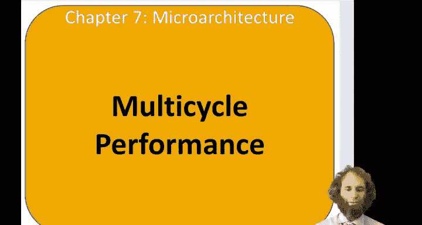
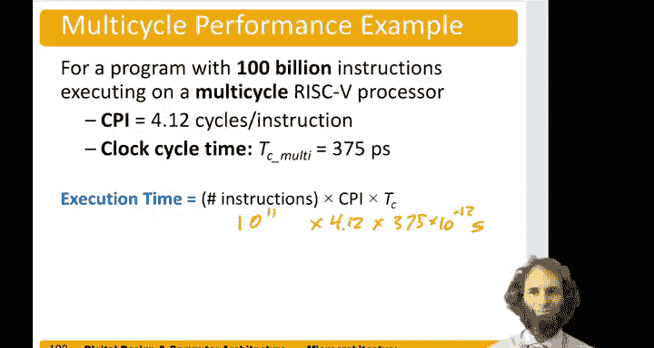

# 哈维穆德学院《数字设计和计算机架构RISC版｜Digital Design and Computer Architecture： RISC-V Edition》 - P108：Chapter 7 12.Multicycle Processor Performance.zh_en - GPT中英字幕课程资源 - BV1JC1MY1E7F

Hello， in this video， we'll analyze the performance of the multicycle processor。

So in the multie processor， different instructions take different numbers of cycles Bra on equal takes only three cycles。

Our type instructions， add I， store word， jump and link all take four， and load word takes5。

So the number of cycles per instruction is the weighted average of these。

If we consider some application， for example， the Speckant 2000 benchmark。

I a benchmark for measuring performance of computers。

About 25% of the instructions in that benchmark were loads， 10% were stores， 13% were branches。

 and the remaining 52% were RTEC data processing instructions。

So the average number of cycles per instruction。Is 13 per being three cycles。

52 plus 10% being four cycles and 25% being five cycles。 So on average。

 it's just over four cycles per instruction。Next， we need to look at the cycle time of the processor and there are various different cycle times that might be limiting。

 so let's look at two of the ones that seem like they could be longer。

One of the steps starts with the program counter and goes through the A L U。So， PC。

We need to select source， A。Youed to then put that through the ALU。We get a。嗯。And we get PC plus4。

And we need to select that PC plus 4 with a result multiplexer。And bring that back around。

So we'll call that the blue path。In the red path， that's the delay reading memory。

 So we'd start with an address and mail you out。 We would choose that address。

With the air result marks。Bring that address around。

Choose it again with the address mugs and access that data memory， read it out。

 and we need to put it into the data register at the end of the cycle。So。Let's make some assumptions。

 one of them is that the register file is faster than accessing memory。

 which makes sense because it's smaller。And another is that writing memory is typically faster than reading memory。

So if those assumptions are true， then the store right path to memory is not a limiter and the paths accessing the register file are not limiters。

So the worst case cycle time for the multicycle processor is the time to come out of the first register。

Plus， time through the decoder。Plus， time for two multiplexors。Plus。

 the maximum of the time either for the ALU or to access memory。Plus。

 time to set up at the next register。So if we put in these values。

 the time through the first register。It's 40 pico secondsds。The time for the decoder。25 pico seconds。

Two multiplexors。Is 60 picoseds。Longest of the A L U and the memory。200 picoconds。

And the setup time is 50 picoconds。So this looks like 100， 200，250。2，75， P second。Check my math，100。

300。Three， 75 piconds。Which is about half， in fact， it' exactly half。

Of what the single cycle process or had been。So this is definitely faster cycle time。

 but got to be careful It's only twice as fast， and now we're taking between three and five steps to doage instruction。

 so we may not be getting a speed up。So if we consider a program with 100 billion instructions。

That's。10 to the。11th。Times 4。12 cycles per instruction。Times the cycle time。Of。

375 times 10 to the -12 seconds per instruction。That will give us our overall execution time。

Which I don't have in front of me， but it's。Going to be about twice as long。

Something a little over 150。Seconds as compared to 75 for the single cycle processor。

