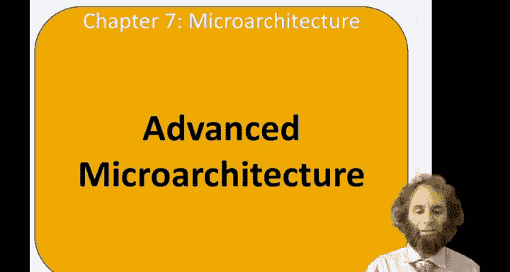
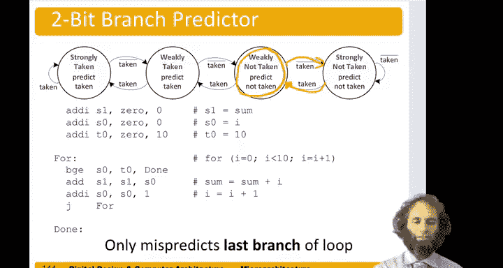

# 数字设计和计算机架构：7.17：高级微架构 🚀

在本节中，我们将探讨现代处理器设计中用于提升性能的一系列高级技术。我们已经学习了单周期、多周期和流水线这三种基础的RISC处理器微架构。本节将介绍更复杂的设计理念，如深度流水线、微操作、分支预测等，这些技术共同造就了当今高速的PC、笔记本电脑、手机和服务器。

## 深度流水线

上一节我们介绍了五级流水线处理器。本节中我们来看看深度流水线技术。其核心思想是：如果五级流水线是好的，那么更多级数可能会更好。

许多现代高性能处理器拥有10到20个甚至更多的流水线级。然而，流水线级数的增加受到以下因素限制：
*   **分支预测错误惩罚**：级数越多，一旦分支预测错误，需要清空（flush）的指令就越多，性能损失越大。
*   **时序开销**：每一级流水线都会引入寄存器建立时间（setup time）和时钟到输出延迟（clock-to-Q delay），这些开销累积起来会限制时钟频率的提升。
*   **功耗与硬件成本**：更多的流水线寄存器意味着更高的功耗和硬件成本。

随着流水线级数增加，时钟周期时间（Cycle Time）会下降。但指令执行总时间取决于 **`执行时间 = 指令数 × CPI × 时钟周期时间`**。如果级数过多，由于冒险（Hazard）导致的CPI上升可能会超过周期时间减少带来的收益，反而使性能下降。

一个极端的例子是奔腾4处理器，在其主要依靠时钟频率竞争的年代，曾达到28级流水线。虽然更高的频率带来了更高的售价，但实际性能并未同比提升，且功耗高达130瓦以上，最终难以为继。英特尔随后转向了级数更少、效率更高的酷睿（Core）微架构。

## 微操作

接下来，我们看看如何处理复杂指令。微操作（Micro-ops）技术将复杂的指令分解为一系列更简单的指令（即微操作）。在运行时，这些复杂指令被解码成微操作序列。

这种技术广泛应用于复杂指令集计算机（CISC），因为其指令无法在我们之前讨论的那种简洁规整的数据通路上高效执行。

例如，假设有一条复杂指令：从寄存器`s2`的值加0偏移量的地址加载数据到`s1`，并且对`s2`进行后自增4（即`s2 = s2 + 4`）。这是一种在数组中遍历元素的常见指令。

我们可以将其分解为两个更简单的微操作：
1.  `lw s1, 0(s2)` // 加载数据
2.  `addi s2, s2, 4` // 地址自增

如果不进行分解，就需要寄存器文件具备两个写端口，以便在同一周期写入两个结果，这会使寄存器文件更大、更慢。因此，将其分解为微操作通常是更好的选择。

## 分支预测

在流水线处理器中，分支冒险会显著影响性能。理想流水线的CPI是1，但分支预测错误会增加CPI。我们的目标是尽可能减少预测错误，以最小化性能损失。分支预测技术就是用来猜测分支是否会被执行。

以下是两种主要的分支预测方法：

**静态分支预测**是最简单的技术，仅依据分支方向进行预测：
*   向后分支（通常对应循环结束条件）预测为“执行”（Taken）。
*   向前分支预测为“不执行”（Not Taken）。

**动态分支预测**则通过硬件记录分支历史来做出更智能的预测。一个称为**分支目标缓冲区（Branch Target Buffer, BTB）** 的硬件结构可以记录最近数百或数千条分支的目的地址和执行情况。当再次遇到分支时，用程序计数器（PC）索引BTB，查看历史记录并进行预测。

动态预测器可以使用状态机来记录更精细的历史信息。以下是两种常见的动态预测器：

假设我们有一个对1到10求和的循环程序，其循环结束分支（`bge`）仅在最后一次迭代时执行。以下是不同预测器在该循环中的表现分析：

*   **1位分支预测器**：只记录上一次该分支是否执行。在循环中，它会错误预测循环的第一次和最后一次迭代。对于10次迭代，错误率为20%。
*   **2位分支预测器**：使用一个2位状态机（如“强不执行”、“弱不执行”、“弱执行”、“强执行”），能容忍一次非常规结果而不改变预测。这样，它只会错误预测循环的最后一次迭代，错误率降至10%，从而获得90%的准确率。

通过良好的分支预测，可以减少需要清空流水线的分支比例。现代分支预测器的准确率通常能超过90%。

## 其他高级技术

除了上述技术，现代处理器还采用了许多其他方法来提升性能：

*   **超标量处理器**：每个时钟周期可以发射（issue）并执行多条指令。
*   **乱序执行处理器**：允许指令不按程序顺序执行，以减少数据冒险带来的停顿。
*   **寄存器重命名**：通过动态分配物理寄存器来消除假数据依赖（写后写、读后写冒险），是乱序执行的关键技术之一。
*   **单指令多数据**：一条指令可以同时对多个数据执行相同操作，用于加速多媒体、科学计算等向量化任务。
*   **多线程**：一个处理器核心能够在多个正在运行的程序（线程）之间快速切换，提高硬件利用率。
*   **多处理器（多核）**：将多个处理器核心集成在一个芯片上，实现真正的并行处理。

## 总结

本节课中我们一起学习了现代处理器高级微架构的多种关键技术。我们从深度流水线的利弊开始，探讨了通过微操作分解复杂指令的方法。然后，深入研究了静态和动态分支预测技术，特别是1位和2位预测器的工作原理及其对性能的影响。最后，我们简要概述了超标量、乱序执行、寄存器重命名、SIMD、多线程和多核等其他重要技术。这些技术相互结合，共同推动了处理器性能的持续提升。