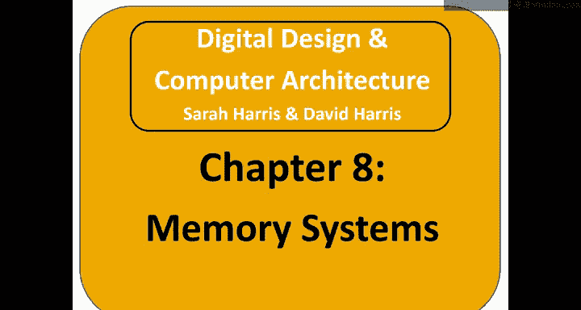
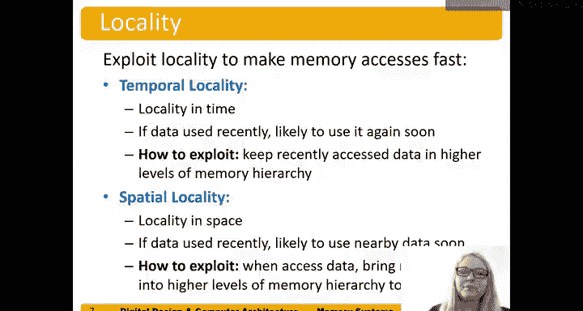

# 哈维穆德学院《数字设计和计算机架构RISC版｜Digital Design and Computer Architecture： RISC-V Edition》 - P116：Chapter 8 1.Introduction.zh_en - GPT中英字幕课程资源 - BV1JC1MY1E7F

In this chapter we're going to talk about memory systems。

 so first I'll introduce memory systems and then we'll talk about memory system performance。

And finally， we'll talk about what affects this performance。And how we， how we build memory systems。

 particularly caches and virtual memory。So a computer systems performance depends on both the processor performance and memory system。

And here's a picture of the processor memory interface。

 we have a processor that sends the memory right signal。Address and write data to the memory。

 and the memory returns the read data to the processor。

So in prior chapters we assumed that we can access memory in one cycle， one processor clock cycle。

 but that really hasn't been true since the 1980s， so you can see this graph here with performance on the left shown in a log scale。

 so you can see the CPUU or processor performance has grown at a much higher rate than the memory system and so now there's at what we call a memory gap。

Prostor memory gap。 So between the performance。 So it takes many proor clock cycles to access memory。

So this is the challenge is to make memory appear as if it's as fast as the processor。

And so in order to do this， we use a hierarchy of memory ideally you know any given memory would be fast。

 cheap and large or cheap is inexpensive and that breaks easily。

 but so we want a fast cheap and large memory but we can only really choose to we choose a fast and cheap memory it's going to be really small we choose a cheap and large memory it's going to be really slow and so we use a hierarchy to。

😊，To act as if we have a fast， cheap and large memory， and we build it from multiple types of memory。

So here's a picture of the memory hierarchy， we have our CPU our processor and on ship。

Nearby that CP that processor is the cache。And the cache is typically as fast as the processor。

 so it's one processor clock cycle to access and then off chip we have main memory which is much slower and even slower is the hard drive。

And so here are some typical numbers， for example， SRAM。

 which is what cash is made of cost $100 per gigabyte， but the access time is really fast 0。

2 to3 nanoseconds， whereas main memory built from DRAM is a lot less expensive。

 3 per gigabyte but a lot slower， 10 to 50 nanoseconds。

 and we can see that solid state drives or hard disk drives we're going to talk about this is what we call we use that for virtual memory is a lot cheaper。

 10 cents to 3 cents but a lot slower， 20，000 to 5 million nanoseconds。

And so in order to make this hierarchy work， we have to exploit two types of what we call locality。

The first one is temporal locality， this is locality and time。

 so if we use data recently we're likely to use it again soon。😊。

So we exploit this by keeping recently accessed data and higher levels of the memory hierarchy。

 particularly the cache。For example。And so an example of this is， if you've used a book recently。

 for example， a textbook， likely use that again recently。😊。

Probably shouldn't go put it into your storage face back you know over five miles away and you know say if every time you have to go look at it。

 you have to go the five miles to get it instead you want to keep it in your backpack right so you can keep it nearby to use that's an example of temporal locality spatial locality is locality and space So if data was used recently you're likely to use nearby data soon so for example。

 if you're looking for a book in the library and it' by your favorite author likely you're gonna access the books nearby once you get to the stacks and find that that book could be like oh here's a new book I didn't realize that author came out with and you'll grab both of them。

So in processors if data was used recently， likely。

The processor is going to use nearby data soon as well。

So we exploit this by the processor when it accesses the given data。

 it pulls in nearby data as well into the cache and keeps it there in the higher levels of the memory hierarchy。

