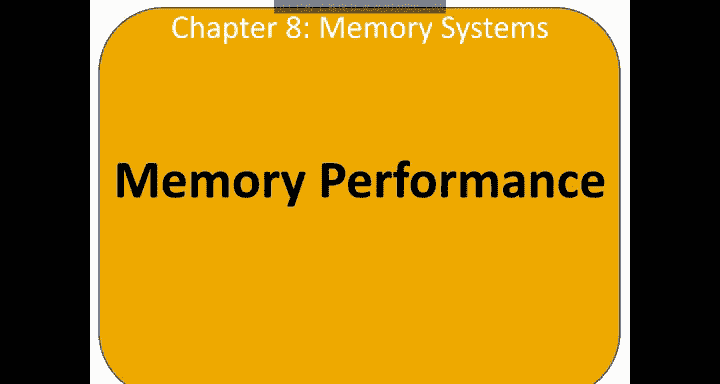
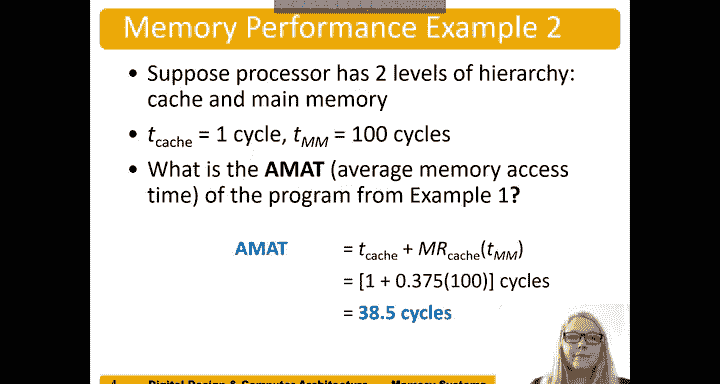

# 哈维穆德学院《数字设计和计算机架构RISC版｜Digital Design and Computer Architecture： RISC-V Edition》 - P117：Chapter 8 2.Memory System Performance.zh_en - GPT中英字幕课程资源 - BV1JC1MY1E7F

So we measure memory system performance by。It's hit and miss rate as well as its memory access time or average memory access time。

So a hit is defined as occurring when data is found in a given level of the memory hierarchy。

 and this is when it's not found and when you have to go to the next level of the memory hierarchy。

The hit rate is the number of hits over the total number of accesses and the miss rate is the number of misses over the number of memory accesses。

 so if we add the hit rate and the miss rate together， we get one。In other words。

 the hit rate is one minus the miss rate and the miss rate is one minus the hit rate。

Average memory access time is a time for the processor to access data。If， for example。

 we have a system that just has a cache and a main memory listed is MM here。

The average memory access time would be the cache， time to access the cache。

 typically one processor clock cycle， plus the miss rate times the time to access main memory。

If there are additional levels in the hierarchy， then that would be plus the mis rate of that level times that time to access that next level。

So let's suppose in this example， our program has 2000 loads and stores， so 2，000 memory accesses。

 and 1，250 of these are of these data values are found in the cache。

 the rest are supplied by other levels of the memory hierarchy。

So what's the cash and hit and miss rate Well， the hit rate is。1250。Number of hits。

Over the number of accesses。2000。And the missrate is。You know， one minus that or in other words。

 750 over 2000。Nicely here， our hit rate is 0。625， 1250 over 2000 miss rate is 750 over 2000 or 0。

375 and you can note that these add together。To be one。

Now suppose our process has two levels of hierarchy， cash and main memory。

And the cash access time is one processor cycle。AndMa memory access times is 100 processor clock cycles what is the average memory access time of the program from example one from that previous slide。

 well average memory access time is the time to access the first level in hierarchy。

 you need to access it to see if it missed or hit。So we have one cycle time of the cache。Plus。

 its missrate， which was point。3，7，5。Time's the time to access that next level hierarchy or 100 cycles。

And so that's our average memory access time， the average time it takes to access any given data。

Written nicely here we have。38。5 cycles is our average memory access time。

