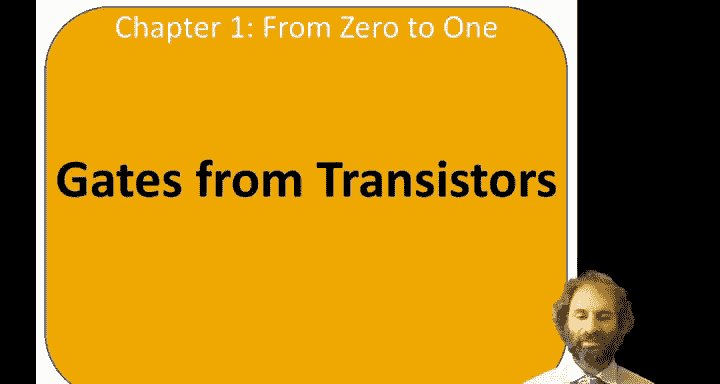
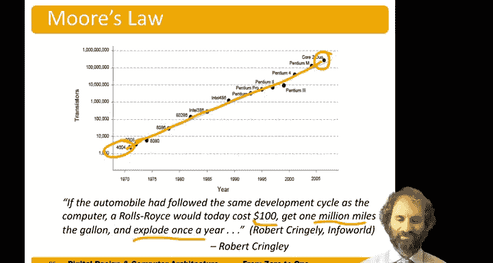

# 哈维穆德学院《数字设计和计算机架构RISC版｜Digital Design and Computer Architecture： RISC-V Edition》 - P11：Chapter 1 10.Gates from Transistors.zh_en - GPT中英字幕课程资源 - BV1JC1MY1E7F

Hello and welcome to the next exciting installment of digital design。😊。

Now we're going to do something kind of magical。 How can we build budget gates from these transistors？

So let's start out with a knot gate。Remember， when a is0， the output should be 1。

 when the input is 1， the output should be 0。We can build the knot gate out of a single en must transistor in a single pimoss。

The end mos is connected between the output and ground。

The Pmos is connected between the output and power。When a is 0。The Pimas transistor is on。

The en Mos transistor is off。So there's a path from power to the output。

 There's no path from ground to the output。So the output is one。On the other hand。If a is1。Now。

 the pimas is off。The en moss turns on。There's a path from the output to ground。

 Theres no path from the output to power。So， the output is low。So， sure enough， the output。

Is the opposite of the input。And we have a knocket。But out of only two transistors。Next。

 let's look at a Nand gate。For a end gate we put two n mos transistors in series between the output and ground。

We'll took two pmos transistors in parallel between the output and ground。And remember。

 the Nand gate is opposite of and， so it should produce a zero output only when both inputs are true。

So if A and B are both0。Both pima transistors are on。Both and mo are off。

So theres no path from wider ground through the endless mos。

There's a path from y to power through either Pimos。 In fact。

 there are two paths through both of the parallel Pimos。 So y definitely becomes one。

Let's say A is 0， and B is1。 When A is 0， P1 is still on。P2 is off。N1 is off。And N2 is on。

So there's a path through P1 from y to power。 There's no path through P2， but it doesn't matter。

 There's some way for power to get to y。 So y will become1。There is no path from wider a ground。

Because even though ground could get through N 2， it gets blocked by N1。

 So there's no connection from Y。If a is 1 and B is 0， we're similar。P1 is off。The2 is on。

 and one is on。And two is off。There's a path from y to power through P2。

There is no path from wider aground because one of the two serious transistors is cut off， so。Again。

 the output is true。Finally， if A and B are both true。P1 is off。And P2 is also off。N1 is on。

And2 is off。Now， there is no path from wider to power because both Pias are off。

There's a path from wide ground through the two in moss transistorence in series。

 So the output goes well。And sure enough， we've built a landscape。So in general。

 we build logic gates。With a network of M mos transistors between the output and ground。

 a network of P Mo between the output and power。Suppose we wanted to build a three input nagate。

A nor produces a true output。Only when all of the inputs are low。So to build this with transistors。

 we'd like to have a path to the power only when all of the inputs are low。

So we need Pma transistors， three Pma transistors in series。Only when all of these inputs are low。

 should the output pull high。Any of the inputs are true。 We want the output to pull out。

 So we'll build three and mus。And parallel。To ground。B。And see if any of the inputs are true。

 the output will go to 0。So here's our three input more。

Let's suppose we wanted to build a two input and gate。The problem we have。Is the end moss pull down。

 So as we have more ones on the input， the output wants to pull down。

If we have more zeros on the input， the output wants to pull up through the Pmos。

So we can't directly build an non inverting gate like an andt。And see us。However。We can build a N。

 and we can build a knot。So we can build our end gate。Has a naand followed by a knot to do an ant。

Remember our。Nandgate。Has。😔，2 pma in parallel。And。😔，To inmason series。Are not gate。

Just had a single M must and a single Pmas。And so here's our to input an。

So another issue happens if we wanted to build a good switch。Remember that N mos pass ones poorly。

 P mo pass zeros poorly。If we wanted to build a switch that could pass both zeros and ones。

 we need both flavors of transistors working together。And we call that a transmission gate。

So let's say， we take an en moss。And a pimas。 And connect them together。Between input A and output B。

We'll connect and enable signal E N to the N mass。And its complement to the Pimos。

When an able is one。A。The switch is on。Nbel bar is 0。

And both the en Moss and the Pmass are turned on。And input A connects to output B。When enable。Is 0。

The inmas is off。 enable bar is one。 So the Pmas is off。

 and there's no path for A to B through either inmas or Pmas。 So we say the switch is off。

So one of the very important figures in semiconductors is Gordon Moore。

More co founded Intel in 1968 with Robert Noyce。And early on。

 he took a look at the number of transistors on ships。And he found that。 It was doubling。Every year。

As of 1965。He plotted that on a semi logarithmic plot and predicted that if that continued。

 we'd have exponential growth in the number of transistors on a chip。And amazing things would happen。

So that growth doubling every year slowed down a little bit。 But since 1975。

 the number of transistors on a chip has doubled approximately every two years。

And so we've gone from two transistors on a chip。In the 60s。Up to hundreds in the 70s。And now。

 billions。Today。And this is known as Moore's law that the number of transistors you can get on a chip is increasing exponentially。

Some corollaries of that， as others transistors are getting smaller。

They also become faster and consume less power， and they're cheaper。

So we have this vicarious cycle that is making chips better and better。

So here's a historic plot of some intel processors。

 The 4004 was the first microprocessor ever produced。

 came out around 1971 with about 2000 transistors on it。And。Nowadays， we had by 2006。

 we had over 100000 transistors。 Now we have close to 10 billion transistors on a ship in 2020。

And so， we've been very steady。On this exponential growth。Over。5 decades。Which is incredible。

There's nothing else I can think of in the history of technology。

That has increased at a dramatic exponential for five decades。Robert Kley had a famous quote。

That if an automobile had followed the same development cycle as Moore'slo。

Of roll rice today would cost $100。We get a million miles to the gallon。And by computers。

 would explode once a year。

