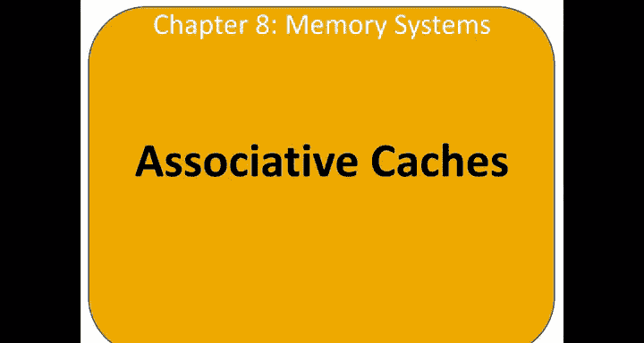
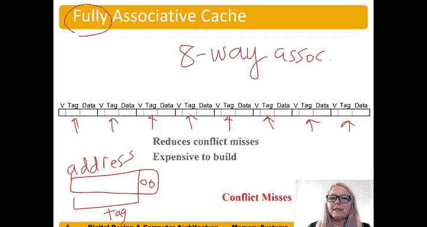

# 哈维穆德学院《数字设计和计算机架构RISC版｜Digital Design and Computer Architecture： RISC-V Edition》 - P120：Chapter 8 5.Associative Caches.zh_en - GPT中英字幕课程资源 - BV1JC1MY1E7F

So in order to help alleviate the issue with conflict misses。

 we use what's called an associative cash， or sometimes we call it n set associative cash。

 but for short， we often call these just associative caches。And so in a set of soative cash。

 we have multiple ways for each set， so it's like if you have a freeway that or a highway that you're going down instead of having just a single lane going in one direction。

 you know， stuck behind a slow car or something。Has two lanes two options I can go in the right lane or the left lane。

And so。What we have here is so we're going to use the same size we still are storing eight words so our set the number of sets has to go down so here we have 0。

1，2，3， we have four sets now。Okay so。Two to the two。

 so we're going to use just two bits to indicate which set is going to it's going to map to you。

 the memory address is going to map2。And it could actually map to either of those ways， so let's say。

 for example， this is a set number here。Thiss our set number。Say we had some address。 I don't。

 let's oh it's this pointing you， It's pointing to address。Seets to here。Let's go ahead and put that。

 So if we map to set2。Right，10 set， and let's say it's just that。 So this would be address Hex 8。

All zeros， and then at 10，0，0。This is address， Hex 8。

And it would map to this set and if it's completely empty， you can choose which set to map you。

 but let's say， let's suppose one of them had already had some data。You know， some random tag in it。

诶。Data， that memory address will just， you know。Whatever some random data that it had in it。

And we's say that's 32 bits of data。And let's say that this way of the cash were not valid then。

You know，It wasn't a hit because well， now we have to compare two tags and say is this tag。You know。

 the same as the tag that I'm looking for。嗯。It would compare here， this would get a zero。

 and that would also compare on whether it's the same as this tag。

 but would also need a valid in this case， this valid here would force hit one in way one to be0 and because it wasn't a match and way zero。

 that way of the hit would be0。And so we would pull data into this way。P zero on the tag。

 whatever date is and memory address。I isent memory address，8。Would go into that。data。嗯。In way one。

And so the next time we accessed memory address 8， it would be a hit。

 I would see that data and now let's erase all this。Now I would compare that tag。

To the tag in way one， and it would say yep， hit， I'd have to make sure to replace that valid with a one and now would' get a hit in way one。

嗯。And this would say hit， yes， the processor would say yes， it's a hit and hits sub1 would be a one。

 and so we choose from this multiplex or we choose data from way1。So again。

 set associative caches are simply called associative caches。Alleviate some conflict misses。

So here's an example of that of what would have been that conflict miss。

HeX4 accessing address Hex4 and Hex 24。Right X4。Times。

This is address X4 and this is address Xx 24 or Hex2。Bre。In our direct map caches。

Reuse these three bits， these maps the same。Set， and it was a problem because there was only one way in that set。

But now if we use our two way。This case is a two way set associative， so it can be n ways。

 we could have four ways， for example， but this is a two way such asciative。Again。

 we're just using two bits because of the。I'm going to have four sets now。For the set bits。

 these still map to the same set， but it's not a problem， so Hex 4 is going to come in here and map2。

Way  zero address X4， and then on the next axis。So hex 24， there's another way available。

So I mean the cache was cold and so we map to that new way。And we put the tag bits， of course。

 for each of those addresses in。And so the first time through is a compulsory miss。

 The first time through this loop is a compulsory miss。 But now the next time， again。

 this is running five times。 And so we have。Five times through this loop。

 and we have two accesses that are misses， so we have two misses。But the next eight axises。

 right the next four times through the loop。2。Our hits。

 so only have two misses total and five times two or 10 memory accesses。

And so this is two out of 10 is the miss rate or in other words， 1 fifth or 20%。

So soocciivity reduces conflict misses， and here's the example of that。

We can have fully associative caches。 So a fully associative cash has one that basically the number of blocks is the number of ways。

 So in this case， we have a fully associative cash means there's only a single set。

 so we don't use any set bits and。This， for example， when we had our eight。Blocks。

 this is now an eight way， you know， fully associative。There's only a single set， in this case。

 an eight way asci of cash。If we had had 16 blocks to be fully associated。

 we wouldd have to have a 16 way asciative cash。So fully social caches reduce conflict misses。

 but they're expensive so remember that now it could have be it could be in any of the ways right and so。

😊，And so now we have to check the tabs for each of them， you have to say， hey， you know。

 when our address comes in from the processor， here's our address coming in。You don't any ss anymore。

And so here are our two。You know， bits on the bottom。Load word addresses， as all as zero。

 but now the rest of it's a tag。And then we have to compare and say， hey。You know。Was that one， nope。

 that one。Like compare all of the ways of the cache now we have to do all of those comparisons to see which way and then our multipleer is also bigger now to now we have an eight to one multixer to choose which of the ways that's that that was in。

The data we're looking for then or perhaps it's not in there。 remember we could get a miss as well。

So a fully subsive cash is great with helping with conflict misses。

 now we can map to any one of those eight ways。😊。

But it's expensive。