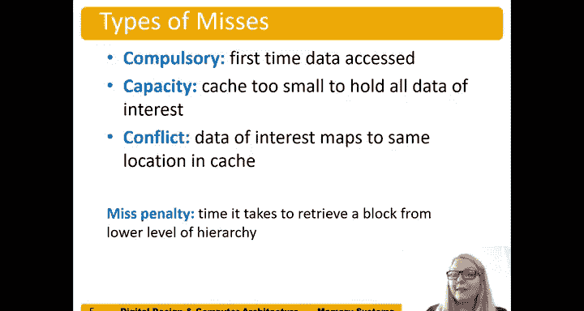
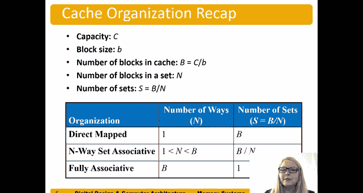

# 数字设计和计算机架构：8.6：空间局部性 🧠

在本节中，我们将学习缓存设计中的另一个重要概念——空间局部性。上一节我们介绍了时间局部性，本节中我们来看看空间局部性如何通过一次读取多个连续的字来提升缓存效率。

空间局部性是指，当我们访问内存中的一个字时，很可能在不久的将来也会访问其附近地址的字。为了利用这一点，我们可以增加缓存的块大小，使得一次内存访问能加载一个包含多个字的块，而不仅仅是单个字。

## 增加块大小

在之前的示例中，我们的块大小只有一个字。现在，我们将块大小增加到四个字。缓存总容量仍然是八个字，但由于每个块包含四个字，我们现在只能存储两个块。因此，缓存中的组数减少为两组（组0和组1）。

内存地址的格式也随之改变。我们引入了一个新的字段，称为**块偏移**。由于块大小为4（即2²个字），块偏移需要2位。如果块大小为8，则需要3位（log₂8=3）。块偏移用于指定我们想要访问块内的哪一个字。

以下是地址字段的划分：
*   **字节偏移**：最低几位，指定字内的字节（通常忽略）。
*   **块偏移**：接下来的几位，指定块内的字。
*   **组索引**：再接下来的位，指定数据应存储在哪个组。
*   **标签**：剩余的位，用于唯一标识内存块。

## 空间局部性示例

假设我们访问地址 `0x8`。在直接映射缓存中，处理器不仅会将地址 `0x8` 处的字加载到缓存中，还会将整个包含 `0x0`、`0x4`、`0x8` 和 `0xC` 的块加载进来。

随后，如果我们访问地址 `0xC`，处理器会检查缓存。由于块偏移不同，它需要的是块内的另一个字。但由于空间局部性，整个块已经在第一次访问 `0x8` 时被加载进来了，因此对 `0xC` 的访问将是一次命中，无需再次访问主存。

## 性能优势分析

考虑一个访问序列：在一个循环中依次访问地址 `0x4`、`0x8` 和 `0xC`，循环执行5次。

*   **总访问次数**：3次访问/循环 × 5次循环 = 15次。
*   **缺失次数**：只有第一次访问 `0x4` 时会发生缺失（冷启动缺失）。后续对 `0x8` 和 `0xC` 的访问，由于它们与 `0x4` 属于同一个块且已被加载，都会命中。
*   **缺失率**：1 / 15 ≈ 6.67%。

与块大小为1个字的情况相比，缺失率显著降低，这清晰地展示了利用空间局部性的优势。

## 缓存缺失类型回顾

以下是三种主要的缓存缺失类型：

1.  **强制性缺失**：数据第一次被访问时必然发生的缺失。
2.  **容量缺失**：由于缓存容量有限，无法容纳所有活跃数据而导致的缺失。
3.  **冲突缺失**：在组相联或直接映射缓存中，多个活跃数据块映射到同一个缓存组，相互冲突而被替换出去导致的缺失。

增加块大小主要有助于减少**强制性缺失**。

## 缓存组织参数总结

以下是描述缓存组织方式的关键参数及其关系：

*   **容量**：`C`（总字节数或字数）
*   **块大小**：`b`（每块的字节数或字数）
*   **块数**：`B = C / b`
*   **相联度**：`N`（每组中的块数，也称为路数）
*   **组数**：`S = B / N`

根据这些参数，我们可以定义不同类型的缓存：

*   **直接映射缓存**：`N = 1`，`S = B`
*   **N路组相联缓存**：`1 < N < B`，`S = B / N`
*   **全相联缓存**：`N = B`，`S = 1`（即整个缓存只有一个组）

## 总结

本节课中我们一起学习了空间局部性的概念及其在缓存设计中的应用。通过增加缓存块的大小，处理器可以一次性预取多个连续的字。当程序展现出良好的空间局部性（即顺序访问内存）时，这种方法能有效减少强制性缺失，从而显著降低缺失率并提升整体性能。同时，我们也回顾了缓存的三种缺失类型和描述缓存组织的关键参数公式。理解这些概念对于分析和优化计算机系统的内存层次结构至关重要。