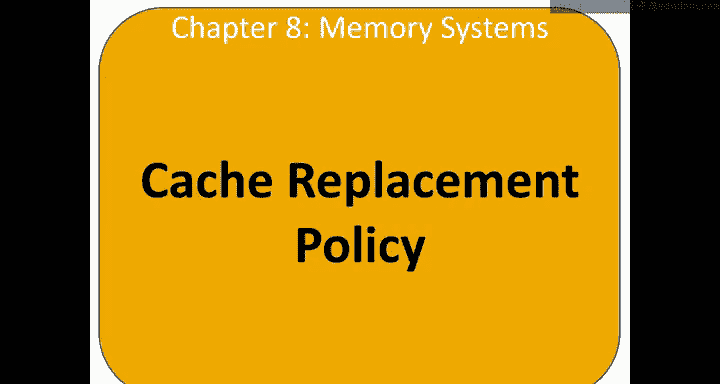
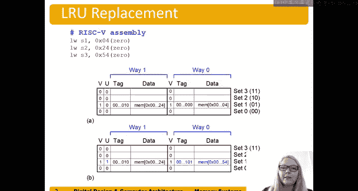

# 哈维穆德学院《数字设计和计算机架构RISC版｜Digital Design and Computer Architecture： RISC-V Edition》 - P122：Chapter 8 7.LRU (Least-Recently Used) Replacement.zh_en - GPT中英字幕课程资源 - BV1JC1MY1E7F

let's talk about cash replacement policies， so when a cache is too small to hold all the date of interest at once。

We're going have to replace some data So when that cache is full， in other words。

 all of the locations in the cash are valid。A program access as data X has to evict some other data that's already in the cache。

 it accesss to some new data that's not in the cache。 and have to evict some。

 some data that's in the cache。ACacity as misHp occurs when we access Y again。

So that means that the cache wasn't large enough to hold all the date of interest。

So how do we choose why to minimize a chance of needing it again？

The most common method for doing this is called least recently used or LRU replacement。Basically。

 we're going to choose the block that was least recently used so use longest go。🤢。

So here's an example of LRU replacement， let's suppose we have an access to address 4， 2，4， and 54。

So， here's address。4。Hex 2，4 and He 5，4。And。😔，It's5，4。

And here we have we're going to use a block size of just one。One word in our block。And so。

Now we're going to look at this and say， well， let's look at the set bits。

 We have four sets in this case， and so we're going to use two bits。For the set beds。

 remember these are the bite offset we only use as if we're doing a load bite or a load half。

And then we'd look at the。The next bit or the remaining bits are going to be the tag bits。

And so we can see that these all map to。😊，Set one。And so this first access to address 4。

 we're going to put the data that's in address Hex4 here。And the tag will be。All zeros。

And we'll make that that valid one。 that's the first access。And then the next access。

It be address Hex 24。And we're going to say。嗯。Vabbits1， we're going to put that。

 whatever is that address to Hex T4 here。And then we're going to make the tag。Whatever that tag is。

All zeros。And the 10。So the problem happens when now。We have to access。Third。

Value or the third address here， which is Hx 54。And so we look at that and we say， well。

 which one should be evict？So least recently used says， well， the most recently used was Hex 24。

 and so we don't want to evict that。Because we， you know， temporal locality。

 we use that most recently， instead we'll evic this least recently used one， which was hex4。

 evict that from the cache and overwrite it with。You know， hex 5， or。A going to data。At Hx 5，4。

And so this is written more nicely here。But not real time。 So we have this is the case here when。

Right after this access where we have hex memory or the data and memory address for and address 20 hex24 there。

 and this says this use bit， we now add this other。Bit here of information， it's called a use bit。

 u equals a use bit， and it says which way was least recently used while way zero。

was lease recently used， so it says that's the way to replace。If there's another access。 So in fact。

 there is one more access here。Our access to x54。And because that used bit was zero， it says。

Evict what was there， so evict。HeX memory it， whatever that data is that heX memory address for。

And pull in replace it with that new data with X54。

SoThat's LRU or at least recently used replacement。

