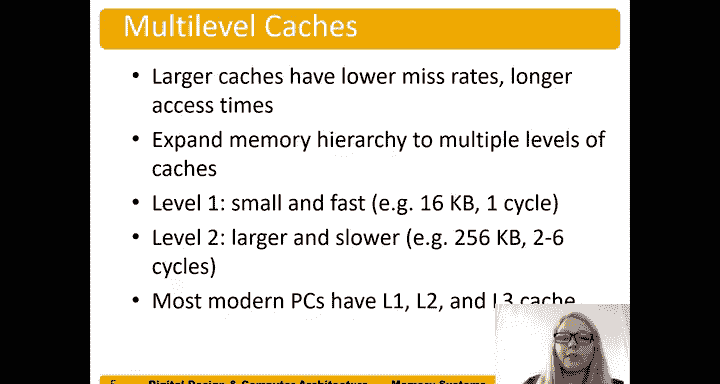

# 数字设计和计算机架构：8：缓存总结

在本节中，我们将对缓存的核心概念进行总结，回顾其工作原理、性能影响因素以及多级缓存结构。

## 缓存数据与寻址 🧠

上一节我们介绍了缓存的基本思想，本节中我们来看看缓存具体存储什么数据以及如何找到它们。

缓存中存储的是处理器最近使用过的数据（利用**时间局部性**）以及附近的数据（利用**空间局部性**）。

数据如何被找到？首先，由处理器提供的地址决定数据位于哪个**组**。接着，同一个地址也决定了数据在块内的具体**字**位置。在相联缓存中，数据可能位于组内的多个**路**中的任何一个。

当需要替换数据时，通常采用**最近最少使用**策略来替换组内的一路数据。

## 缓存性能趋势图 📊

以下是展示缓存缺失率趋势的图表。图表底部是缓存容量（单位：千字节），向右递增；纵轴是总体缺失率。

可以看到，典型的缓存缺失率范围很广。例如，10%的缺失率对缓存而言相对较高，而低于1%的缺失率则表现优异。

## 容量、相联度与块大小的影响 ⚙️

现在，我们来分析影响缓存性能的几个关键参数。

### 相联度的影响
随着相联路数的增加，我们可以减少**冲突缺失**。例如，对于一个8KB的缓存，从直接映射（1路）改为2路相联，能显著减少冲突缺失。增加到4路能带来小幅提升，但增加到8路则收效甚微。

### 容量的影响
图表下方的**容量缺失**会随着缓存容量的增大而减少。而**强制性缺失**所占比例通常很小，在图中几乎看不到。

**核心结论是：更大的缓存减少容量缺失，更高的相联度减少冲突缺失。**

### 块大小的影响
为了利用空间局部性，我们会增加块大小。图表展示了从16字节到256字节不同块大小下，多种缓存容量（4KB到256KB）的缺失率变化。

对于较小的缓存（如4KB），增加块大小起初有助于降低缺失率，但超过某个点（例如64字节后）反而可能因加剧冲突而导致缺失率上升。

对于较大的缓存（如64KB或256KB），增加块大小（直至64字节）能有效降低缺失率，但超过此点后收益甚微。

## 多级缓存 🏗️

我们可以构建多级缓存系统。我们之前讨论的通常是第一级缓存，但现代系统普遍包含第二级缓存，第三级缓存也很常见。

较低级别的缓存容量更大，缺失率更低，但访问时间也更长。我们不希望将第一级缓存做得太大，以免其访问时间超过一个处理器时钟周期。

因此，为了获得更大的有效缓存容量，我们采用多级结构：
*   **第一级缓存**：容量小、速度快。典型大小为16KB，目标是在1个时钟周期内完成访问。
*   **第二级缓存**：容量更大。典型大小为256KB，访问需要数个时钟周期。
*   **第三级缓存**：容量最大，访问时间也最长。

下图展示了Pentium 3处理器的芯片布局，可以清晰地看到规整排列的一级缓存和二级缓存存储阵列。

## 总结 📝

本节课中我们一起学习了缓存系统的核心总结。我们回顾了缓存存储的数据类型（基于时间与空间局部性）和寻址方式。通过分析图表，我们理解了**缓存容量**主要影响**容量缺失**，**相联度**主要影响**冲突缺失**，而**块大小**的优化需要权衡空间局部性收益与潜在的冲突增加。最后，我们介绍了**多级缓存**的设计理念，即通过分层结构在访问速度与容量/低缺失率之间取得平衡。