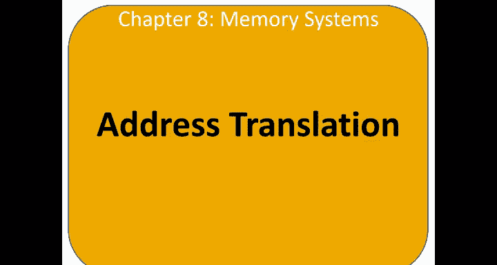
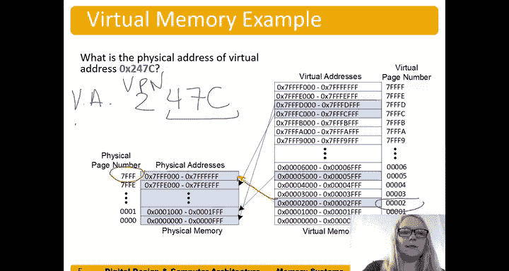

# 哈维穆德学院《数字设计和计算机架构RISC版｜Digital Design and Computer Architecture： RISC-V Edition》 - P125：Chapter 8 10.Address Translation.zh_en - GPT中英字幕课程资源 - BV1JC1MY1E7F

So let's talk about how translation occurs， so introduce this term called virtual addresses。

 so virtual addresses are produced by the processor now instead of physical addresses when your system has a virtual memory system。

😊，And so this is virtual addresses produced by the processor but。诶。

The physical address is what addresses main memory。

And so we have to translate that virtual address produced by the processor to a physical address so we can access it in main memory。

And so here's our address， our address in this case， it's a 31 bit address。That's 0330。

 and in this case our physical memory address is a 27 bit，0 to 26 bits。27 bid address。

And so that means we have two to the 31， or in other words， two gigabytes of virtual。喂。😊。

And2 to the 27。Bs where each byte can has its own address。To the 27 bytes of physical memory。

 in other words， two to the seven。Times2 the 20th。Equals。128。Megabytes。Of physical or main memory。

And so what we do is this page offset， in other words。

 the word or byte within the page is going to be the same， that doesn't get translated。

 but we do translate the virtual page number， the VPN to the physical page number to the PPPN。Okay。

 so we need to translate that upper so example， for example， if the virtual page was on page。9ine。

 and the physical page was on page 1。Page can map that virtual page。

Can map to any place in physical memory。So like we just said， the virtual memory size in this case。

 because we have a 31 B virtual address is 2 gigabyte。😊。

Physcal memory is 128 megabytes because we have 27 bit physical memory address and the page size is 4 kilobytes because we have a 12 bit page offset。

So two to the 12 is two to the two times2 the 10 equals 4。Clorbits。And remember we can。

 you'll see that often written like that what we're referring to instead of powers of10 you know。

thhousand and a million and so forth we'll refer it to it's actually two to the 10 and two to the 20 we'll put that I in the middle there。

So they'll see it both ways， just without the eye。Or with the eye in the middle。Okay。

 so the organization of this is。31 bits of virtual address， 27 bits of physical address。

 page asset is 12， so the number of virtual pages that we have is well2 to 31 over2 to 12 in other words。

 how many bits do we have left， we have 19 bits of a virtual page。So two to the 19 virtual pages。

We have 15 bits left for the virtual physical page number， so we have two to the 15 physical pages。

We have fewer physical pages in this system than virtual pages。Now here's an example of this mapping。

 so you can see this is our physical memory， remember this is the main memory。😊。

And our virtual memory。Which is the hard drive。We store other stuff on our hard drive， to。

 like files。 This is for the what we use for the。For the virtual memory system。So in this case。

 we have a， as we saw in the previous slides， 19 bit virtual page number and 15 bit physical page number。

😊，And so。Here's our 15 bit physical page number and our。19 bit virtual page number。 So for example。

 page5。As we can see here， page five， virtual page5。Maps 2， physical page one。I'll see another one。

Virtual page。7 F。FFD maps to physical page。0。And we're going to talk about how this translation occurs。

And that means that this entire page that's in physical memory here or a virtual memory here。

Is located in physical memory。Ones in white are not mapped。To physicals memory， right。

 physical memory is smaller in this case， and so all of the virtual memory cannot fit in the physical memory at once。

So let's do an example， what is the physical address of virtual address HeEcX 247C？😊。

So remember those lower。12 bits， 47 C， this is our page offset。So we don't have to translate that。

So here's our virtual page number is virtual page number two， we can look over here。

This is virtual page number two。And we can see that it maps too。Physcal page number。7， F， F F。

And so we're going to take that。 this is our virtual page number here。For virtual address。

 virtual address。And we're going to translate that to our physical address。

All we need to translate is that physical page number。Virtual page number two。2。

 physical page number 7， F。F， F。And the actual word within there stays the same， right is the。

We call the page offset。And gives us the word within that page that we actually want。Okay。

 so that physical address is that corresponds to that virtual address is 7 FFF4，7 C。

