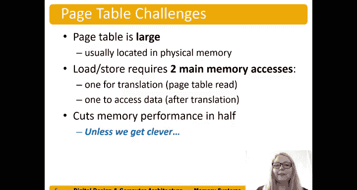

# 数字设计和计算机架构：8.11：页表

在本节中，我们将学习虚拟地址如何通过页表转换为物理地址。页表是内存管理单元（MMU）中的核心数据结构，负责记录虚拟页与物理页之间的映射关系。

## 页表概述

为了完成虚拟地址到物理地址的转换，我们使用一种称为页表的结构。页表为每个虚拟页提供一个条目，因此条目的数量等于虚拟页号的数量。

## 页表条目结构

页表中的每个条目都包含一个有效位和该页所在的物理页号。

*   **有效位**：指示该虚拟页是否已映射到物理内存（主存）。
*   **物理页号**：如果有效位为真，则此字段存储该虚拟页对应的物理页号。

如果条目无效，则意味着该虚拟页当前未映射到物理内存。

## 页表工作示例

以下是一个页表示例。在本例中，虚拟页号有19位，因此我们的页表条目总数（未全部显示）是 **2^19** 个。

我们使用虚拟页号来索引页表。例如，处理器产生虚拟地址 `0x247C`。我们不转换页内偏移量，只关注虚拟页号，即高19位。这里是 `2`，因此我们查看页表的条目2。条目2是有效的，表示该页已映射到物理内存。我们从该条目中读取物理页号（即上一张幻灯片中使用的转换结果）。我们检查有效位，如果命中（即有效），则使用该物理页号，然后附加页内偏移量，从而得到物理地址。

## 实践练习

给定这个页表，虚拟地址 `0x5F20` 对应的物理地址是什么？

请先自行尝试，然后我们一起解答。

**解答过程**：
页内偏移量仍然是低12位，因为我们的页大小是 **2^12** 字节。这部分我们不转换。我们只转换虚拟页号。

我们查看页表，查找条目 **5**（因为虚拟页号是5）。该条目有效，意味着该页已映射到物理内存。其转换后的物理页号是十六进制数 `0x1`。

现在，我们将这个物理页号与我们的页内偏移量拼接起来，就得到了物理地址 `0x1F20`。这就是虚拟地址 `0x5F20` 对应的物理地址。

## 页表未命中示例

第二个例子：虚拟地址 `0x73E4` 的物理地址是什么？

同样，我们只看高位数。低12位是页内偏移量，我们不看这12位，因为它们保持不变（这基本上表示我们在该页内查找哪个字）。我们使用高19位的虚拟页号。

我们查看页表中的条目7，发现它是无效的。这意味着该页没有映射到物理内存。因此，系统需要将该页调入物理内存，或者选择物理内存中的一个页来写入这个虚拟页。这在系统中称为未命中。

## 性能考量与术语

将页面调入物理内存的术语称为**分页**，有时当需要换出另一个页面时，也称为**交换**。

页表通常非常大，并且因为它很大，所以通常位于物理内存中。因此，一次加载或存储操作不仅需要一次内存访问来读取页表以完成虚拟到物理地址的转换，还需要在获得物理内存地址后，再进行一次内存访问来实际存取数据。这会使内存性能减半，除非我们采用一些更巧妙的设计。

## 本节总结

本节课中，我们一起学习了页表的基本原理。我们了解到页表通过虚拟页号索引，每个条目包含有效位和物理页号，共同完成地址转换。通过实例，我们练习了如何使用页表将虚拟地址转换为物理地址，并理解了当页表条目无效（未命中）时，系统需要进行分页操作。最后，我们指出了基础的页表设计会带来额外的内存访问开销，影响性能。