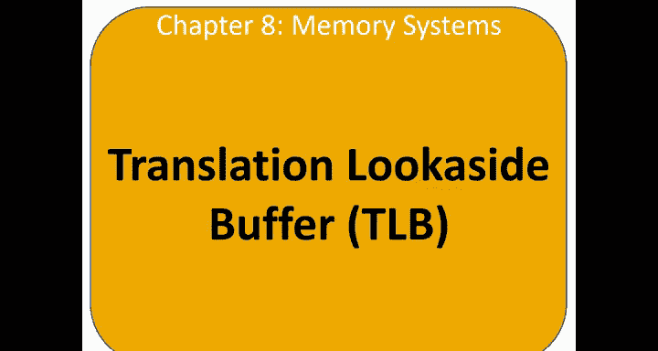
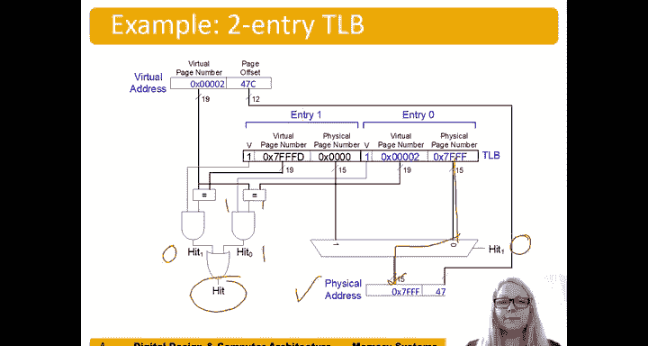

# 哈维穆德学院《数字设计和计算机架构RISC版｜Digital Design and Computer Architecture： RISC-V Edition》 - P127：Chapter 8 12.TLBs (Translation Lookaside Buffers).zh_en - GPT中英字幕课程资源 - BV1JC1MY1E7F

So we left on a little bit of a cliffhaner last time。

 the way we get clever with making our translations。

 our virtual to physical memory translations faster is by using what's called a translation locoide buffer or a TLB。

So a TLB is basically a small cache of the most recent translations。

 so again we're using this temporal locality to tell us， well， you know what。

 if we did a translation recently， we'll probably do that again soon。😊。

So this reduces the number of memory accesses for most loads and stores。From two back to one。

So it's TLB。😊，Uses you know， basically stores these translations page table access has high temporal locality。

 very large page size， so consecutive loads and stores are likely to access the same page remember we have two to the 12 byte page sizes。

 so in other words，4 kilobyte page sizes。A TLB is a small cache basically of these translations。

 it's accessed in less than one processor clo cycle， and typically it holds about 16 to 512 entries。

😊，It's fully sosociative and the hit rates are typically above 99%。And again。

 this reduces the number of memory accesses for most。Loads and stores from two to one。

So here's an example to entry TLB。So looks a lot like our cache figure。

 right but now instead of storing data， what's being stored in this TLB is these translations。

 these physical page numbers。And the tag is。The virtual page number。Because it's fully sosociative。

 any of these translations could be in any of the ways。Of this TlB。So here's an example。

 pose where accessing virtual address Hex 247 c， remember the page offset is not translated。

 so that's just brought down to you know。To populate the lower 12 bits of the physical address。

And then we check on because it's fully sociative， we have to check on each of the tags to see if。

There's a match。So in that left entry in entry one。Virtual page number does not match。

 so that's that would be that quality comparator would be zero would get a zero out of hit for entry one。

But。We look at entry 0。 compareare that with the virtual page number。

Have the virtual address supplied by the processor。 And in fact， that is a hit and。It is valid。

And so we get ones for both of those， and so we get a hit in entry zero。Numb hit one was zero。

 and so this would be。hit one is a selectck line， and so we choose。Entry。At tree zero here。

So that's fed to the upper bits， upper 15 bits in this case of the physical address and the processor sees that it was a hit。

And has the translation。For for the memory access has the physical address。

That's needed。