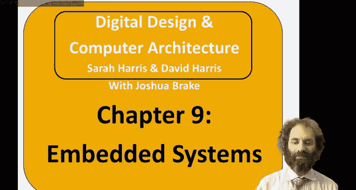
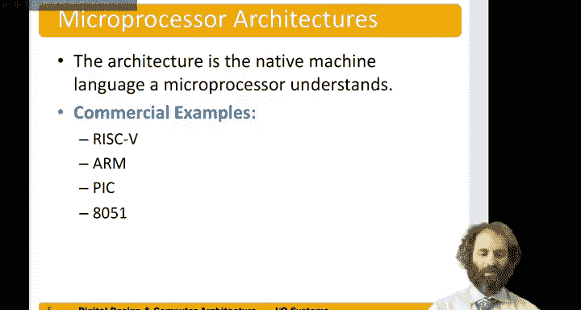

# 哈维穆德学院《数字设计和计算机架构RISC版｜Digital Design and Computer Architecture： RISC-V Edition》 - P129：Chapter 9 1.Introduction.zh_en - GPT中英字幕课程资源 - BV1JC1MY1E7F

Hello and welcome to the ninth exciting chapter of digital Design and Comp Archecture。

This chapter will be covering embedded systems and input output for our computers。

In this chapter， we'll take a close look at microcontrollers。

 which are chips that have a microprocessor and also various input output peripherals for controlling things in the real world。

For example， these peripherals would include a general purpose IO to be able to drive pins to logic high or logic low。

They could include serial links for connecting with other devices， data converters。

 for generating or receiving analog voltages from the real world。In particular。

 we'll focus on the riskk 5 microcontrollers of risk5 architecture as the subject of this book。

We'll look at memory map Di in which we can read and write memory locations in our program。

 and they will cause physical things to happen in the real world pins to take on values。

So general purpose Io is the name for when we make a pin， take on a value。Next。

 we'll look at device drivers。Device drivers are software that controls talking to devices。

And we can hide some of the details of the device from the programmer。

I will look at how to generate delay and in particular， how to use a timer to make precise delays。

And then we'll apply all this with an example of a program that plays Morse code on anility。Next。

 we'll look at interfacing our processor to other chips。And in particular。

 serial interfacing with SPI， the serial peripheral interface， which is a common way of doing this。

Finally， we'll take another deep dive into an SPI accelerometer interface and see all the details of really connecting a processor to the chip。

So most of this chapter is at the level of the application software and also the operating system。

 the。Device drivers can be viewed as part of the operating system。

So a microprocessor is a computer on a chip。And a microcontroller is a microprocessor associated with flexible input and output peripherals on the same chip intended for controlling things in the real world。

So， again， some examples of peripherals would include a general purpose I O。

 the ability to drive pins to higher low logic levels。Ceeral ports。

To control devices over a small number of wires， one B at a time。

Timers to measure or generate precise intervals。Analoggue to digital and digital analog converters to go between the analog domain of the real world and the digital domain of our processor。

Pulse width modulation， these are related to timers in which we can generate pulses of precise width and。

I used those pulse trains to drive things in the world， such as motors。Universal serial bus。

 you're all familiar with USB devices and so some microcontrollers have the ability to talk to those or to other standards such as Ethernet。

So microcontrollers are commonly used in what we know as embedded systems。

An embedded system is a system that you don't think of as a computer。

 even though it has a microprocessor inside。So some examples。

 a microwave oven has a microprocessor inside that runs the clock。 And when you press go。

 turns on the microwave for a certain period of time and then turns it off。

 it may also have some sensors to look for thermal overload。And so it really is a computer system。

 even though most people when they go to the store to buy a microwave don't think they're buying a computer。

Similarly， a clock and radio these days have microprocessors in sight。In your car。

 the electronic fuel ignition， the entertainment system， the。

Even the power windows all have microcontrollers。Anything that you give to a toddler that has batteries and makes annoying noises is an embedded system with a microprocessor generating all those noises。

And many medical devices， for instance， if you implant a glucose monitor in your body to help treat diabetes。

That would be an embedded system with a microprocessor going inside the body。

So microcontrollers are a major sector of the semiconductor industry。In 2019。

 there were about 26 billion of these sold， so about three microcontrollers for every human being on the planet。

The average price of the microcontroller， was 60 cents。And for example。

 our average new car in 2019 has about 70 microcontrollers in it。That's not just luxury car。

 That's an average car。Autommobiles are the biggest market for microcontrollers。

But there are many other places that they're used， consumer electronics。

 any sort of gadget that makes sound or light or operates off a batteries。

 probably has a microcontroller in it， they're widely used in industrial applications。

 medical devices are revolutionized by making them smart and having microcontrollers。

And military is another huge customer for microcontrollers。

Many microcontrollers cost less than 40 cents， and every penny matters in the microcontrollers。

These days， putting a processor into your system is cheaper than putting in a cable or a push rod to actuate something。

 so if you can do it electrically， it can often be cheaper and also more flexible， smart。

 re programgrammable， maybe more energy efficient， all sorts of advantages。

If you put a microcontroller onto a larger chip， the cost of adding that microcontroller is often less than a tenth0th of a penny for the total system manufacturing cost。

So for instance， your cell phone contains a chip that has several application processors that you see。

 but it also has many other microcontrollers that are invisible to the user。

The cost of the memory tends to be the largest portion of the cost of the microcontroller。

 So an important part of selecting your microcontroller is picking one with no more memory than necessary。

And microcontrollers are typically classified as 8。

 16 or 32 bits based on the size of the internal bus。

 how much memory they access in a single operation。

E bit microcontrollers became popular in the 1970s and they're still adequate for a surprising number of applications。

But 16 B microprocessors have the greatest revenue share in 2019。

And 32 B microprocessors are rapidly catching on。Their incremental price over a 16 B processor is only about 5 to 10 cents these days。

 they're faster and they're more flexible。But their drawback is they tend to use more code memory。

Microprocessors are classified by their architecture。

The architecture is a native machine language that a microprocessor understands。

So some examples of commercial architectures include the risk five architecture that we're looking at in this course。

The arm architecture that's very widespread in mobile devices。

A pickick micro architectureitecture and the classic 8051 micro architectureitect。

Architecture that's still widely used。

