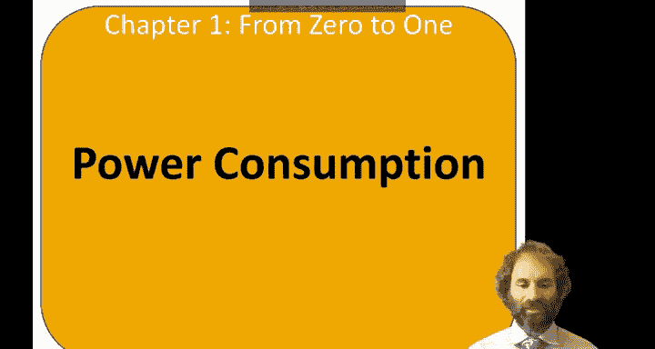
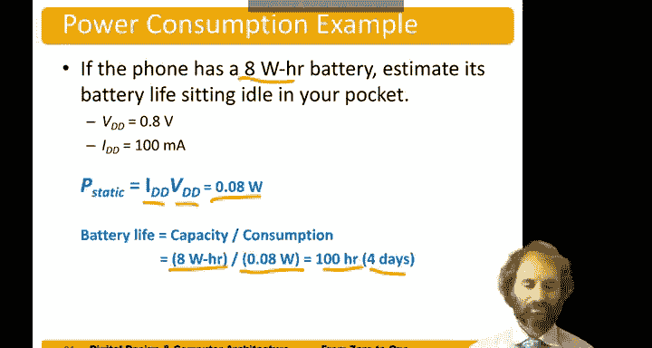

# 数字设计和计算机架构：1.11：数字电路的功耗 💡

在本节课程中，我们将学习数字电路功耗的基本概念。功耗是衡量电路能量消耗速率的关键指标，理解它对于设计高效、节能的电子系统至关重要。

## 概述

功耗由两部分组成：动态功耗和静态功耗。动态功耗源于电路开关时电容的充放电过程，而静态功耗则是在电路不进行任何操作时持续存在的能量消耗。

## 动态功耗

上一节我们介绍了功耗的基本定义，本节中我们来看看动态功耗的具体计算。在电子学中，晶体管栅极可以等效为电容。这个电容由金属栅极、绝缘的二氧化硅层和导电沟道构成。

为电容从地电平充电到电源电压 `VDD` 所需的能量为 `C * V^2`。假设电路以频率 `F` 运行，即每秒 `F` 个周期，并且电容平均每秒充电 `α` 次（因为从1放电到0是免费的），那么消耗的功率就是每次充电的能量 `C * V^2` 乘以每秒充电的次数 `α * F`。

因此，动态功耗的公式为：
**P_dynamic = α * C * V^2 * F**

### 活动因子详解

以下是关于活动因子 `α` 的进一步说明。活动因子是电容被充电的周期所占的比例。

*   **时钟信号**：时钟在每个周期内上升和下降一次。因此，每个周期电容都会充电和放电各一次，活动因子为 **1**。
*   **周期性切换的数据信号**：如果一个数据信号在每个周期都从0变到1或从1变到0，那么一半的周期在充电，另一半在放电，活动因子为 **0.5**。
*   **随机数据**：对于真正的随机数据，大约每两个周期发生一次切换事件，且其中一半是充电事件。因此，只有四分之一的周期在为电容充电，活动因子为 **0.25**。

在实际的数字系统中，连续周期的数据值之间通常存在相关性，它们更可能保持不变。在这种情况下，活动因子会更低。对于数字逻辑电路，**10%** 的活动因子相当常见。

## 静态功耗

静态功耗是在没有门电路切换时也持续消耗的功率。这由电源的静态电流（也称为漏电流）引起。在现代芯片中，静态功耗主要源于晶体管尺寸变得非常小，即使在试图关闭时也无法完全关断，仍会有纳安或皮安级的漏电流。当乘以芯片上数十亿个晶体管时，其总量就变得相当可观。

静态功耗的计算公式为：
**P_static = I_static * V**

## 单位回顾

了解相关单位对计算很有帮助，因为芯片的参数通常数值很小、频率很高。

*   **电容**：通常在飞法（`10^-15` F）到皮法（`10^-12` F）量级。
*   **电流**：通常在微安（`10^-6` A）到纳安（`10^-9` A）量级。
*   **频率**：通常在兆赫兹（百万次/秒）到吉赫兹（十亿次/秒）量级。

## 功耗估算实例

假设我们有一部正在运行“愤怒的小鸟”游戏的手机，我们来估算其功耗。

给定参数：
*   电源电压 `V = 0.8 V`
*   平均开关电容 `C = 5 nF` （`5 * 10^-9 F`）
*   工作频率 `F = 2 GHz` （`2 * 10^9 Hz`）
*   活动因子 `α = 10%` （`0.1`）
*   静态电流 `I_static = 100 mA` （`0.1 A`）

**计算动态功耗**：
`P_dynamic = 0.1 * (5e-9) * (0.8)^2 * (2e9) = 0.64 W`

**计算静态功耗**：
`P_static = 0.1 * 0.8 = 0.08 W`

**总功耗**：
`P_total = P_dynamic + P_static = 0.64 + 0.08 = 0.72 W`

通常，静态功耗远小于动态功耗。手机在运行时消耗约 `0.72 W` 的功率。

## 电池续航估算

大多数时候，手机处于口袋中的空闲状态，动态功耗很低。假设手机电池容量为 `8 Wh`（瓦时），我们想估算其待机时间。

首先计算空闲时的功耗（主要是静态功耗）：
`P_idle ≈ P_static = 0.08 W`

然后计算电池续航时间：
`电池寿命 = 电池容量 / 功耗 = 8 Wh / 0.08 W = 100 小时`

如果手机完全处于空闲状态且不被使用，电池续航时间约为100小时，即超过4天。

## 总结

本节课中我们一起学习了数字电路功耗的核心概念。我们了解到总功耗由 **动态功耗**（`P_dynamic = α * C * V^2 * F`）和 **静态功耗**（`P_static = I_static * V`）两部分组成。动态功耗与电容、电压平方、频率及活动因子成正比；静态功耗则由漏电流引起。通过一个手机功耗的实例，我们演示了如何应用这些公式进行估算，这对于设计低功耗电子系统具有重要意义。