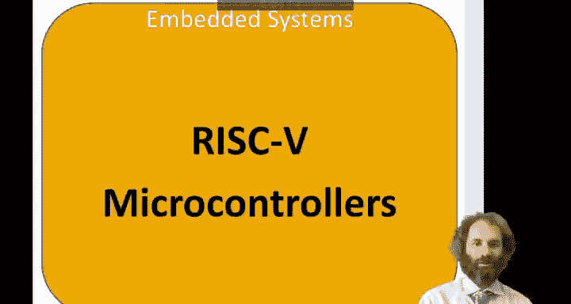
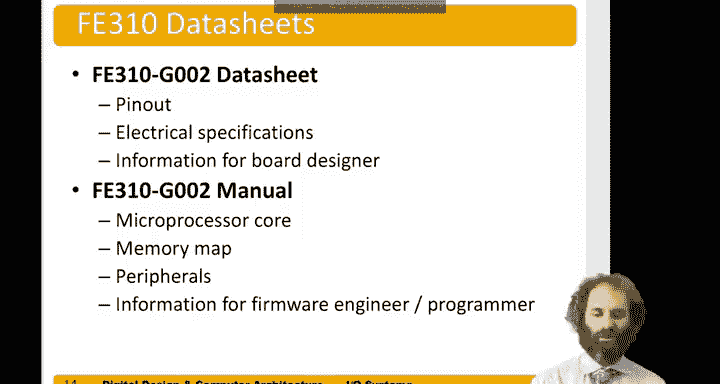

# 哈维穆德学院《数字设计和计算机架构RISC版｜Digital Design and Computer Architecture： RISC-V Edition》 - P130：Chapter 9 2.RISC-V Microcontrollers.zh_en - GPT中英字幕课程资源 - BV1JC1MY1E7F

Hello， in this video， we'll be talking about risk5 microcontrollers。

Risk5 is a relatively new architecture， it's an open standard architecture that sets it aside from most others。

 originally developed at Berkeley starting in 2010。It has no licensing fees。

 so anybody can build risk 5 microprocessors， however they want without having to pay fees or patents。

And because of this， they've become increasingly popular， especially for embedded system on ship。

 where the processor is going inside a larger chip。

The architecture is fairly new and there's only one microcontroller widely available for Risk5 right now。

 it's the Psi5 Freedom E3 and Generation 2 chip。Released in 2019。

 and it's available on several fairly low cost boards。

The Freedom E310 microprocessor is a microcontroller with variety of things inside。

 first is the E31 microprocessor， has a five stage pipeline like we'll be talking about in chapter 7 of this class。

And it follows the RV 32 IMAC architecture。RV 32 I is the 32 B risk 5 integer instructions。

 the standard instruction set。And then in addition to that， there's several supplements。

 the M is for multiply and divide， hardware multipier and divider A is for atomic memory operations where you can do access that's not broken into pieces。

And C is for compressed operations of their instructions that are packed into 16 bits instead of 32 for code efficiency。

This processor gets reasonably good performance， benchmarks of 2。73 core marks per megahertz。So。H。

A fancy processor could do quite a bit better than that， but this is not bad。

chipip operates up to 320 MHz， which is relatively fast as microcontlerers go。

 even though it was built in an antiquated 1 80 nanom process。And the chip operates off of 1。

8 volts for the core， and then 3。3 volts for IO to the rest of the world。

The Freedom 310 has a variety of onboard memory。Has a 16 kiloB static Ram for data for holding your most common variables。

 In fact， all your variables。 That's all the Ram that's built in。

It also has a 16 kB instruction cache for holding the most recently as instructions。

It has two kinds of roms， an8 kiloby mask rom that's programmed at the factory and another 8 kilote one time programmable rom for boot。

And all these really do is when you reset the processor。

 they point the processor to the right location to begin fetching instructions。

And most of the instructions then come from an external flashship。

The processor has a bunch of bio peripherals。It has 19 pins available for general purpose I O that can be driven high or low。

It has several serial ports， two serial peripheral interfaces accessible to the user。

 plus a third one for communicating with the external flash。An I squared C。And two U art。

 cereal ports。Has three blocks for generating pulse width modulated outputs， a timer。

 and a debug interface over JTAC。Here's the pin out of the processor。

 It comes in a 48 pin QFN quad flat pack。You'll notice that the pads for this chip are underneath。

 So soldering has to be done by putting solder on pads of a circuit board underneath and then carefully aligning this chip and heating。

 It's not something that's terribly easy to do by hand。Of the 48 pins。

 the purpose is listed over here，12 of those pins are power and ground。 for instance， VD D。I O VDD。

Analoggue， VDD， and so on。19 are available for general purpose IO。So here is GPIO number 9。

 number 10， number 11。F of them are used for。A JTAG programmer that stands for Jot test access Group。

 so standard for programming embedded systems。Six are used for fetching instructions over SPI from flash memory。

Two hook up to the clock crystal and six are for other control。🤧嗯。

Then these processors are mounted on boards， here are three commercially available FP310 boards。

And each one receive the processor。If310 processor。The Spark fun red 5 thing plus board。Is $30。

It fits in a breadboard。 It's nice and small， about the size of a pack of gum。

One drawback is the pins don't come soldered by default。

So you need access to a solduttering iron to a solder pins on。

But that's the one that we're using in this class。For $40， you can get the Spark fun Red5。Redboard。

 which is similar。 It's a little larger， and it has the。Pins already solded on for us。

Weird thing about this is it uses adual pin numbers。Instead of the。

Pin numbers corresponding with the processor。 So anytime you want to talk to a pin。

 you have to look up。See how the pin numbers written on this board mapped the actual pin numbers of the processor。

One more option is the high5 board from SI5， it's a bit more money and it comes with Wi Fi and Bluetooth built in。

So all three boards are functionally similar。 They all operate off of USB connection that supplies power and lets you program and debug the board。

They will also have an external power connector so you could use the device without a USB connection。

They all have 19 IO pins tapped out two pins on the board。

 and the software is compatible for all of them。In this course。

 we're going to use the red5 thing plus board for a lapse because it's the lowest cost and because it easily plugs into a breadboard。

As we study what's on the board we need to refer to two data sheets。

 the first one is the FE310Gs generationration 2 data sheet that had the pin out。

 the electrical specifications， functionss， what voltages are used and information that would be relevant to somebody designing a circuit board。

The main one we'll refer to in this chapter is the F310 manual。

That talks about the specs of the microprocess at core。

 it talks about the memory map and the peripherals。

 and it has all the information that a firmware engineer or programmer would need。

