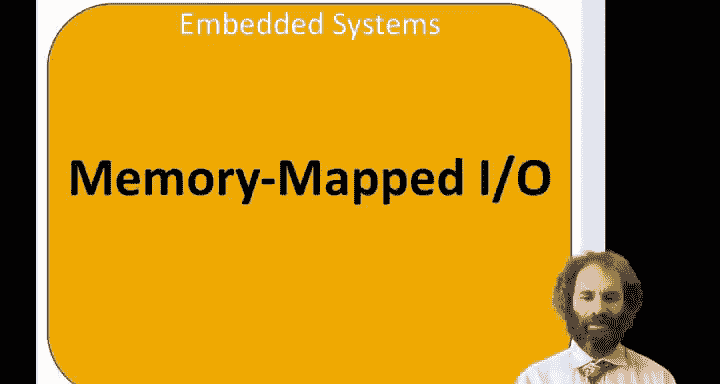
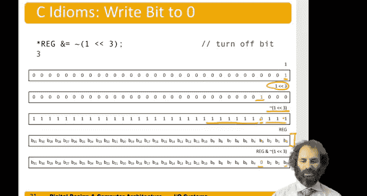

# 哈维穆德学院《数字设计和计算机架构RISC版｜Digital Design and Computer Architecture： RISC-V Edition》 - P131：Chapter 9 3.Memory-mapped I O.zh_en - GPT中英字幕课程资源 - BV1JC1MY1E7F

Hello， in this video， we'll be talking about memory mapped input and output。

So under memory mapped input and output， we control peripherals by reading or writing memory locations that are called registers。

This is a little bit misleading term。 They're not necessarily a bank of flip flops。

 but theres some place in memory where by， say， writing to that memory location。

 we can cause physical things to happen in the real world。 and by reading。

 we could measure the state of the real world。So part of the address space in our processor is reserved for IO registers rather than for program or data。

And in C， we use pointers to specify such addresses to read or write。

Here's an example of the memory map of the FE310。We see。ARound address。1000 through1 FFF。Is boot ra。

 And I'm just calling that 1000 for convenience， even though it's obviously a longer number。

So when the processor starts， it begins fetching instructions out of that rom。

 And the first thing it does is jump to the one time progable ro。That， in turn。

Soon jumps into the code flash。So the program is stored in flash memory。And as in these addresses。

 I'll call that 2 million through almost 4 million。There's also staticogram。

Starting at this location， call that 8 million。And then there are a bunch of peripherals。

And they are at different addresses in memory。Spanning this range。

And we'll look at several of those peripherals in this chapter。

So let's jump in with an example of memory map Di O in C。

We'll start by including STD int so that we can define our integers of various sizes。

And the registers are 32 B registers。 So let's。Use the unsigned integer 32 type。

To represent a 32 B number。We are。Let's say we want to use two registers。

 One is an input value for general purposepoo and one is an output value。

 and we'll talk later about exactly what this means。

These registers have 32 bits in them that can tell you the value3 of an IO pin or drive a value out to the pin。

For the input and the output registers。We saw that the GPIO。

Is in this memory of location starting at 10，012000。10012000。

 and the input registers at exactly that address， the GPIO output value is a 12 byte slate。

So let's declare pointers to these addresses so we can read and write what's at the address。

They are a pointer to an unsigned in 32。And。Will declare them as volatile。

Which tells C that the value might be changing。Outside the program's control。

 and that any time we want to look at that value， we actually need to go out to the memory map and fetch what's from there。

 rather than assuming that it was the same as the last time we fetched it。

So if we wanted to read the value of all 32 GPIOs。We could take that pointer to the input register。

Do you reference it。And that will give us a 32 bit number。And we just put it in a register。

But it didn' a variable。Suppose in particular， we wanted to know the value of Bi 19 of the GPIO。

So of that 32 bit register， we need to extract bit 19。Can do that by first getting the entire 32 Bs。

 Then we can shift it right by 19。And end it with a one。And that will leave us either a0 or one。

With the value of the 19th bit of GI。Let's say we wanted to wait for that bit to become 0。

We could have a while loop。Inside this wild loop， we are looking at the value of the bit。

As long as it's one， this value is one， and the while loop is true。

 So we wait until it's no longer one。 and now the bit is 0。Similarly。

 if we wanted to wait for bit 19 to be1， we could put a knot before this。 so while the value is0。

 we wait once it becomes1， we stop waiting。If we wanted to write a one to a particular bit。

 let's say bit 5。We could take a one shift it left by5。

 So now we have a one in column 5 and zeros everywhere else and or it with the existing value of the register。

And that will put a one into the fifth bit and leave all the other bits unchanged。Similarly。

 if we wanted to force the fifth bit to be 0， we could take a one。

 move it left by5 into the fifth column， and then knot it。

And now we are left with ones in every column， except the fifth bit， a 0 and the fifth bit。

If we end that with the value of the GPIO register。Then。We will leave all anything and one is itself。

 Anything and 0 is 0。 So we'll leave all the bits the same。 except bit 5， which will be forced to 0。

Let's take a look at that in a little more detail。So let's say we wanted to read the value of the third bit of a particular register。

So we have the pointer that register。 We dereference that pointer。

And we come out with this 32 bit value。If we then shift it left by three。Bit 3。

Goes into the bottom position。 The other bits move over， and we're left with zeros in the top。Then。

 if we and。That。With the number one。A one is a one in the least significant bit。

And zeros every wellis。 So B3 and1 gives us B3。 All the other bits are 0。

So leaves us with a 32 bit number that's either 0 or1。

 corresponding with a third bit of the register。As another example。

 if we wanted to write the bit to one。Let's start。With a one。We'll shift it left by3。

 So now there's a one in the third column and zeros everywhere else。

Then we'll read the value of the register。Gives us a 32 B value。We'll or it。

With the one in the third column。 So0 or anything as itself that leaves all the other bits of B。

But one or something is one。 so we force a one into the third column。

And we've changed the IO register to be now have a one in the third column and a0 everywhere else。

Finally， if we want to write a zero to a particular bit。Let's start with our one。Shift it left by3。

 Now that's so one in the third column。Now， we invert that。 So we've got zeros in all the columns。

 except that one in the third column。Now， if we and with the value of B， one and anything mix。Itself。

0 and anything makes 0。 So we're left with all the bits of B unchanged。

 except the third bit is forced to 0。

