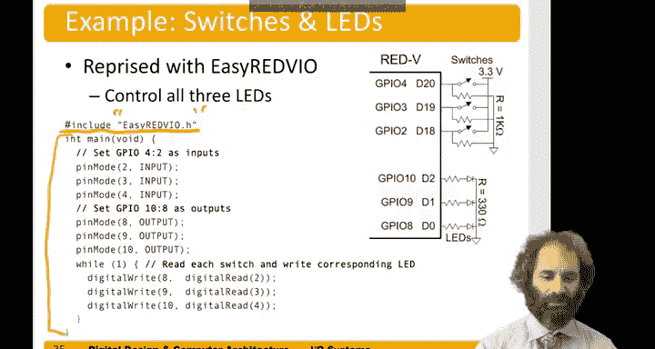

# 数字设计和计算机架构RISC版：9.5：RISC-V设备驱动库 🧩


在本节课程中，我们将学习如何为RISC-V开发一个简单的GPIO设备驱动库。我们将了解直接使用内存映射指针的局限性，并学习如何通过结构体和函数来抽象硬件操作，从而编写更清晰、更易维护的代码。

---

## 直接内存映射I/O的局限性

上一节我们介绍了通过指针直接操作内存映射I/O的方法。虽然这种方法很直接，但在大型系统中存在一些缺点。

以下是直接使用指针的几个主要问题：
*   **难以把握全局**：如果只是向特定的内存地址写入数据，开发者必须不断查阅手册来确认每个地址的功能，这容易造成混淆。
*   **容易出错**：GPIO的地址通常很长（例如8位十六进制数），输入时一个字符的错误就会导致写入错误的内存位置，程序将无法正常工作。
*   **对初学者不友好**：许多C语言初学者对指针操作的理解不够深入，使用晦涩的指针赋值语句会增加学习难度。

因此，我们将编写一个设备驱动库来隐藏底层细节，让我们能以更抽象的方式访问GPIO。这个库将提供一个类似Arduino风格的接口。

---

## 使用结构体定义内存映射

本节中，我们将使用结构体来代替简单的指针定义内存映射I/O。你可能还记得，通过结构体，我们可以指向内存中结构体的起始位置，然后将后续的内存位置作为结构体的成员来访问。

这意味着我们无需像使用指针那样手动输入所有地址，从而得到更清晰、更易读的C代码。

以下是我们 `easyrv5io` 库中GPIO的定义。首先，我们定义引脚模式：
```c
#define INPUT 0
#define OUTPUT 1
```

接下来，声明一个用于GPIO寄存器的结构体：
```c
typedef struct {
    volatile uint32_t input_val;
    volatile uint32_t input_en;
    volatile uint32_t output_en;
    volatile uint32_t output_val;
    // ... 可能还有其他寄存器
} gpio_t;
```
这个结构体包含多个32位无符号整数，它们对应GPIO的各个寄存器。偏移量0是输入值寄存器，偏移量4是输入使能寄存器，偏移量8是输出使能寄存器，偏移量C（12）是输出值寄存器。这些是内存映射I/O中GPIO部分的前四个寄存器。

然后，我们定义GPIO的基地址：
```c
#define GPIO0_BASE 0x10012000U
```
这个地址是GPIO在内存映射中的起始位置。末尾的 `U` 表示这是一个无符号十六进制数。我们称其为 `GPIO0_BASE`。我们的芯片只实现了最多32个GPIO，因此只需要一个GPIO内存区域，但芯片的后续版本可能会实现更多。

最后，我们声明一个指向该基地址处GPIO结构体的指针：
```c
#define GPIO0 ((gpio_t *) GPIO0_BASE)
```
现在，我们有了一个指向结构体的指针，该结构体的成员对应着硬件所在的内存位置。

---

## 实现用户友好的GPIO函数

现在，让我们看看如何使用这个结构体来访问GPIO，以便编写友好的函数。

**`digitalRead` 函数**：该函数接收我们想要读取的引脚编号，并返回该引脚上的值（0或1）。
```c
int digitalRead(int pin) {
    return (GPIO0->input_val >> pin) & 1;
}
```
它通过我们便捷的 `GPIO0` 结构体指针（实际上指向内存映射GPIO的起始位置）来工作。读取结构体的 `input_val` 字段，这让我们从地址 `0x10012000` 获取全部32位输入值。然后，通过右移操作将目标GPIO引脚的值移到最低位，并与1进行与操作，以屏蔽掉其他引脚的值。最终，我们得到对应引脚值的0或1。

**`digitalWrite` 函数**：该函数接收我们想要写入的引脚编号和要写入的值。
```c
void digitalWrite(int pin, int val) {
    if (val == 1) {
        GPIO0->output_val |= (1 << pin); // 将对应位置1
    } else {
        GPIO0->output_val &= ~(1 << pin); // 将对应位置0
    }
}
```
如果值为1，我们通过或操作将GPIO输出值寄存器的对应位置1。否则，我们将除了目标位之外的所有位都置为1，而目标位置0，以关闭该引脚。

**`pinMode` 函数**：该函数设置引脚的模式，可以是输入或输出。
```c
void pinMode(int pin, int function) {
    if (function == INPUT) {
        // 设置为输入：使能输入，禁用输出和IO功能
        GPIO0->input_en |= (1 << pin);
        GPIO0->output_en &= ~(1 << pin);
        // 假设有IO功能寄存器，也需禁用
        // GPIO0->iof_en &= ~(1 << pin);
    } else if (function == OUTPUT) {
        // 设置为输出：使能输出，禁用输入和IO功能
        GPIO0->output_en |= (1 << pin);
        GPIO0->input_en &= ~(1 << pin);
        // GPIO0->iof_en &= ~(1 << pin);
    }
}
```
如果功能是输入，我们通过或操作将输入使能寄存器的对应位置1，并关闭输出使能和IO功能使能寄存器，使其成为输入而非输出或特殊功能。类似地，如果要将引脚设置为输出，我们则将输出使能寄存器的对应位置1，并关闭输入和IO功能寄存器。

---

## 应用驱动库编写程序

最后，让我们应用这个驱动库来编写一个更易读的程序。该程序读取三个开关的状态，并相应地控制三个LED。

我们首先包含头文件：
```c
#include "easyrv5io.h"
```
使用引号而非尖括号，是告诉编译器在我们的项目文件夹中寻找该文件，而不是在系统目录中。

现在，我们的主程序如下：
```c
int main() {
    // 假设开关连接到GPIO2到GPIO4（在Red5开发板上对应D18到D20）
    pinMode(2, INPUT);
    pinMode(3, INPUT);
    pinMode(4, INPUT);

    // 假设LED连接到GPIO8到GPIO10
    pinMode(8, OUTPUT);
    pinMode(9, OUTPUT);
    pinMode(10, OUTPUT);

    while (1) {
        // 读取GPIO2（第一个开关）的值，并写入GPIO8（第一个LED）
        digitalWrite(8, digitalRead(2));
        // 对第二对和第三对开关/LED执行相同操作
        digitalWrite(9, digitalRead(3));
        digitalWrite(10, digitalRead(4));
    }
    return 0;
}
```
这样，我们就完成了我们的程序。



---

## 总结

本节课中，我们一起学习了如何为RISC-V处理器构建一个简单的GPIO设备驱动库。我们首先分析了直接使用内存映射指针的缺点，然后引入了使用结构体来更清晰、更安全地定义硬件寄存器的方法。接着，我们实现了 `digitalRead`、`digitalWrite` 和 `pinMode` 等用户友好的函数，将底层硬件操作封装起来。最后，我们应用这个库编写了一个控制开关和LED的程序，演示了如何使代码更易读和维护。通过创建这样的抽象层，我们可以让I/O操作对开发者更加友好，尤其是对于初学者而言。