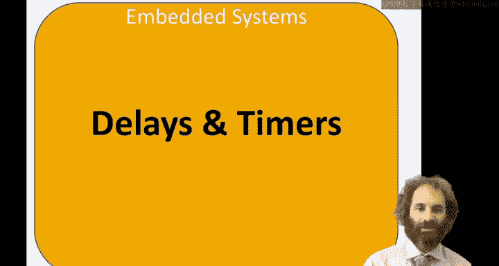
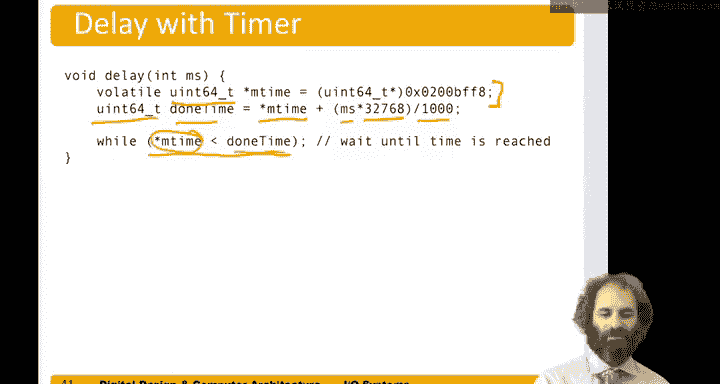

# 数字设计和计算机架构：9.6：定时器 ⏱️

在本节中，我们将学习如何在微控制器上实现延时和使用定时器。我们将从简单的软件延时循环开始，然后介绍更精确、更可靠的硬件定时器使用方法。



## 概述

与真实世界交互时，最常见需求之一是测量时间或生成特定的时间间隔。本节将介绍两种实现方法：基于循环的软件延时和使用硬件定时器的精确延时。

## 软件延时循环

首先，我们来看一种简单的延时方法：在程序中编写一个循环。

假设我们需要延时特定的毫秒数。可以声明一个整数变量，将其设置为某个初始值，然后递减计数到零。通过校准每毫秒所需的循环次数，可以实现大致的时间延迟。

以下是实现此功能的核心代码逻辑：

```c
int i = desired_milliseconds * counts_per_millisecond;
while (i-- > 0) {
    // 空循环，消耗时间
}
```

通过实验校准，发现大约需要1600次计数才能延时1毫秒，即每秒约160万次计数。

基于此延时函数，我们可以编写一个让LED闪烁的程序。例如，将引脚5设置为输出（连接蓝色LED），然后在循环中先点亮LED，延时500毫秒，再熄灭LED，再延时500毫秒，如此反复。

```c
// 伪代码示例
set_pin_as_output(5);
while (1) {
    turn_on_pin(5);
    delay_ms(500);
    turn_off_pin(5);
    delay_ms(500);
}
```

然而，这种延时循环方法存在几个问题。首先，手动校准每毫秒的计数次数非常繁琐。其次，校准结果可能不精确（例如，是1600还是1670？）。最后，如果编译器优化策略改变，生成了运行更快的代码，那么实际的延时长度就会变得不准确。

## 硬件定时器

为了解决软件延时的问题，微控制器通常配备了一种称为“定时器”的外设。这是一种更可靠的延时方法。

我们使用的微控制器拥有一个64位的定时器，它通过一个外部的32.768 kHz振荡器进行计数。这意味着定时器每秒钟会计数32768次。

根据手册，我们可以通过访问内存映射外设中的特定寄存器来使用这个定时器。该寄存器位于核心本地中断器的内存映射区域，地址为 `0x200BFF8`。它是一个64位的寄存器，名为 `MTIME`。读取这个寄存器，就能获得系统启动以来经过的、以32kHz时钟周期为单位的时间。

以下是使用硬件定时器实现延时的步骤：

1.  声明一个指向该寄存器的指针。由于寄存器是64位的，指针类型应为 `uint64_t*`。
2.  声明一个 `uint64_t` 类型的变量来存储目标完成时间。
3.  计算目标时间：`完成时间 = 当前时间 + 所需延时毫秒数 * (32768 / 1000)`。
4.  循环读取当前时间，直到当前时间达到或超过目标完成时间。

核心计算公式如下：

**目标完成时间 = MTIME + (延时毫秒数 × 32.768)**

以下是代码实现的示意：

```c
volatile uint64_t *mtime = (uint64_t*)0x200BFF8; // 指向MTIME寄存器的指针

void delay_ms(uint64_t milliseconds) {
    uint64_t current_time = *mtime;
    uint64_t done_time = current_time + (milliseconds * 32768ULL / 1000ULL);
    while (*mtime < done_time) {
        // 等待，直到定时器值达到目标时间
    }
}
```

使用这种方法，延时精度由硬件振荡器保证，不受编译器优化或CPU速度变化的影响，因此更加精确和可靠。

## 总结

本节课我们一起学习了在微控制器上实现延时的两种方法。

我们首先介绍了简单的软件延时循环，它易于实现但存在校准繁琐、精度不高和受编译器影响等问题。

接着，我们探讨了更优的解决方案——使用硬件定时器。通过访问 `MTIME` 寄存器，我们可以基于稳定的外部振荡器进行精确计时。这种方法避免了软件延时的缺陷，是生成精确时间间隔的推荐方式。



理解这两种方法的区别和适用场景，对于进行嵌入式系统和硬件交互编程至关重要。