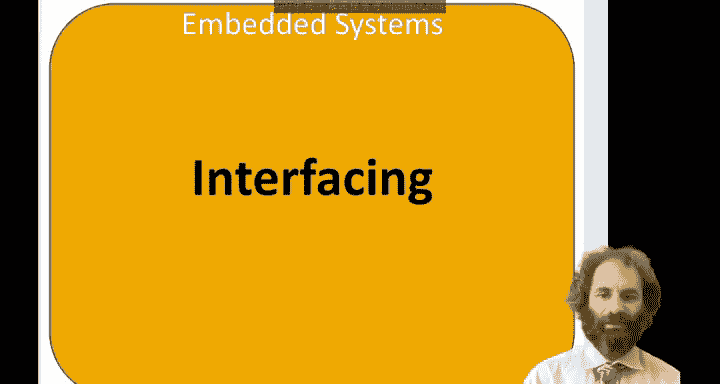
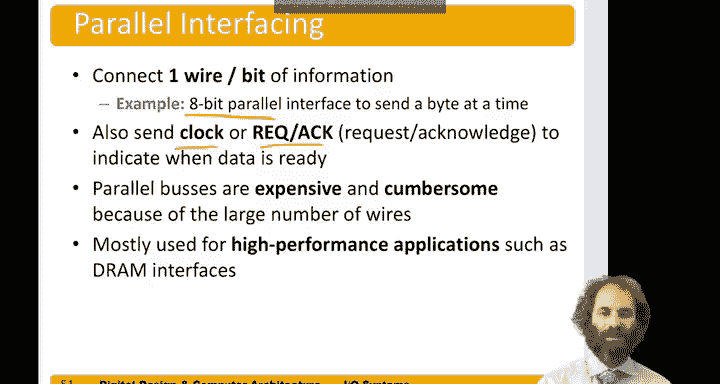

# 数字设计和计算机架构：9.8：接口技术 🖥️➡️🌍

在本节课程中，我们将学习接口技术，即如何在数字系统中将不同的组件连接在一起。我们将探讨与外部世界（如传感器、执行器或其他处理器）通信的几种主要方法。

## 概述

数字系统（如微控制器）需要与现实世界交互。这通常涉及连接到传感器以监测环境，连接到执行器以触发动作，或连接到其他处理器以交换信息。例如，在一个化工厂中，可能需要传感器来测量温度、pH值和湿度，同时需要执行器来启动电机或打开阀门。此外，系统中可能还有其他微控制器需要相互通信。为了实现这些连接，主要有三种通用的接口方法：并行接口、串行接口和模拟接口。

## 并行接口

上一节我们介绍了接口的基本概念，本节中我们首先来看看并行接口。在并行接口中，我们使用多根导线同时发送包含多个比特的完整信息。

**公式/概念**：发送N比特信息需要至少N根数据线。

如果信息量很大，需要大量导线，这种方法的成本会很高。除了数据线，通常还需要一根时钟线或某种握手信号（如请求和应答信号）来指示数据何时准备就绪。由于线缆数量多，并行总线通常笨重、不易弯曲且成本较高。因此，它主要用于高性能、短距离的通信，例如将动态RAM芯片连接到计算机主板上的处理器。

## 串行接口

由于并行接口在远距离或需要灵活布线的场景下存在不足，本节我们来看看串行接口。串行接口使用单根数据线，通过多次使用这根线来发送多位信息，从而减少了所需的物理连线。

以下是三种常见的串行接口标准：

*   **SPI (Serial Peripheral Interface)**：它使用一根时钟线、一根数据输出线和一根数据输入线。主设备通过多个时钟周期向从设备发送信息。例如，发送一个字节需要8个时钟周期，每个周期在数据输出线上发送一个比特，同时在数据输入线上接收一个比特。
*   **UART (Universal Asynchronous Receiver and Transmitter)**：它与SPI类似，但没有专用的时钟线，属于异步通信。通信双方需要预先约定数据传输速率，并自行检测数据跳变。
*   **I²C (Inter-Integrated Circuit)**：它使用一根时钟引脚和一根双向数据引脚。由于数据线是双向的，其使用稍微复杂一些。

所有这些标准都广泛应用。本课程将重点介绍SPI。此外，还有更复杂但功能强大的接口，如USB，它虽然也是串行传输（每周期一位），但可以通过极高的时钟频率实现每秒吉比特的数据传输速率。

## 模拟接口

数字系统处理的是离散的比特，而现实世界的许多信号（如电压、温度）是连续变化的模拟量。因此，我们需要模拟接口来进行转换。

主要有三种方式实现数字与模拟世界的交互：

*   **模数转换器 (ADC)**：用于将连续的模拟电压转换为一组与该电压成比例的数字比特。
    *   **公式/概念**：`数字值 ∝ 输入电压`
*   **数模转换器 (DAC)**：与ADC相反，它接收一个数字值，并产生一个与该数值成比例的模拟电压。
    *   **公式/概念**：`输出电压 ∝ 数字输入值`
*   **脉宽调制 (PWM)**：这种方法通过以足够高的频率在低电压和高电压之间快速切换一个数字信号来模拟模拟输出。当这个信号被平滑（滤波）后，其波形的平均值与期望的输出值成比例。
    *   **概念**：通过改变一个周期内高电平所占的时间比例（占空比）来控制平均输出电压。

## 总结

本节课中我们一起学习了数字系统中连接不同组件的接口技术。我们介绍了三种主要方法：**并行接口**（多线同时传输，适合高速短距通信）、**串行接口**（单线分时传输，常见标准有SPI、UART、I²C，节省连线）以及**模拟接口**（用于连接真实的模拟世界，涉及ADC、DAC和PWM技术）。理解这些接口是设计能够与现实世界有效交互的数字系统的关键。