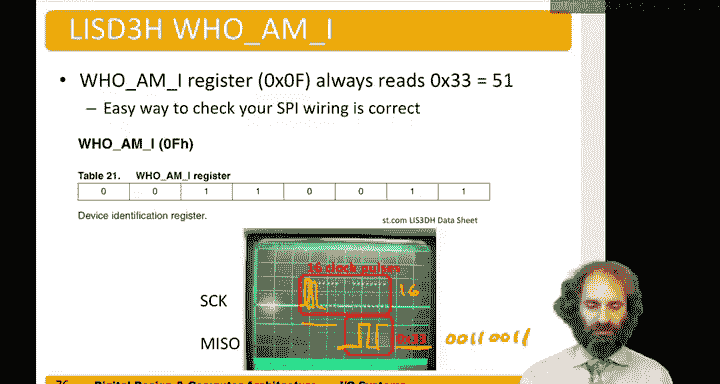
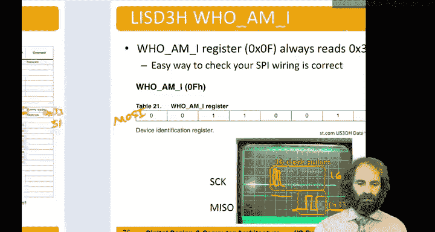
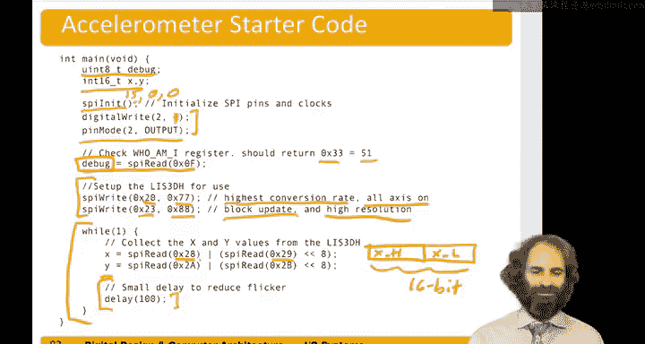

# 数字设计和计算机架构：9.10：SPI加速度计示例 🎯


在本节中，我们将学习如何通过SPI接口将加速度计连接到微控制器。我们将以LIS3DH三轴加速度计为例，介绍其工作原理、硬件连接、寄存器配置以及数据读取方法，并最终将其应用于一个数字水平仪项目中。

---

## 概述

LIS3DH是一款三轴加速度计，可测量X、Y和Z轴上的加速度，满量程最高可达±8G。它通过SPI接口以16位数据格式传输每个轴的测量值，灵敏度可低至1毫克。该芯片采用16引脚LGA封装，结构坚固。为了方便使用，Adafruit和SparkFun等公司提供了包含该芯片、支持电容电阻以及连接引脚的整体模块。

## 工作原理

加速度计内部采用微机电系统技术。它包含硅悬臂梁，这些梁被蚀刻在芯片上小于一平方毫米的区域中。梁上有一个导体，下方有另一个导体，两者之间形成电容。当施加加速度时，梁会移动，改变与下方导体的距离，从而改变电容。一个高精度的模数转换器感知此电容变化，并读出加速度值。此外，设备还包含温度传感器，用于补偿温度变化引起的热膨胀效应。

从我们的角度来看，它只是一个带有SPI接口的“黑盒”。我们可以发送命令来配置其工作模式，然后发送更多命令来读取各轴的加速度值。该设备同时支持SPI和I²C接口，本节我们专注于SPI。

## 硬件连接

以下是将LIS3DH连接到RISC-V开发板的步骤：
1.  连接共地，确保共同的参考电平。
2.  将开发板的3.3V输出连接到加速度计的VCC引脚。**注意：切勿使用5V，否则会损坏设备。**
3.  连接SPI接口所需的四根信号线：
    *   **SCK**：从主设备（RISC-V板）到从设备（加速度计）的串行时钟。
    *   **MOSI**：主设备输出，从设备输入。
    *   **MISO**：主设备输入，从设备输出。
    *   **CS**：片选信号（例如使用引脚2）。当该信号为低电平时，表示正在与加速度计通信。

## SPI通信协议

加速度计内部有一组寄存器，微控制器通过读写这些寄存器与之通信。每个寄存器有一个6位地址和8位数据。

访问寄存器需要使用16位的SPI事务。具体格式如下：
*   **第1位**：读写控制位（`RW`）。`1`表示读，`0`表示写。
*   **第2位**：单/多寄存器访问位（`MS`）。`0`表示访问单个寄存器。
*   **第3-8位**：6位寄存器地址。
*   **后续8位**：在写操作时，是待写入的8位数据；在读操作时，是用于填充时钟周期的哑元数据，同时从设备会在此阶段返回寄存器的8位内容。

整个通信过程需要将片选信号（`CS`）拉低，并在16个时钟周期内完成两次8位的SPI传输。

### 写操作流程
1.  拉低`CS`。
2.  发送第一个8位数据：`RW=0`， `MS=0`， 以及6位地址。
3.  发送第二个8位数据：待写入的8位数值。
4.  拉高`CS`。此时返回的8位数据无意义，可丢弃。

### 读操作流程
1.  拉低`CS`。
2.  发送第一个8位数据：`RW=1`， `MS=0`， 以及6位地址。
3.  发送第二个8位数据（哑元数据，如全0）。
4.  拉高`CS`。在第二个8位时钟周期内，从设备返回的8位数据即为目标寄存器的内容。

## 关键寄存器





以下是几个重要的寄存器：

### “我是谁”寄存器（WHO_AM_I）
*   **地址**：`0x0F`
*   **功能**：用于验证SPI通信是否正常。读取该寄存器应返回固定值`0x33`（十六进制）或`51`（十进制）。

### 控制寄存器1（CTRL_REG1）
*   **地址**：`0x20`
*   **功能**：用于开启各轴并设置采样率。
*   **配置示例**：写入`0x77`可开启X、Y、Z轴，并设置输出数据率为400Hz。

### 控制寄存器4（CTRL_REG4）
*   **地址**：`0x23`
*   **功能**：设置分辨率、量程等。
*   **配置示例**：写入`0x88`可启用高分辨率模式（16位输出）、设置量程为±2G，并启用块数据更新。

### 数据输出寄存器
每个轴（X, Y, Z）的加速度值由两个8位寄存器（低字节`OUT_X_L`和高字节`OUT_X_H`）共同组成一个16位的补码数。例如：
*   X轴低字节地址：`0x28`
*   X轴高字节地址：`0x29`

读取时，需要将高字节左移8位后与低字节组合。

## 数据校准

加速度计读取的原始值需要经过换算才能得到以G为单位的加速度。换算公式大致为：
`加速度(G) = (原始值 - 偏移量) * 比例系数`

为了获得精确的偏移量和比例系数，需要进行校准：
1.  将设备水平放置，读取各轴输出值，此值即为零加速度时的**偏移量**。
2.  将设备沿某一轴旋转±90度，读取输出值。结合水平时的读数，即可计算出该轴的**比例系数**。

## 代码实现

以下是如何用代码实现SPI读写和加速度计数据读取的示例框架：

```c
#include <stdint.h>
#include "spi.h" // 假设包含SPI操作函数

// 引脚定义
#define CS_PIN 2

// 向加速度计寄存器写入数据
void accel_write(uint8_t addr, uint8_t data) {
    digitalWrite(CS_PIN, LOW); // 选中设备
    spi_transfer((addr & 0x3F) | 0x00); // RW=0, 发送地址
    spi_transfer(data);                 // 发送数据
    digitalWrite(CS_PIN, HIGH); // 取消选中
}

// 从加速度计寄存器读取数据
uint8_t accel_read(uint8_t addr) {
    uint8_t value;
    digitalWrite(CS_PIN, LOW); // 选中设备
    spi_transfer((addr & 0x3F) | 0x80); // RW=1, 发送地址
    value = spi_transfer(0x00);         // 发送哑元数据并接收返回值
    digitalWrite(CS_PIN, HIGH); // 取消选中
    return value;
}

void setup() {
    // 初始化SPI，设置速率、相位等
    spi_init(SPI_MODE0, 500000);
    // 配置CS引脚为GPIO输出模式
    pinMode(CS_PIN, OUTPUT);
    digitalWrite(CS_PIN, HIGH); // 初始化为不选中状态

    // 1. 验证通信：读取WHO_AM_I寄存器
    uint8_t id = accel_read(0x0F);
    if(id != 0x33) {
        // 处理错误：通信失败
    }

    // 2. 配置加速度计
    accel_write(0x20, 0x77); // 开启所有轴，400Hz
    accel_write(0x23, 0x88); // 高分辨率模式，±2G，块更新
}

void loop() {
    // 3. 读取加速度数据
    int16_t accel_x;
    uint8_t x_low = accel_read(0x28);
    uint8_t x_high = accel_read(0x29);
    accel_x = (x_high << 8) | x_low; // 组合成16位有符号数

    // 同样的方法读取Y轴和Z轴
    // int16_t accel_y = ...;
    // int16_t accel_z = ...;

    // 此处可进行数据校准和后续处理
    delay(100); // 以10Hz频率采样
}
```

## 项目应用：数字水平仪

在实验8中，你将基于上述加速度计代码构建一个数字水平仪。目标是：
1.  校准加速度计，确定水平（0G）和倾斜（±1G）状态对应的原始值。
2.  连接一个8x8 LED点阵（实际使用其中7x7部分），用于显示一个光点。
3.  当开发板水平时，光点位于矩阵中心。
4.  当开发板向不同方向倾斜时，光点会向相应方向移动，从而直观显示倾斜状态。



这需要你使用开发板上的14个GPIO引脚以并行接口方式驱动LED点阵，并注意串联限流电阻以防止LED过流损坏。

---

## 总结

本节课我们一起学习了如何通过SPI接口连接和操作LIS3DH加速度计。我们了解了其硬件连接方法、SPI通信协议、关键寄存器的配置，以及如何读取和校准加速度数据。最后，我们探讨了如何将这些知识应用到一个具体的数字水平仪项目中。掌握这些内容，你就能在嵌入式系统中集成并使用类似的SPI传感器了。