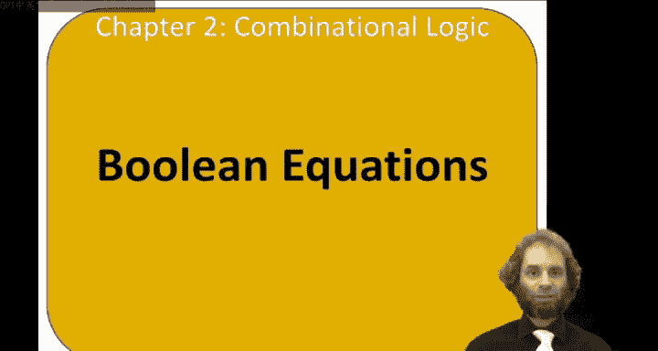
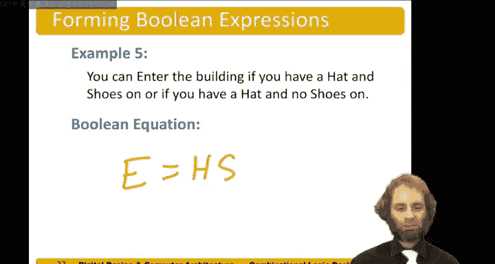

# 数字设计和计算机架构：2.3：布尔方程与SOP/POS形式 📚

在本节课中，我们将学习布尔方程，以及如何用“积之和”与“和之积”这两种标准形式来描述逻辑功能。布尔方程是定义数字逻辑模块功能的核心工具。

---

## 布尔方程简介

布尔方程是一种非常有用的方式，用于为逻辑模块提供功能规范。它们描述了输出如何依赖于输入项。

例如，在这个模块中，我们有三个输入，分别命名为 A、B 和 Cin，以及两个输出，命名为 S 和 Cout。每个输出都是三个输入变量的布尔函数。

我们可以这样描述：
*   S = A ⊕ B ⊕ Cin
*   Cout = (A AND B) OR (A AND Cin) OR (B AND Cin)

这就是用布尔方程描述的功能规范。

---

## 核心概念定义

在深入之前，我们先定义一些核心概念，这些概念将有助于后续的理解。

*   **补码**：一个变量上方带有一条横线。如果 A、B、C 是我们的变量，那么 `A̅`、`B̅`、`C̅` 就是它们的补码。
*   **文字**：一个变量或其补码。例如，对于变量 A、B、C，有 6 个文字：`A`、`A̅`、`B`、`B̅`、`C`、`C̅`。
*   **蕴含项**：文字的乘积，即文字的“与”运算。例如，`A B C̅`、`A̅ C`、`B C`、`B̅` 都是蕴含项。
*   **最小项**：一个包含所有输入变量（以原变量或补码形式出现）的乘积项。例如，`A B C̅` 是一个最小项，因为它包含了 A、B 和 C̅。而 `B C` 不是最小项，因为它没有包含 A 或 A̅。
*   **最大项**：文字的“或”运算，且包含所有输入变量。例如，`A OR B̅ OR C` 是一个最大项。而 `B̅ OR C` 不是最大项，因为它没有包含 A 或 A̅。

---

## 积之和形式

任何布尔方程都可以写成**积之和**形式。在这种形式中，我们使用最小项的和。

在真值表中，我们可以将每一行与一个最小项关联起来。例如，在这个真值表中：
*   第一行 (A=0, B=0) 对应最小项 `A̅ B̅`。
*   第二行 (A=0, B=1) 对应最小项 `A̅ B`。
*   第三行 (A=1, B=0) 对应最小项 `A B̅`。
*   第四行 (A=1, B=1) 对应最小项 `A B`。

假设我们有一个真值表，其输出 Y 具有特定的模式。为了找到其积之和形式的布尔方程，我们只需圈出输出 Y 为真的行，并读出这些行对应的最小项。

例如，如果 Y 在第一行和第三行为真，那么对应的最小项是 `A̅ B̅` 和 `A B̅`。因此，这个布尔函数的积之和方程为：
**Y = (A̅ B̅) OR (A B̅)**

观察这个方程，你可能会发现它可以简化为 `B̅`。我们稍后将讨论系统化的简化方法。

---

## 和之积形式

任何布尔方程也可以写成**和之积**形式。在这种形式中，我们使用最大项的积。

对于真值表的每一行，我们可以给出一个最大项，来描述“不在这行”的条件。例如：
*   对于行 (0, 0)，对应的最大项是 `A OR B`。因为如果 A 为真或 B 为真，我们就不在这一行。
*   对于行 (0, 1)，对应的最大项是 `A OR B̅`。
*   对于行 (1, 0)，对应的最大项是 `A̅ OR B`。
*   对于行 (1, 1)，对应的最大项是 `A̅ OR B̅`。

接下来，我们圈出所有输出为 0 的行。我们可以说，输出 Y 为真，当且仅当我们不在任何这些被圈出的行上。

因此，如果第一行和第三行输出为 0，对应的最大项是 `(A OR B)` 和 `(A̅ OR B)`。那么 Y 的和之积方程为：
**Y = (A OR B) AND (A̅ OR B)**

和之积形式通常不如积之和形式直观，也不是描述电路的常用方式，因此我们通常使用积之和形式。

---

## 实例分析：午餐决策电路

让我们通过一个例子来实践。假设我们想去食堂吃午餐，并需要一个电路来帮助我们做决定。规则是：如果食堂不干净，或者他们只供应肉饼，我们就不吃午餐。

我们构建真值表，输入是“干净”和“有肉饼”，输出是“吃午餐”。

根据规则：
1.  不干净，无肉饼：不吃（因为不干净）。
2.  不干净，有肉饼：不吃。
3.  干净，无肉饼：吃。
4.  干净，有肉饼：不吃（因为只有肉饼）。

**积之和形式**：这很简单。我们圈出唯一输出为 1 的行（第三行）。对应的最小项是：`C AND M̅`。因此方程为：
**Lunch = C AND (NOT M)**
（如果干净且没有肉饼，我们就吃午餐。）

**和之积形式**：我们需要圈出所有输出为 0 的行（第1、2、4行）。对应的最大项分别是：
*   行1: `C OR M`
*   行2: `C OR M̅`
*   行4: `C̅ OR M̅`

方程为：
**Lunch = (C OR M) AND (C OR M̅) AND (C̅ OR M̅)**
（如果这三个条件都满足，我们就吃午餐。）可以看到，这种形式不那么直观。

---

## 从文字描述到布尔方程

通常，你可以直接将文字描述翻译成布尔方程。以下是一些例子：

1.  **去公园**：如果不下雨并且我们有三明治，我们就去公园。
    *   `Park = (NOT Raining) AND Sandwiches`

2.  **成为赢家**：如果我们送你一百万美元或一个记事本，你就是赢家。
    *   `Winner = MillionDollars OR Notepad`

3.  **享用美食**：如果你自己制作，或者你有一位有才华但不贵的私人厨师，你就能享用美食。
    *   `DeliciousFood = MakeItYourself OR (PersonalChef AND Talented AND (NOT Expensive))`

4.  **进入大楼**：如果你戴着帽子并穿着鞋，或者你只戴着帽子，就可以进入。
    *   `Enter = (Hat AND Shoes) OR Hat` （注意：这可以简化为 `Enter = Hat`）

5.  **进入大楼（变体）**：如果你戴着帽子并穿着鞋，或者你戴着帽子但没穿鞋，就可以进入。
    *   `Enter = (Hat AND Shoes) OR (Hat AND (NOT Shoes))` （注意：这同样可以简化为 `Enter = Hat`）

---

## 总结

在本节课中，我们一起学习了布尔方程的核心概念及其两种标准形式。我们定义了**补码**、**文字**、**蕴含项**、**最小项**和**最大项**。我们重点掌握了如何从真值表推导出**积之和**方程，这是最直观和常用的形式。我们也了解了**和之积**形式作为另一种等价的描述方式。最后，我们通过实例练习了如何将日常的文字问题直接转化为布尔逻辑方程。掌握这些是设计和分析数字逻辑电路的基础。