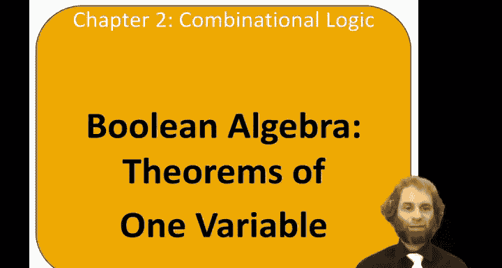
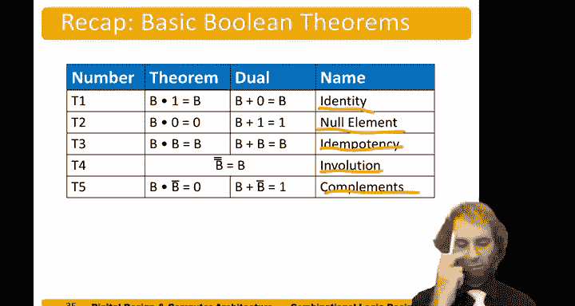

# 哈维穆德学院《数字设计和计算机架构RISC版｜Digital Design and Computer Architecture： RISC-V Edition》 - P17：Chapter 2 5.Boolean Theorems of One Variable.zh_en - GPT中英字幕课程资源 - BV1JC1MY1E7F

Hello， in this video， we'll talk about Boan algebra and particularly theorems of one variable。

So now that we've defined axioms， let's define a set of theorems Today on this video。

 we'll just lay them out。 And in the next video， we'll talk about how to do proofs。So。

Here we have a set of theorems。 and remember， duality applies we can replace and with or0 with one and get the duel of the theorems。

 So let's look at all of them together。Theorem 1 is the identity theorem。

It says that B and one is just B。So anything and one。Gives you back。

So one is the identity element for an。Likewise，0 is the identity element for or， because B or。

0 gives you back B。Theorem，2， describes the no element。B and 0 equals 0。

 Anything and 0 just gives you 0。 So 0 is the null element for ant。1 is the no element for or。

 because B， anything or one gives you one。Next theorem is item potency。B and B just makes B。B。

 or B makes B。An item potency comes from the Greek word for I have job security because I know big。

 fancy words。Theoreorem4。Is called involution。B， bar， bar is just B。

 So anything not of not gives you back the original。In other words， digital systems。

 two wrongs make a right。Finally， compliments。Anything and its complement gives 0。

Anything or its compliment gives one。So let's try to get a graphical understanding of these theorems。

The identity theorem， B， and one makes B。So if we have an end gate。AndWe're taking B and1。

We can simplify that to just a wire。Getting out B。Similarly， if we have an or gate for doing B or 0。

That's equivalent again， to just a wire。Giving us B。The null element theorem。Something and 0。

It's just equivalent to 0。Something or one。It's just equivalent to a wire connected to power。

Item potency。If we have an end gate that's getting both B and B。

 that's equivalent to just a wire with B。Likewise， an orgate。B or be。Is the same。As a wire giving B。

Identity。B going through two knot gates is the same as just B。And compliment。Bei。And not be。

Is the same as0。Be or not be。He's the same as one。So in summary， again， we have the identity。So。

Thing and the or the identity element gives you back itself。The no element。

 something and or the no element， gives you the no element。Item potency， something and or itself。

 just gives back itself。Involution，2 wronggs mecca， right。And compliment。

 something ander or its compliment gives the null element。

