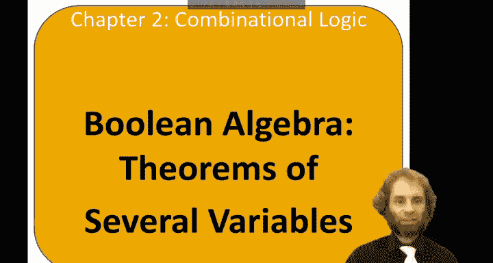
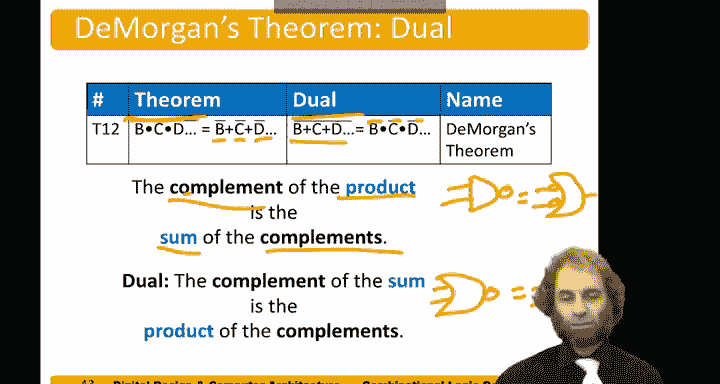

# 数字设计和计算机架构：2.6：多变量布尔定理 📚

在本节课程中，我们将学习涉及多个变量的布尔代数定理。这些定理对于简化布尔方程至关重要。我们将介绍这些定理的内容，并学习两种证明它们的方法。

上一节我们介绍了单变量的布尔定理，本节中我们来看看涉及多个变量的、更有趣的定理。

## 多变量定理

以下是几个重要的多变量布尔定理。

### 交换律
布尔代数具有交换律，即运算顺序不影响结果。
*   `B AND C = C AND B`
*   `B OR C = C OR B`

### 结合律
布尔代数具有结合律，即运算分组方式不影响结果。
*   `(B AND C) AND D = B AND (C AND D)`
*   `(B OR C) OR D = B OR (C OR D)`

### 分配律
布尔代数具有分配律，并且与常规代数不同，它对“与”和“或”运算都适用。
*   `B AND (C OR D) = (B AND C) OR (B AND D)`
*   `B OR (C AND D) = (B OR C) AND (B OR D)`

### 吸收律
吸收律允许我们消除不必要的变量以简化表达式。
*   `B AND (B OR C) = B`
*   `B OR (B AND C) = B`

### 合并律
合并律允许我们将两个具有互补变量的项合并为一项。
*   `(B AND C) OR (B AND NOT C) = B`
*   `(B OR C) AND (B OR NOT C) = B`

### 一致律
一致律指出，如果一个表达式包含 `B AND C`、`NOT B AND D` 和 `C AND D` 三项，那么最后一项是冗余的。
*   `(B AND C) OR (NOT B AND D) OR (C AND D) = (B AND C) OR (NOT B AND D)`

## 定理的证明方法

要证明这些定理，有两种通用方法。

### 完美归纳法
完美归纳法意味着尝试所有可能的变量组合（0和1）。由于变量数量有限，这种方法简单直接。

### 代数推导法
这种方法更传统，通过应用其他已知的定理和公理来逐步简化方程，直到证明两边相等。

## 证明示例

让我们通过一个例子来实践这两种证明方法。

### 证明吸收律：`B AND (B OR C) = B`

**使用完美归纳法证明：**
我们可以列出所有可能的 `B` 和 `C` 组合，并计算两边的值。通过对比真值表，可以发现两边的结果在所有情况下都完全相同，从而证明定理成立。

**使用代数推导法证明：**
我们可以通过一系列已知定理进行推导：
1.  从 `B AND (B OR C)` 开始。
2.  应用分配律：`(B AND B) OR (B AND C)`。
3.  应用幂等律：`B OR (B AND C)`。
4.  应用同一律（`B = B AND 1`）：`(B AND 1) OR (B AND C)`。
5.  应用分配律（逆用）：`B AND (1 OR C)`。
6.  应用零一律：`B AND 1`。
7.  应用同一律：`B`。
推导完成，`B AND (B OR C)` 简化为 `B`。

### 证明合并律：`(B AND C) OR (B AND NOT C) = B`

**使用代数推导法证明：**
1.  从 `(B AND C) OR (B AND NOT C)` 开始。
2.  应用分配律：`B AND (C OR NOT C)`。
3.  应用互补律：`B AND 1`。
4.  应用同一律：`B`。
推导完成。

## 德摩根定律

这是最有趣且非常有用的定理，尤其是在处理与非门和或非门时。

德摩根定律指出：
*   多个变量“与”运算后再取“非”，等于各变量取“非”后再进行“或”运算。
    *   `NOT (B AND C AND D) = (NOT B) OR (NOT C) OR (NOT D)`
*   多个变量“或”运算后再取“非”，等于各变量取“非”后再进行“与”运算。
    *   `NOT (B OR C OR D) = (NOT B) AND (NOT C) AND (NOT D)`

简而言之：
*   **“与”之非** 等于 **“非”之或**。
*   **“或”之非** 等于 **“非”之与**。

> 有一个关于德摩根定律的趣闻：一位数字设计专业的学生学习这些内容时感到头晕和头痛。他去看医生，说：“医生，医生，这些‘与’、‘或’、‘非’搞得我头好痛。” 医生说：“好吧，**不要**吃这片药，**也**不要吃那片药。” 或者等价地说，“既不吃这片药，也不吃那片药，然后早上给我打电话。”

---

本节课中我们一起学习了多变量的布尔定理。我们了解到布尔代数像常规代数一样，具有交换律、结合律和分配律。吸收律、合并律和一致律可以帮助我们简化表达式。最后，德摩根定律为我们提供了在“与”、“或”、“非”运算之间进行转换的强大工具，这在电路设计中尤其重要。