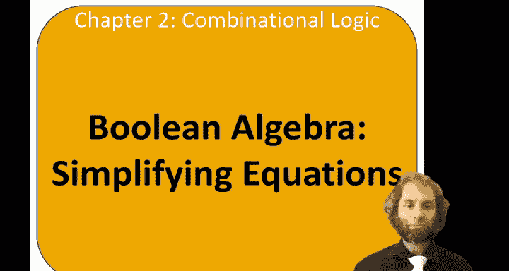
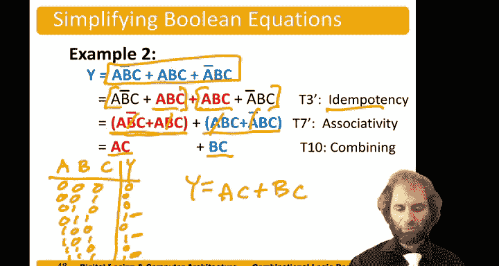

# 哈维穆德学院《数字设计和计算机架构RISC版｜Digital Design and Computer Architecture： RISC-V Edition》 - P19：Chapter 2 7.Simplifying Equations & Proving Theorems.zh_en - GPT中英字幕课程资源 - BV1JC1MY1E7F

Hello， the topic of this video is Boolean algebra。 and in particular。

 using Boolean algebra to simplify equations。

So simplifying could mean a variety of things。A one is to create a minimal sum of products expression。

And that means a sum products equation that has the fewest number of implicants where each implicant has the fewest literals。

So。Recall that the implicants are the products of literals。

And the literals are the variables in their complements。

So when we do some of products on a truth table， we get a bunch of minterms。

And then we could apply Boin algebra to simplify them to simpler implicate。However。

 other definitions of simplifying could be to get the fewest number of gates， the lowest cost。

 the lowest power consumption and many different metrics of interest。For example。

 if we had minimal sum of productss， that's y equals A and not B or A bar and B。Another。

 even though that's minimal sum of products， could also be built as y equals a exclusive or B。

 and in most implementation technologies， the XO would be simpler。

But the details depend on the technology。 So there is no close form way of saying one is always better than another。

Let's take some examples。 sayy we had a truth table， A， B， Y。0，0，0，1，1，0。And our output was 0，1，0，1。

I could circle the rows。This row is A bar， B。This row is A B。So。

This truth table gives us a sum of products expression。 Y equals。Hey， Barbie。Or A B。Now。

 that's clearly not the simplest。 And just by looking at this truth table。

 we see the output is true whenever B is true。So by inspection。

 we might just be able to write y equals B。We can also use the combining theorem T 10 to see that we have a bar。

And a， when we have B and either a bar or a。Then we just simplify a B。

If you didn't remember the combining theorem， you could use， say， the distributed property。

That we combine the B。B and a or a bar。Then using compliments， A or A bar is just one。

 And then by the identity， B and one is just。Let's do another example。Let say， we had a truth table。

And let's put some ones。In。This row。This row。And。😔，Thisel。So。And did that to give us。

This summer products expression。That one is correct。But again， it's not minimal。 This time。

 the truthth table might be a little bit too complicated to read off the answer by inspection。

We could apply Boy algebra， to simplify。And here's a clever simplification that's maybe not obvious at first。

We can take this AB， C term and duplicate it， using item potency。Now。

We can combine the first two terms。And we can combine the second two terms。Now。

 the first two terms differ only in B。B versus B。So we can combine those away。

To get y equals A and C。The second term only differs a bar versus A Comality is B C。 So again。

 we can combine to get B C。And finally， we get y equals AC or B。So。😔，The output is true。

If A and C are both true。Which is this row。And。😔，This real。Or if B and C are both true。

Which is this surreal。And this room。So sure enough， our equation is correct。

