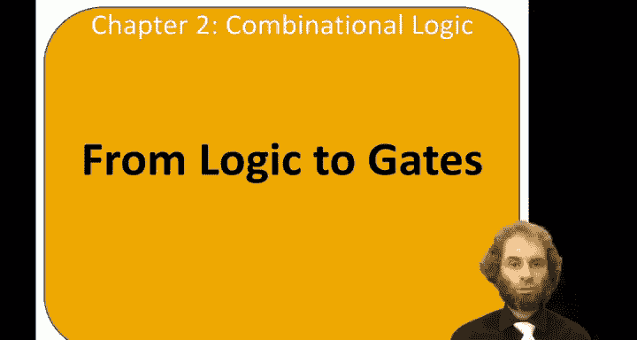
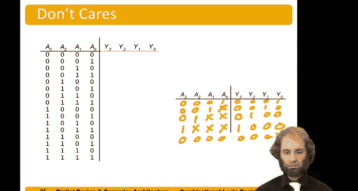

# 数字设计和计算机架构：2.8：从逻辑到门电路 🧠➡️🔌

在本节中，我们将学习如何将布尔方程转换为实际的逻辑门电路。我们将从简单的例子开始，逐步介绍绘制可读电路图的规则，并探讨多级逻辑和多输出电路的设计。

---

## 从布尔方程到门电路

假设我们有一个布尔方程，我们希望在暗巷中实现它，并用逻辑门来构建。我们可以直接解读这个方程。例如，我们有 **A and B bar**。

所以，这里有一个与门。然后我们将其反转，得到 **A and B bar**。接下来，我们需要 **C and C bar and D， and E**。因此，将 C 反转，得到 **C bar**。然后与 D 和 E 进行与运算。最后，将所有这些结果进行或运算。

---

## 绘制可读电路图的规则

在绘制原理图时，有几个规则需要考虑，以确保图纸的可读性。

*   让数据流沿着合理的方向流动。通常，输入在左侧或顶部，流向右侧或底部的输出。
*   门电路通常从左向右流动。
*   尽可能保持导线笔直。在原理图中追踪一团乱麻般的导线非常困难。

以下是关于导线连接和交叉的约定：

*   当两条导线在 T 型节点处汇合时，它们总是连接的。不需要用点来表示连接，因为不连接是没有意义的。
*   当导线交叉时，如果没有点，表示它们不连接。
*   如果交叉处有点，则表示存在连接。
*   通过这种方式，我们可以明确地判断是否存在连接，并且只使用必要的连接点。

---

## 两级逻辑示例

让我们看一个两级逻辑的例子。这里有一个积之和表达式，我们来构建一个电路。

我们有输入 A、B 和 C。我喜欢将它们垂直排列，并同时列出它们的反相值：A bar、B bar 和 C bar。

现在，我们需要三个三输入与门。
*   第一个与门接收 A bar、B bar 和 C bar。
*   第二个与门接收 A、B bar 和 C bar。
*   第三个与门接收 A、B bar 和 C。

这样就得到了我们的最小项。然后，我们可以将它们进行或运算。

将输出汇集起来。通过这种方式，我们可以系统地绘制任何积之和表达式。

我们的输出是 Y。输入从左上角开始，向下延伸。输入及其反相值向下排列。然后，我们有一组与门来形成基于这些字面量的乘积项，并产生横向的输出。最后，我们有一组或门，每个输出对应一个，接收这些最小项。

---

## 多级逻辑

有时，使用多级更简单的门来构建多级逻辑更为方便。

例如，如果我们想构建一个八输入的异或门，我们可以使用 128 个不同的最小项，每个涉及八个不同的字面量，形成一个巨大的两级积之和电路。但更好的方法是使用仅需 7 个两输入异或门构成的树形结构。

另一个例子是一个由三级与非门和或非门构建的电路。这在芯片上很常见，因为当我们使用 CMOS 技术时，与非门和或非门是自然可用的。

---

## 多输出电路示例：优先权电路

现在，让我们看一些多输出电路的例子。以优先权电路为例。

优先权电路是一个盒子，有输入和输出。假设输入 3 具有最高优先级，输入 0 具有最低优先级。我们希望最多只激活一个输出，对应于具有最高优先级的输入。

*   如果 A3 为真，则我们希望 Y3 为真，其他所有输出为 0。
*   如果 A3 为假，但 A2 为真，则 Y2 应为真，Y3 为假，其他输出为假。
*   如果 A2 和 A3 都为假，但 A1 为真，则这是最高优先级，我们激活 Y1。
*   如果 A0 为真，且其他输入都为假，则 Y0 应为真。
*   如果所有输入都不为真，则所有输出都不为真。

这被称为优先权电路，在数字系统中有许多有用的应用。

我们可以为此设计硬件。可以通过一个巨大的积之和表达式，然后应用布尔代数进行简化来推导布尔表达式。但通常，通过观察就可以直接设计。

观察这个逻辑：
*   Y3 为真，当 A3 为真时。
*   Y2 为真，当 A3 为假且 A2 为真时。
*   Y1 为真，当 A3 和 A2 都为假，但 A1 为真时。
*   Y0 为真，当 A3、A2 和 A1 都为假，且 A0 为真时。

编写这样的大真值表相当繁琐。因此，另一个选择是利用无关项来简化它。

我们可以这样描述：
*   如果 A3 为真，那么我们不在乎 A2、A1 或 A0 是什么，我们使 Y3 为真，其他为假。这里的 X 表示“无关”。
*   如果 A3 为假，但 A2 为真，那么我们不在乎 A1 或 A0 是什么。Y3 将为假，但 Y2 将为真。
*   如果 A3 和 A2 都为假，A1 为真，那么 A0 是什么无关紧要。我们激活 Y1。
*   如果 A0 是最高优先级，那么我们激活 Y0。
*   如果所有输入都为 0，则输出全为 0。

这就是利用无关项来简化真值表的方法。

---

## 总结

在本节中，我们一起学习了如何将布尔方程转换为逻辑门电路。我们介绍了绘制清晰电路图的规则，通过实例练习了两级逻辑的构建，了解了多级逻辑的优势，并探讨了多输出电路（如优先权电路）的设计方法，包括利用“无关项”来简化设计。掌握这些从抽象逻辑到具体门电路的转换技能，是数字硬件设计的基础。