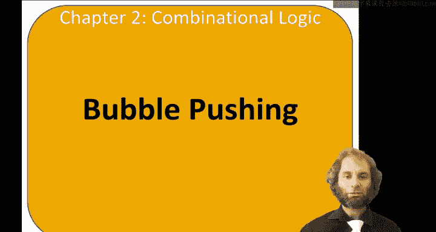
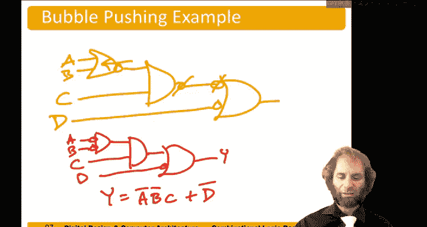

# 哈维穆德学院《数字设计和计算机架构RISC版｜Digital Design and Computer Architecture： RISC-V Edition》 - P21：Chapter 2 9.Bubble Pushing.zh_en - GPT中英字幕课程资源 - BV1JC1MY1E7F

Hello， the topic of this video is bubble pushing。We're going to look at using De Morganorgan's law to simplify things involving Nns and nors。

So remember to Morgan's theorem says that the nand of a bunch of variables。

Is the ore of their compliments。And its duel says that the nor of a bunch of variables is the and of their complements。

So we can apply this theorem to simplify equations involving compliments。And typically。

 I like to work from the outside end， starting with a topmost bar and work my way down。

And whenever I get a bar over a bar， I can use involution to strike better away。

So let's say we had this expression。 Y equals a or。BC bar， all。Inverted。How can apply。

To Morgan's law， I have something or something bar。Gives me。😔，A bar。And。BC， bar bar。

Now I have a double bar。 So by involution， two wronggs make a right。 get rid of that。

 And I'm left with A bar and B， C。And now， just。Combine those together。 and I get A bar， B C。

Here's another example， slightly more complicated。Here， I have an no。Have a bunch of expressions。

So applying to Morgan's law， it becomes the end of their compliments。 I get a bar。And。BC bar bar。

And a bar， B bar bar。Now， using involution， I construct strike that bar。Using the Morgan's law again。

I can replace a bar， B bar bar。With a。Bar bar or B barbar。And remember， for order of operations。

 we better put parentheses around this or to keep everything kosher。Now。😔，I can strike。Those。

Double bars by invol。And I'm left with。A bar， B C。And A or B。Now。

 I could apply the distriive property。And。Bring out the a。to be。A bar and a is just 0。

 So this term goes away。B and B is just B。 So I'm left with A bar， B， C。And again， remember。That。

 when we apply。To Morgan's law to A N and B。 We need to write it as a bar or B bar and keep parentheses around it。

2。And follow our order of operations。I like to use in Morgan's law， graphically， whenever I can。

So from graphical point of view， remember that Nand is equivalent to an ore of inverted inputs。So。

 here I have my Nand。I push the bubble。Through。And the bubble pops out on the inputs。

 and the gate changes from an an to an ore flavor。So A N to B is equivalent to not A poor not B。

You notice I'm just going to draw my bubbles on the gates。 I'd got fancy enough at this point。

 we don't need to draw inverters everywhere。Similarly， a nor B。

If we take that bubble and push it through， the bubble pops out on the inputs。

 and the flavor of the gate changes from Nor。Or to。So now anytime you have bubbles that line up。

They cancel't。 This is by evolutionvol， two wrongs make a right。And so canceling。

 it becomes easy to read off the truth table for the circuit。 It's y equals A and B or C and D。

So if we can push bubbles around in a circle until they cancel。

 it becomes easy to read off the bullaning expression。

Let's say we had something nastier with Nans and nors。

 This kind of circuit shows up pretty common when you're designing sea moss circuits， because。

See my skate are in here， in inverted。And our technique is。

 we're going to start at the end and work our way back towards the inputs。We want to push bubbles。

Now we have no bubble on the output。And that bubbles line up and cancel。So let's do that。

 This Nand has a bubble on the output。 So let's try to push it back through。And that will leave us。

Here was our a。Nor B。Nanxi。And now， if I push the bubble through this land。And left with an no。

 or an whoar。With converted inputs。Now， this bubble cancels with this one。This nor。

 the bubble on the output is a problem because it doesn't cancel with anything。

 So let's push that bubble through again。And rejove our circuit。Now， that nor。

Were showing the bubbles on the input。Then it was and with C。W。没了 bubble。

So now we can just read this off。Y equals a bar and B bar。And see。Huer。地板。

So bubble pushing let us easily determine the logic function of a second。

