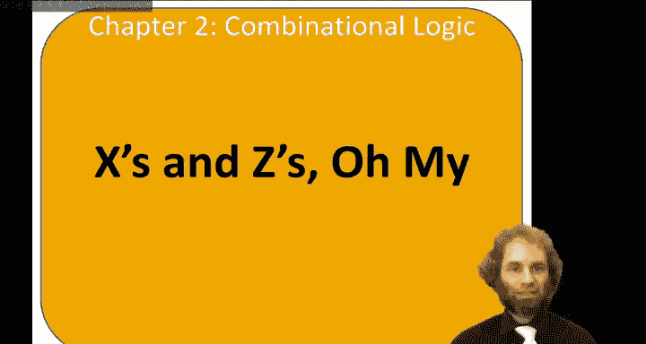
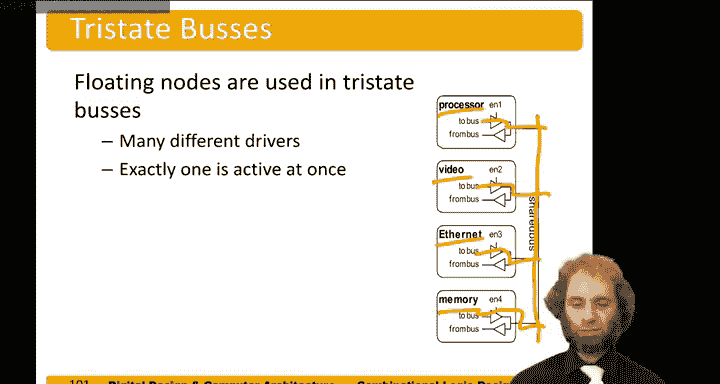

# 数字设计和计算机架构：2.10：X与Z状态详解 🔌

在本节课程中，我们将学习数字电路中除0和1之外的两种特殊逻辑状态：X（未知/争用）和Z（高阻态/浮空）。理解这些状态对于电路设计、调试和避免潜在问题至关重要。

---

## X状态：未知与争用

上一节我们讨论了正常的逻辑电平0和1。本节中，我们来看看X状态。X通常表示电路输出端存在**争用**。

想象一个场景：两个反相器的输出端被短接到同一个节点上。这并非一个组合逻辑电路，因为两个输出被短路在了一起。

假设输入A为1，B为0。那么，上方的反相器试图将输出Y驱动为0，而下方的反相器则试图将Y驱动为1。根据这两个反相器的相对驱动能力，最终节点电压可能停留在高电平、低电平，或者处于两者之间的**禁止区**。

此外，这个最终电压可能随电源电压、温度、器件老化、电源噪声而变化，并且在不同芯片之间也可能不同，这取决于反相器的相对强度。更重要的是，这种争用通常会导致很大的功耗，因为两个器件在相互“对抗”。

我们称这种状态为**X**。如果在电路仿真中看到X出现，这通常是存在争用的标志，往往意味着设计存在错误。请严肃对待这些X状态并修复它们。

电路仿真中使用X的另一个场景是**未初始化的信号**。例如，我们稍后会讲到的触发器具有记忆功能。在仿真开始时，我们不知道触发器里存储了什么值，就会用X来表示该值未知。同样，你需要修复这些未初始化的问题。

请注意，在之前的幻灯片中，我们讨论过在输入端使用X作为“无关项”。因此，必须根据上下文来理解X的含义：在输出端，X通常意味着争用；在输入端，X可能意味着“无关”。

争用可能导致功耗问题，如果争用发生在驱动能力很强的输出端之间，甚至可能烧毁引脚。为了纪念这一点，我今天戴了一条特别的领带，上面印有数字设计和本·比特德尔（Ben Bitdiddle）的图案，图中本正在因为电路争用而炸毁他的芯片。

---

## Z状态：高阻态与浮空

现在，让我们转向Z状态。如果一个节点既没有被驱动到高电平，也没有被驱动到低电平，我们就说它处于**浮空**状态。描述此状态的其他术语还包括高阻抗、开路或**高Z**。在电路仿真中，我们通常使用**Z**来表示浮空。

一个浮空的节点可能偶然处于低电压、高电压，或者处于两者之间的禁止区，并且其电压可能不断变化。例如，它可能因为荧光灯的辐射而每秒变化60次，或者在你触摸它时发生变化。

浮空节点的问题是，万用表可能无法指示出该节点处于浮空状态。实际上，万用表可能会干扰该节点，使其达到一个明确的电压值，导致电路在你用表笔接触时工作正常，而一旦移开表笔就停止工作。同样，在实验室测试时可能一切正常，但当指导老师走过来检查时，电路可能就失灵了。因此，无意的浮空节点会带来极大的调试困扰，它们通常在你忘记将导线连接到某个输入端时无意中产生。

浮空状态也可以是有意为之的。我们有一个叫做**三态缓冲器**的元件。

以下是一个常规反相器和一个三态缓冲器的对比：

*   **常规反相器**：`Y = NOT(A)`
*   **三态缓冲器**：具有输入A、输出Y，以及一个使能信号（EN）。

当使能信号有效（例如EN=1）时，它作为一个常规缓冲器工作：若A=0，则Y=0；若A=1，则Y=1。但当使能信号关闭（例如EN=0）时，无论输入A是什么，输出Y都会进入**浮空（高阻态）**。这使得我们能够构建一个电路，在其被禁用时让输出端保持断开连接。

三态缓冲器的一个典型应用是构建**三态总线**。例如，在计算机中有一个共享总线，我们希望处理器、视频系统、以太网控制器或内存都能在某一时刻与总线通信。每个设备都可以连接一个三态缓冲器，由独立的使能信号控制。

只要我们确保在任何给定时刻**只有一个使能信号为真**，那么总线就由需要通信的那个设备驱动。其他系统的输出则处于浮空状态，因此它们不会与当前驱动总线的设备发生争用或冲突。

---

## 总结

本节课中，我们一起学习了数字电路中的两种特殊状态：
1.  **X状态**：通常表示输出端存在**争用**（多个驱动源冲突）或信号**未初始化**。这通常是设计错误，需要修复。
2.  **Z状态**：表示**高阻态**或**浮空**，即节点未被任何源驱动。这可能是无意错误（如未连接），也可能是有意设计（如使用三态缓冲器实现总线共享）。

理解并正确管理X和Z状态，对于设计可靠、高效的数字系统至关重要。