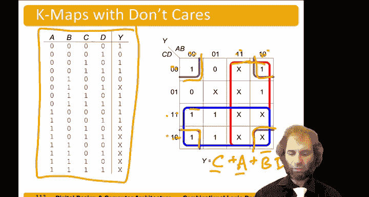

# 数字设计和计算机架构：2.12：带无关项的卡诺图 🗺️

在本节中，我们将学习如何处理带有“无关项”的逻辑函数，并利用卡诺图来找到最简化的积之和表达式。无关项是指在某些输入组合下，输出值可以是0也可以是1，我们对此“不关心”。通过巧妙地利用这些无关项，我们可以合并更大的卡诺图圈组，从而得到更简单的逻辑表达式。

---

## 概述

卡诺图是化简逻辑函数的有力工具。当逻辑函数的真值表中存在无关项时，我们可以选择性地将这些无关项视为1或0，以便在卡诺图中形成更大的矩形圈组，从而得到更简化的逻辑表达式。本节课将通过一个具体例子，演示如何操作。

---

## 真值表与卡诺图填充

首先，我们有一个四输入变量的真值表，其中部分输出被标记为“无关项”（用X表示）。我们的目标是将此真值表的信息填入卡诺图。

以下是真值表对应的输出值（Y）：
*   当输入 A, B, C, D = 0000 时，Y = 1。
*   当输入为 0001 时，Y = 0。
*   当输入为 0010 时，Y = 1。
*   当输入为 0011 时，Y = 0。
*   当输入为 0100 时，Y = 0。
*   当输入为 0101 时，Y = X（无关项）。
*   当输入为 0110 时，Y = 1。
*   当输入为 0111 时，Y = 0。
*   当输入为 1000 时，Y = 1。
*   当输入为 1001 时，Y = 1。
*   当输入为 1010 时，Y = X（无关项）。
*   当输入为 1011 时，Y = X（无关项）。
*   其余输入组合（1100, 1101, 1110, 1111）对应的 Y = 0。

根据以上信息，我们将其填入四变量卡诺图。填图时需要特别注意行列顺序，避免出错。

---

## 圈组策略与无关项利用

上一节我们填充了卡诺图，本节中我们来看看如何圈组。我们的原则是：圈出最大的矩形块以覆盖所有标为1的格子，并且可以**选择性地**将无关项（X）当作1来圈入，如果这有助于形成更大的圈组。我们不必圈入所有的无关项。

观察填充好的卡诺图，我们可以识别出三个主要的圈组机会：
1.  一个覆盖了图中部两行的4x2巨型块（蓝色）。
2.  一个覆盖了右侧两列的4x2巨型块（红色）。
3.  一个覆盖了四个角的2x2块（绿色）。

图中还有一个孤立的无关项（X），圈入它并不会让任何圈组变得更大或更简单，因此我们选择不圈它。

---

## 从圈组推导逻辑项

现在，我们将每个圈组转换为对应的乘积项（蕴含项）。

以下是每个圈组对应的变量取值分析：
*   **蓝色圈组**：在此区域内，A和B取遍了所有可能值（00, 01, 11, 10），因此A和B是“无关的”。C的值始终为1。D的值有0也有1，因此也是“无关的”。所以，这个蓝色块对应的乘积项就是 **C**。
*   **红色圈组**：在此区域内，A的值始终为1。B的值有0也有1，是“无关的”。C和D取遍了所有可能值，都是“无关的”。所以，这个红色块对应的乘积项就是 **A**。
*   **绿色圈组（四角）**：四个角对应的A值有0也有1，是“无关的”。B的值始终为0（即 **B'**）。C的值有0也有1，是“无关的”。D的值始终为0（即 **D'**）。所以，这个绿色块对应的乘积项就是 **B' D'**。

---

## 总结

本节课中，我们一起学习了如何利用卡诺图中的“无关项”来简化逻辑表达式。关键步骤是：将真值表填入卡诺图，然后通过将无关项视为1来帮助形成尽可能大的圈组，最后将每个圈组翻译成对应的乘积项。对于本例，最终得到的最简积之和表达式为：

**Y = C + A + B' D'**

通过这种方法，我们可以有效地处理具有不完全定义特性的逻辑函数，并得到成本最低的实现方案。