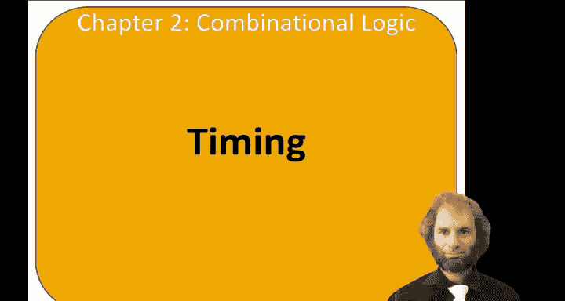
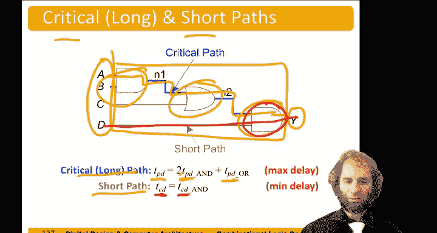

# 哈维穆德学院《数字设计和计算机架构RISC版｜Digital Design and Computer Architecture： RISC-V Edition》 - P27：Chapter 2 15.Timing of Combinational Logic.zh_en - GPT中英字幕课程资源 - BV1JC1MY1E7F

Hello， the topic of this video is timing。So now we know how to build circuits that are correct。

 and the next question is how do we know how to build fast circuits？

How do we analyze how fast they are。So suppose we had a circuit element。 this case。

 it's just a buffer， but it could be anything。The input a。Will rise at some time， and in response。

The output， Y will。Change will rise。 some amount of delay later。

So we draw these things with delay on the horizontal axis and showing our signals changing at various times。

In general。We could draw。A diagram like this。Where a had some value could be either 0 or  one。

 We don't care what it is， but at some time， it changes to the other value。

And that's what this crossover means。In response， the output Y initially had some value was the same as a。

 but we don't really care what it is。After some amount of time， why might start changing。

And we don't know exactly how long it will take。 But after another amount of time。

 it will have definitely finished changing and will have the new value of why。 In the meantime。

 why could be。Either high or low。So， let's define two delays。The contamination delay。

Is the time from when the input changes until the output might start changing。

Time until the old output is no longer guaranteed to be there。And then， the propagation delay。嗯。

Here's another color。Proropagation delay。I is the time。

From when the input changes until the output has definitely settled to the new value。

So the contamination and the propagation delay are the minimum and the maximum amount of time from the input changing until the output has reached a new value。

So delay comes from a variety of reasons。 First of all。

 every circuit has some inherent capacitance and resistance。

Take some energy to charge up nodes in the circuit。

 and that energy finite amount of current can flow modeled by the resistance。

 So there's an R C delay。Also， in circuits， nothing can move faster than the speed of light。

 So even if you really manage to optimize your circuit to the point that the resistance and capacitance were very low。

There's still some time required for information to travel a distance。Caused by the speed of light。

The propagation and contamination delay might be different for a variety of reasons。

Sometimes the delay of a gate rising versus falling could be different because。

 say rising is going through a network of Pmos and falling is going through a different network of enma transistors。

The delays could be different because we have many inputs and outputs to the gate。

 and some inputs might be faster than others's。And also， the delay might depend on the environment。

So circuits tend to be slower at high temperature， faster at low temperature。

They tend to be faster at high voltage and slower at low voltage。

We introduced a notion of a critical long paths， and short paths。

So when we have an entire circuit here。Our inputs are A through D， and our output is y。

And we want to know the longest time for any of the inputs changing and the shortest time。

So the longest path。From any of these input changing to the output seems to go through all of these gaps。

That's the delay of this hand gate。Plus， the delay of this orgate。Plus， the delay of this sand gate。

 and it's the propagation delay through each。 So we have the propagation delay of the entire circuit。

Is the two propagation delays of end gates plus one of an orate。On the other hand， the shortest path。

Is from D to y。It just goes through a single hand gate。

And so the contamination delay through the whole circuit is just a contamination delay of the end gate。

 That's the shortest delay。

