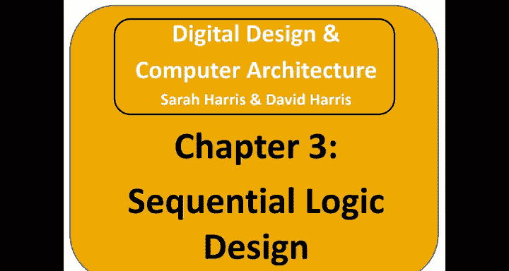
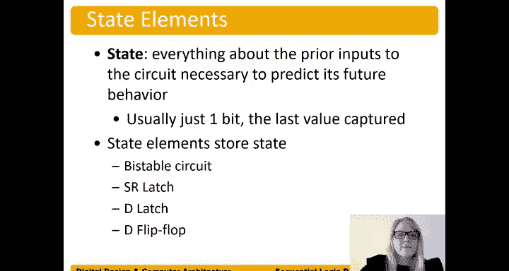

# 数字设计和计算机架构：第3章：时序电路简介

在本章中，我们将学习时序电路，即具有记忆功能的电路。我们将从状态元件开始讨论，然后解释同步时序逻辑的一般定义。接着，我们将探讨两种类型的同步时序逻辑：有限状态机和并行电路（或并行性）。最后，我们还将学习如何计算这些时序电路的时序。

## 概述

时序电路的输出不仅取决于当前输入，还取决于先前的输入值。因此，时序电路具有记忆功能，因为它能记住过去的输入。例如，在智能手机上输入解锁密码时，手机不仅需要知道当前输入的数字，还需要记住之前输入的数字序列。这就是为什么我们需要时序电路。

## 状态的定义

首先，我们定义几个术语。**状态**是指解释电路未来行为所需的所有信息。例如，在输入密码“3-1-5”解锁手机时，电路的状态记录了输入进度：是否已输入“3”？如果已输入，电路就处于“已输入3”的状态，等待下一个正确输入“1”。一旦输入“1”，电路状态更新为“已输入3和1”，并等待输入“5”。因此，状态是决定电路下一步行为的关键信息。

我们将使用锁存器和触发器来存储这种状态，并用二进制值（比特）对状态进行编码。在本课程中，我们主要使用触发器，但锁存器同样可以用于此目的。

## 同步时序电路

**同步时序电路**是一种使用触发器且所有触发器共享一个公共时钟的时序电路。这个时钟类似于个人电脑中的时钟，例如2 GHz时钟。所有电路元件都响应这个时钟信号，因此称为“同步”。本章将详细讨论时钟在电路中的作用。

## 时序电路的作用

时序电路为事件提供序列，这正是其名称的由来。例如，在检测密码序列“3-1-5”时，电路需要按顺序识别这些输入事件。这些电路具有短期记忆，能够记住先前的输入。它们通过从输出到输入的反馈来存储信息，所存储的信息就是比特。

再次强调，状态是关于先前输入的所有信息，电路需要这些信息来预测其未来行为。状态通常只用1比特表示，并且是最后捕获的值或状态。

## 状态元件的类型

我们将使用特定的电路元件来存储状态。接下来介绍四种类型的状态元件：双稳态电路、SR锁存器、D锁存器和D触发器。最终我们将主要使用**D触发器**。

---

上一节我们介绍了时序电路的基本概念和状态的定义。本节中，我们来看看用于存储状态的具体元件类型。

以下是四种主要的状态存储元件：
*   **双稳态电路**：具有两个稳定状态的电路。
*   **SR锁存器**：一种基本的锁存器，通过Set和Reset输入控制状态。
*   **D锁存器**：在时钟信号有效期间，输出跟随输入（Data）变化的锁存器。
*   **D触发器**：在时钟边沿（上升沿或下降沿）瞬间捕获并存储输入值（Data）的触发器，是我们将主要使用的元件。

## 总结

本节课中，我们一起学习了时序电路的核心概念。我们了解到时序电路具有记忆功能，其输出依赖于当前和历史的输入。我们定义了“状态”的概念，它是决定电路未来行为的信息集合。我们还介绍了同步时序电路，其特点是所有触发器共用一个时钟信号。最后，我们列举了四种存储状态的基本元件，并指出在本课程后续内容中将重点使用D触发器。