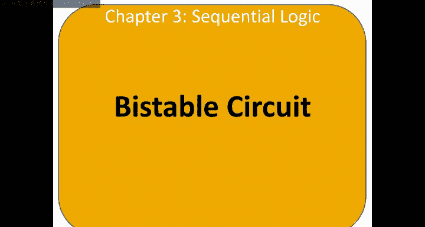
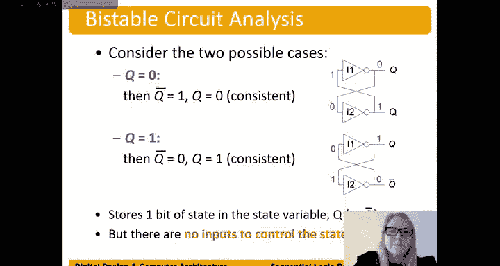

# 数字设计和计算机架构：3.2：双稳态电路

在本节中，我们将学习双稳态电路。这是构成其他状态元件的基本构建块，它能够存储一个比特的信息。

## 双稳态电路概述

双稳态电路之所以被称为“双稳态”，是因为它拥有两个稳定的状态。该电路没有输入，但有两个输出：**Q** 和 **Q_bar**（Q的非）。这两个输出始终保持相反的逻辑值。

## 电路工作原理

以下是双稳态电路的两种等效表示方式。其核心是两个交叉耦合的反相器。

从功能上看，两个首尾相连的反相器等效于一个缓冲器，其输出被反馈到输入，从而形成一个存储单元。

### 稳定状态分析

该电路能够稳定地存储一个比特值（0或1）。让我们来分析它的两种稳定状态。

**状态一：存储逻辑0**

假设初始时 `Q = 0`。
1.  `Q = 0` 作为输入进入反相器2（I2）。
2.  I2 将其反相，输出 `Q_bar = 1`。
3.  `Q_bar = 1` 作为输入进入反相器1（I1）。
4.  I1 将其反相，输出 `Q = 0`。

这个过程形成一个稳定的闭环，电路将保持 `Q = 0`， `Q_bar = 1` 的状态。

**状态二：存储逻辑1**

假设初始时 `Q = 1`。
1.  `Q = 1` 作为输入进入反相器2（I2）。
2.  I2 将其反相，输出 `Q_bar = 0`。
3.  `Q_bar = 0` 作为输入进入反相器1（I1）。
4.  I1 将其反相，输出 `Q = 1`。

同样，电路将稳定地保持 `Q = 1`， `Q_bar = 0` 的状态。

## 电路的局限性

虽然双稳态电路能够存储信息，但它存在一个明显的缺陷：**没有控制输入**。这意味着一旦电路处于某个稳定状态，我们无法从外部改变其存储的值。它只能“记住”最初被设置的状态（可能是上电时的随机值），而无法被写入新的数据。

## 总结与过渡

本节课中，我们一起学习了双稳态电路。我们了解到它通过两个交叉耦合的反相器，能够稳定地存储一个比特（0或1），并分析了其两种稳定状态的工作原理。然而，我们也指出了它的关键限制——缺乏控制输入，导致我们无法主动设置其存储的值。

正因为这个缺陷，我们需要一个更强大的电路。在下一节中，我们将探讨如何改进这个设计，引入控制输入，从而创造出我们可以实际写入和读取数据的状态元件。