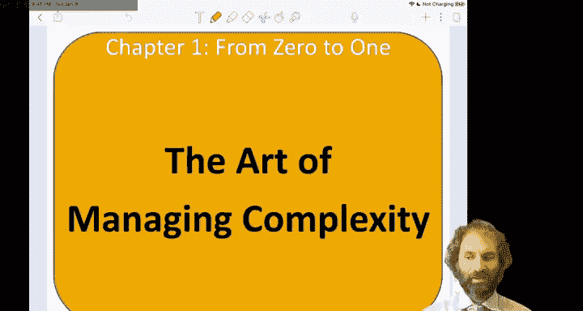
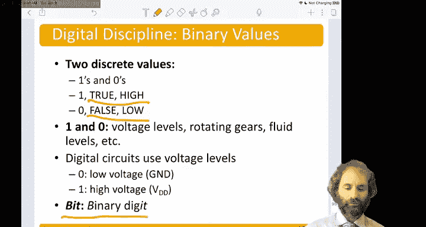

# 数字设计和计算机架构：第1章：管理复杂性的设计原则 🧩

在本节课中，我们将学习如何设计那些过于庞大、无法一次性装入人脑的系统。工程师们通过一系列核心原则来应对这种复杂性，包括抽象、设计约束以及由层次化、模块化和规律性构成的“三Y”原则。

---

## 抽象：隐藏不重要的细节 🎭

上一节我们提出了管理复杂性的核心问题，本节中我们来看看第一个关键工具：抽象。抽象意味着在细节不重要时将其隐藏。

例如，要理解计算机的工作原理，我们可以从量子力学开始。最终，所有现象都归结为原子晶格中电子的运动。然而，为海量组件同时求解波动方程是完全不可行的。

因此，我们向上移动到更高的抽象层次：
1.  **器件层**：我们定义**晶体管**，它由掺杂原子构成，但我们可以将其视为具有特定电压-电流关系的多端器件。
2.  **模拟电路层**：例如运算放大器或滤波器，由器件构成，但我们无需关心内部晶体管的精确排列，只需将其视为一个放大器。
3.  **数字电路层**：我们定义**逻辑门**，它输入和输出0与1。
4.  **逻辑层**：例如加法器或存储器，由许多逻辑门构成，但我们可以将其视为一个具有输入输出关系的黑盒。
5.  **微架构层**：组合加法器和存储器等，构成数据通路和控制器。
6.  **架构层**：这是程序员看到的系统视图，包括计算机可执行的指令和内部寄存器。
7.  **操作系统层**：例如设备驱动程序，可以打开它以访问键盘并读取键入的字符，而无需关心总线上传输的0和1的具体模式。
8.  **应用软件层**：例如编写程序在屏幕上打印内容、运行视频游戏或进行计算。

这些程序最终依赖于所有底层抽象，但程序员在编写“Hello World”时，通常不会思考导致这一切发生的电子波动方程。这就是抽象的力量。

在本课程中，我们将主要关注从数字电路到架构的中间抽象层次。

---

## 设计约束：有意识地限制选择 🔧

上一节我们介绍了通过抽象来简化理解，本节中我们来看看另一个重要概念：设计约束。设计约束是指有意识地限制设计选择，这初看似乎违反直觉，但实则能极大简化设计。

一个绝佳的例子是**数字约束**。我们使用离散的电压值，而非连续的电压值。这使得设计变得更简单，并能构建更复杂的系统。

例如，在模拟电视中，连续的电压信号决定屏幕上像素的颜色，任何电压噪声都会导致视觉上的雪花干扰。而在数字系统中，每个像素由一组**比特**（`bits`）表示，并且可以引入纠错机制。即使存在噪声，比特信息仍可恢复，从而获得清晰的图像。

因此，数字系统已在众多领域取代了其模拟前身。

---

## 三Y原则：层次化、模块化与规律性 🏗️

上一节我们探讨了通过约束来简化设计，本节中我们来看看管理复杂性的三个具体技术：层次化、模块化和规律性，合称“三Y原则”。

以下是三Y原则的具体含义：
*   **层次化**：递归地将复杂系统分解为更小的子系统。
*   **模块化**：用定义明确的**功能**和**接口**来构建系统。模块化意味着没有副作用。
*   **规律性**：与可互换部件的概念相关。

以福特T型车为例，看三Y原则如何应用：
1.  **层次化**：将汽车整体分解为底盘、车轮、座椅、发动机等组件。发动机又可进一步分解为气缸、火花塞、排气系统、化油器等。化油器再分解为进气口、进油针、供油管和连接螺母。
2.  **模块化**：以连接螺母为例。其**功能**明确：将油管固定在进气歧管上，防止泄漏，且易于拆卸以便维修。其**接口**标准化：具有标准直径、标准螺纹间距和标准扭矩。
3.  **规律性**：标准化的螺母可以从众多供应商处购买，这降低了成本并提高了可用性。亨利·福特的名言“任何顾客可以将这辆车漆成任何他想要的颜色，只要它是黑色”就是规律性的体现，它使得所有部件可互换，简化了生产和维修。

---

## 数字抽象：从连续到离散 🔢

上一节我们通过T型车了解了三Y原则，本节中我们将聚焦于本课程的一个关键抽象：**数字抽象**。

大多数物理变量是连续的，例如导线上的电压、振荡频率或物体的位置。但在数字抽象中，我们只考虑这些值的一个离散子集来定义我们的0和1。

数字抽象的一个早期例子是分析机，由查尔斯·巴贝奇在19世纪中期设计。它被认为是第一台数字计算机，但并非使用电信号，而是使用机械齿轮。每个齿轮有10个不同位置（0到9），通过摇动曲柄，齿轮相互啮合并运动，使系统能够执行加法和计算数学用表等操作。

巴贝奇因数学用表中的大量错误而感到沮丧，萌生了用机器计算的想法。然而，他不断追求更优雅的设计，导致项目一再推倒重来。加之当时的机械加工精度有限，以及他本人难以相处的性格，最终项目在耗尽巨资后未能完成，巴贝奇抱憾而终。直到20世纪90年代，工程师们利用现代CNC技术才根据他的图纸成功建造出可运行的分析机。

回到电子系统，拥有10个状态的机械系统非常精密且易出错。相比之下，仅区分两种状态（如两种电压）要容易得多。如今，我们可以制造出极其微小、快速且廉价的晶体管（成本低至纳美分级别），这使得构建数字系统变得非常容易。

我们将这两个离散值称为**0**和**1**。0可能代表“假”或低电压，1可能代表“真”或高电压。这些值可以用各种不同的物理量表示，但我们通常使用电压。我们还有一个术语叫**比特**（`bit`），是二进制数字的缩写，其值要么是0，要么是1。

---

## 总结 📚

本节课中，我们一起学习了管理复杂性的核心设计原则。我们了解了**抽象**如何通过隐藏不必要细节来帮助我们理解庞大系统；认识了**设计约束**（如数字约束）如何通过限制选择来简化设计并实现更强大的功能；最后，我们探讨了**层次化、模块化和规律性**这“三Y原则”如何通过递归分解、明确定义和标准化来构建复杂而可靠的系统。这些原则是数字设计和计算机架构的基石，将在后续课程中反复应用。