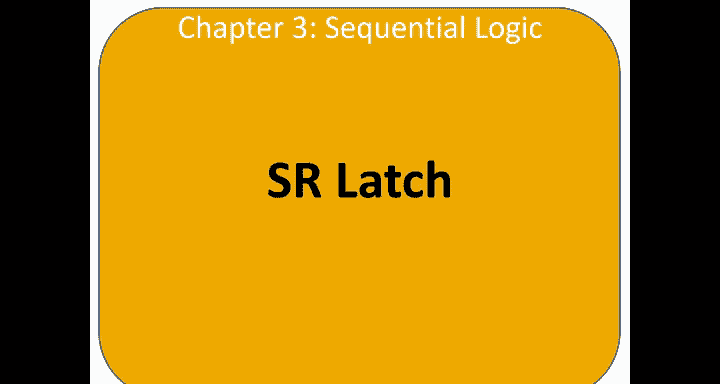
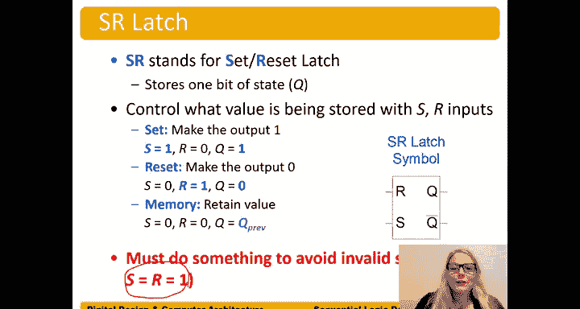

# 哈维穆德学院《数字设计和计算机架构RISC版｜Digital Design and Computer Architecture： RISC-V Edition》 - P30：Chapter 3 3.State Element 2 SR Latch.zh_en - GPT中英字幕课程资源 - BV1JC1MY1E7F

Yeah。The S R latch， also called the set reset latch。 That's what S stands for， is set。

And R stands for。Reset， so the set reset latch or S R latch。

 You can also hear it be called the Rs latch。The SR Latch has two inputs。And S。

 So R for reset and S for set。And so we can analyze a circuit， know。

 just like we've analyzed other circuits and probe it to see what happens for the possible input values and with two inputs。

 we have two to the two or four possible input combinations。So 1，0，0，1，0，0， and 11。

And so we can probe this circuit and see what happens to the output Q。In each case。

So here's the first case where S equals 1 and r equals zero。And so we have。

 you know we have this feedback from the output to the input。

 so it's a little more tricky to analyze than combinational circuits。

But let's look at this bottom Nor gate here， the N to gate。

 So we have a one on the input of that or gate， one or anything。Its just one。

 so we get a one on the output of that right before the bubble， we get a one。And inverted。

Pass the bubble is zero。So Q bar is zero。And now we can consider it right no it doesn't even matter what this。

 we don't even need to know what Q is to know that that nargate is going to output to  zero because we have a one or something。

It doesn't matter what that something is。 One or anything is just one。

And so we get a zero on the output of Q。As zero comes around， we get zero or0 on the input of N1。

 norgate 1。0 or 0 is 0 right before this bubble gets inverted。By the bubble and becomes a one。And so。

We can see that when Q is 1。When S is 1 and r is0， Q is 1。And Q bar is zero。So this sets the output。

 so Q is our state， and it sets the output to one。Whenever S is one。And R is the opposite。

 So S being one sets the output Q to one。 When we say something is set。

 we mean that it has become it is set to the value 1。Now let's consider the case with S equals 0。

 R equals1。 So this is a symmetric circuit。 so you can expect what happens。

 But this bottom circuit N2 is hard to analyze if we have 0 or something。

We don't know what that something is。 We don't know what Q is yet。 So that's a harder one to analyze。

 So instead， let's analyze N1 at the top and we get one or something。 Well。

 one or anything is just one。 So one is one right at the。Right before the bubble， gets inverted。

 Q becomes zero。One is inverted across that bubble and becomes zero。

And then we have that zero coming around。Back to the input of N2， we get  zero or0。

 and there's a bubble here。And we're going to get0 or0 is0。

And right past the bubble of that noradate。That becomes a one。And so。Here， we can。

With the written written numbers there。 So when r equals one， when the reset input is one。

 then the output Q is reset。 And by reset， we mean made0。 So the output Q becomes 0。 when R is1。

 well， N S is the opposite。And S is 0。And Q and Q bar。Are inverses of each other。 Q is 0。

 and Q bar is  one。 So that's consistent with our Boolean axioms。

Now also consider the case where S equals0 r equals0。So when S is0 and R is0。

 we can't do that trick where we had， you know， we considered the one that had a one on it or we did one or anything is one。

 Well now we have zeros on both of them and we can't do that。

 So I'm going to show two ways of solving this。 One is to say， well， we don't know what Q was。

 but it could be one of two cases。 It can be either have been a zero or a one。

And so let's suppose it were a 0。 Let's assume Q previous。 So before S and R became0。

That the value on Q was 0。 So that's what we mean by Q previous。

Now we're trying to determine the current value。So Q if Q were zero， we don't know that it was。

 but we're just going to assume that next time we're going to assume that it was one。

 we'll do both cases。Then that Q comes down to this N2。

And we get0 or0 is0 right before the output of this nogate。Inverts and becomes one。Okay。

 then the one feeds around。And we get zero or1。Is one right for the bubble。Of that Norgate。

outputput bubble and inverted is 0。So check， it's consistent if the previous value of Q was0 and it stays at zero and this is stable。

Now let's considered the other case， we didn't know what Q was。

 so now we need to consider both cases。If the previous value had been1， let's analyze that case。

On the bottom， Nor gate， we get one or a 0 right before the bubble。 The alpha bubble。

 we get  one or a 0 is one。Inverted。Is 0。On keybar， and then that zero feeds around。

When get 0 or0 right for the bubble is is 0。Zero inverted across that bubble is one。Check。

So we get a consistent value for either case， either previous value Q。

 whether it had been zero or one， that would it still retains the value。

So let me show you a second way of solving this。 So this is a case where Q equals Q previous。

If S is0 and R is0， Q retains its value and this is the memory state， just remembers what it had。

So' I'm going to show you a second way of analyzing this。 Let's instead say， okay， well。

 we don't know what Q was， but let's just put a variable in there the previous value。

 it was some value Q。Okay， so that Q comes down here。 We use our bulloleying algebra skills。

 and we get Q or0。 while Q or0 is just Q。 That's identity。Q or 0 is Q。

 So we it's right before the bubble that gets inverted and we get Q bar。Whatever Q is。

 it's a variable， we don't know if it's zero or1。But it's one of those。 It's a variable Q。

 And then Q bar comes around here， goes to this top Norgate and one， and we get Q bar。Or zero。

So Q bar or is zero。Equals Q bar。 again， identity。And so we get。Q bar coming in here。

Right before the bubble of that Norgate， we get Q bar because Q bar。Or0 is Q bar。

And then across the bubble。We get。H bar bar right gets inverted again。So it's already inverted。

 and now it gets another bar across it。 key bar bar。 and we get。Q back。Through involution。

right even if we don't assume a value of Q previous， we just leave it as a variable。

 we can solve it that way as well。😊，So either way， valid。

 whichever way works for you to understand it better you do that way。Okay， so in the S equals 0。

 R equals 0 case， we have memory。 It just retains whatever。

Bit is stored in Q or whatever value Q has， it just retains that value。 So that's the memory state。

So now let's do the case where S is1 and R is1。 I'm going to go ahead and use this figure up here。

Because it's not covered。 Let's say S is1 and R is one。 So now we're doing this case。

 but using that figure at the top。Well， at the top we have the Nordgate one， one or anything。

 well we know that's one。Through signal element theorem， right， one or well。

 it doesn't matter is equal to one because it's in an oral relationship with a one。Okay。

 so we get a one or anything。Is one。Inverted is zero。Okay， so Q is0。And then zero comes around here。

Did't we didn't really need that information to solve this bottom one。

 either1 or 0 is one right before the bubble gets inverted。And we get a zero here。

And this0 comes around。 And yeah， still consistent。 So we get Q equals 0。And Q bar equals 0。

We've just violated our Booleing axis right Q and Q bar have to be the inverse of each other。

 but they're both zero。And so this， when R and S are both one。

 this is actually an invalid state because Q bar is not。The inverse。Of Q。They're equal。

Q and Q bar have to have an inverse relationship。So， now we've。Violated that， both Q and Q bar are 0。

Not good。So in our SR latch， so as a recap on SR latches。

 the SR latch stands for set reset stands for set， R stands for Re。

And we can see the symbol here with an R input and S input。And。1 state bid output Q。

 So Q stores one bit of state。 And we also have the inverse of Q as an output， as well。

So when S equals1。We set the output or the state bit being stored to one。

When S equals1 and r equals 0， the output becomes one or is set to one。

We reset the output or the state be Q when R the reset input is one。And S is 0。

Then we reset the output or the state bit being stored。To 0。 So to reset a value means to make it 0。

And then there's the memory state。 When S and R are both0， then Q just retains whatever value it had。

 So Q equals Q previous。But there's that one state that is invalid where S and R are both one。

Then Q and Q bar do not have the inverse relationship。In fact， they are both zero。

 and so this is an invalid state， and we have to do something to make sure that this state doesn't happen。

