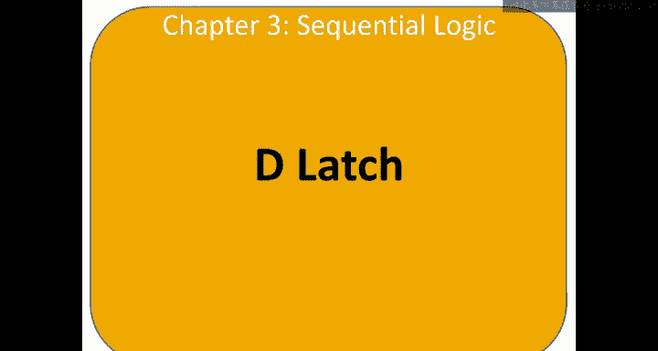
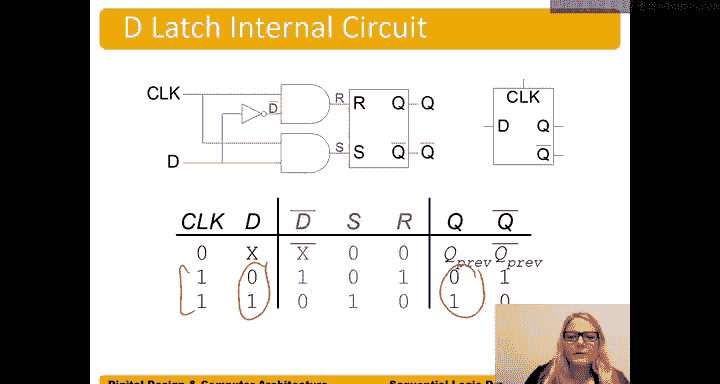

# 数字设计和计算机架构：3.4：D锁存器 🧠



在本节中，我们将学习第三种状态元件——D锁存器。我们将了解它的结构、工作原理以及它在时钟信号控制下的行为。

## 概述

D锁存器是一种基本的状态元件，用于存储一位数据。它有两个输入：时钟信号（`clock`）和数据输入（`D`），以及一个输出（`Q`）。其核心功能是：在时钟信号为高电平时，输出`Q`跟随输入`D`的变化；在时钟信号为低电平时，输出`Q`保持之前的状态不变。

## D锁存器的构成

D锁存器是在SR锁存器的基础上构建而成的。它通过增加两个与门，将数据输入`D`和时钟信号`clock`结合起来，控制SR锁存器的`S`和`R`输入。

以下是其内部电路的核心逻辑：

*   **数据路径**：数据输入`D`直接连接到一个与门，该与门的输出连接到SR锁存器的`S`端。
*   **反相路径**：数据输入`D`经过一个反相器变为`D_bar`，然后连接到另一个与门，该与门的输出连接到SR锁存器的`R`端。
*   **时钟控制**：时钟信号`clock`同时连接到上述两个与门的另一个输入端。

用逻辑表达式可以描述为：
```
S = D AND clock
R = (NOT D) AND clock
Q = 状态（由S和R根据SR锁存器规则决定）
```

## D锁存器的工作原理

上一节我们介绍了D锁存器的构成，本节中我们来看看它在不同时钟信号下的具体行为。其工作模式完全由时钟信号`clock`决定。

### 当 Clock = 0（低电平）

当时钟信号为低电平时，无论数据输入`D`是什么值，两个与门的输出（即`S`和`R`）都为0。

根据SR锁存器的特性，当`S=0`且`R=0`时，锁存器处于“保持”状态，输出`Q`将维持其之前的值。

**总结：Clock=0时，D锁存器不透明，输出Q保持不变。**

### 当 Clock = 1（高电平）

当时钟信号为高电平时，与门的输出将完全由另一个输入（即`D`或`D_bar`）决定。此时，D锁存器变得“透明”。

以下是两种具体情况：

*   **情况一：D = 1**
    *   `S`输入收到 `1 AND 1 = 1`。
    *   `R`输入收到 `0 AND 1 = 0`（因为`D_bar = 0`）。
    *   根据SR锁存器规则（`S=1, R=0`），输出`Q`被置位为1。

*   **情况二：D = 0**
    *   `S`输入收到 `0 AND 1 = 0`。
    *   `R`输入收到 `1 AND 1 = 1`（因为`D_bar = 1`）。
    *   根据SR锁存器规则（`S=0, R=1`），输出`Q`被复位为0。

**总结：Clock=1时，D锁存器透明，输出Q实时跟随输入D的变化。**

## D锁存器的符号与特性

理解了工作原理后，我们来看它的标准符号和关键特性。D锁存器的符号通常如下图所示，时钟输入常置于顶部以强调其控制作用。


其核心特性可以归纳为：
*   **透明模式**：当`clock=1`时，`Q`跟随`D`。输入数据的任何变化都会直接反映到输出。
*   **不透明（保持）模式**：当`clock=0`时，`Q`保持`clock`从1跳变为0瞬间所捕获的`D`值。在此期间，无论`D`如何变化，`Q`都保持不变。
*   **避免无效状态**：通过内部电路设计（`S`和`R`由`D`及其反相信号生成），确保了`S`和`R`不会同时为1，从而避免了SR锁存器中可能出现的无效或不确定状态。

## 总结



本节课中我们一起学习了D锁存器。它是一种受时钟控制的状态元件，其输出行为分为两个阶段：在时钟高电平时透明传输数据，在时钟低电平时锁存并保持数据。这种特性使其成为构建更复杂时序电路（如寄存器）的基础模块。理解D锁存器如何由SR锁存器构建而成，以及时钟信号如何控制其透明与保持状态，是掌握数字系统中数据存储与同步的关键一步。