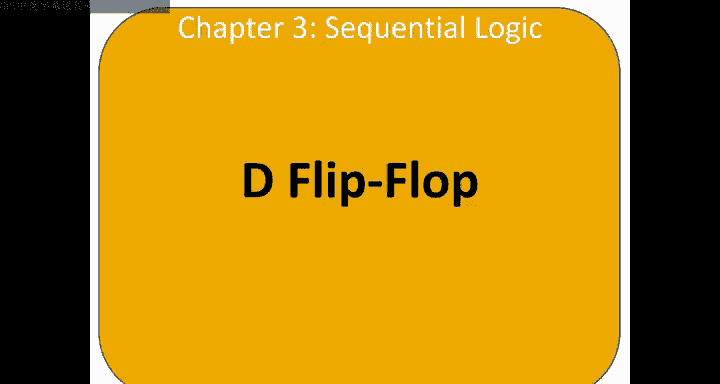
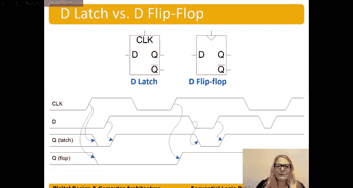

# 数字设计和计算机架构：3.5：D触发器 🧠

在本节中，我们将学习本章的最后一种状态元件：D触发器。我们将了解其工作原理、内部电路结构，并与之前介绍的D锁存器进行比较。

## 概述

D触发器是一种边沿触发的状态元件，它仅在时钟信号的上升沿对输入D进行采样，并将该值存储到输出Q。与电平敏感的D锁存器不同，D触发器提供了更精确的时序控制，是现代同步时序电路的核心构建模块。

## D触发器的符号与功能

D触发器的符号与D锁存器相似，但有一个关键区别：时钟输入端有一个三角形标记。这个三角形表示该电路是**边沿触发**的。

**符号表示：**
*   **D**: 数据输入
*   **CLK** (带三角形): 时钟输入 (上升沿触发)
*   **Q**: 数据输出

为了简洁，我们通常使用一个简化符号，不标注D和Q，也不显示Q的非输出。

**功能定义：**
D触发器在时钟信号的**上升沿**（从0变为1的时刻）对输入D进行采样，并立即（或经过一个极短的传播延迟后）使输出Q等于采样到的D值。在其他所有时间，Q都保持其之前的值，即具有记忆功能。

**公式描述：**
在时钟上升沿：`Q(t+1) = D(t)`
其他时间：`Q(t+1) = Q(t)`

## 内部电路结构

D触发器的内部电路由两个D锁存器背靠背连接而成。

**电路构成：**
1.  **主锁存器 (Master Latch)**: 接收输入D。
2.  **从锁存器 (Slave Latch)**: 接收主锁存器的输出。

两个锁存器的时钟信号是相反的。

**工作原理时序分析：**
以下是D值传递到Q的时序过程。

1.  **时钟为低电平 (CLK=0)**:
    *   主锁存器的时钟输入（CLK的反相信号）为高，因此**主锁存器透明**，输入D的值传递到其内部节点N1。
    *   从锁存器的时钟输入为低，因此**从锁存器不透明**，隔离了N1和最终输出Q。

2.  **时钟上升沿 (CLK从0→1)**:
    *   在上升沿即将发生前，D的值已被捕获在主锁存器的内部节点N1。
    *   时钟变为高电平时，主锁存器变为不透明，锁存住N1的值。
    *   同时，从锁存器变为透明，将N1的值传递到输出Q。

3.  **时钟为高电平 (CLK=1)**:
    *   主锁存器保持不透明，输入D的变化无法影响内部节点N1。
    *   从锁存器保持透明，但因其输入N1已稳定，所以输出Q也保持稳定。

这个过程在每一个时钟上升沿重复。两个锁存器交替工作（一个透明时另一个不透明），因此得名“触发器”(Flip-Flop)。

## D锁存器与D触发器的对比

上一节我们介绍了D锁存器，本节中我们来看看D触发器。理解两者的区别对设计时序电路至关重要。

以下是D锁存器与D触发器工作波形的对比。

**D锁存器 (电平敏感)**:
*   **透明期**: 当CLK为高电平时，输出Q跟随输入D的变化。
*   **保持期**: 当CLK为低电平时，Q保持CLK下降沿前一刻的D值，忽略之后D的变化。

**D触发器 (边沿触发)**:
*   **采样点**: 仅在CLK的上升沿对D进行采样，并更新Q。
*   **保持期**: 在两次上升沿之间的所有时间，Q都保持上一次采样到的值，完全不受D变化的影响。

**关键区别总结**:
*   D锁存器在CLK高电平期间是“透明”的。
*   D触发器只在CLK上升沿的瞬间“眨眼”看一下D的值，其他时间都是“闭眼”记忆状态。

## 初始状态问题

一个重要的实际问题是：在第一个时钟上升沿到来之前，或者电路刚上电时，触发器的输出Q是什么？

答案是：**不确定**。它可能是0，也可能是1。这个初始状态通常是未知的，在波形图中我们用双线或“X”来表示。在实际系统中，需要通过复位电路来将触发器置为一个已知的初始状态。

## 总结

本节课中我们一起学习了D触发器。
*   D触发器是一种**边沿触发**的状态元件，使用带三角形的时钟符号表示。
*   其核心功能是：在**时钟上升沿**采样输入D，并更新输出Q；在其他所有时间保持Q不变。
*   内部通常由两个反相的D锁存器（主从结构）构成，实现了精确的边沿采样。
*   与D锁存器相比，D触发器提供了更严格、更清晰的时序控制，是构建复杂同步数字系统的基石。

理解D触发器是学习寄存器、计数器、状态机等更复杂时序逻辑电路的第一步。