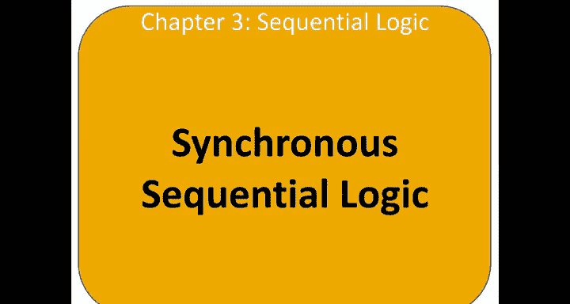
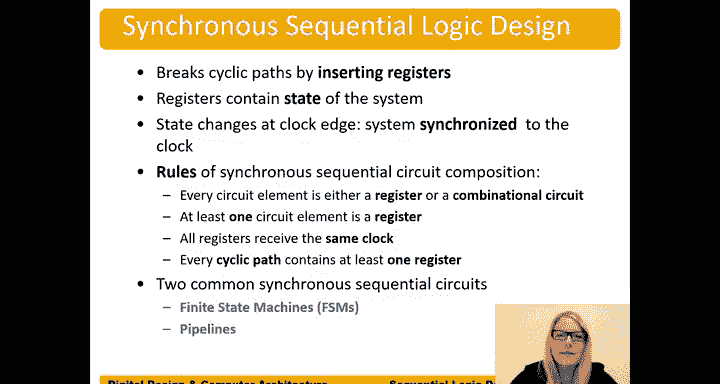

# 数字设计和计算机架构：3.7：同步时序逻辑设计 🧠



在本节中，我们将学习如何设计同步时序逻辑电路。我们将了解时序电路与组合电路的区别，并探讨如何通过引入寄存器和时钟信号来解决简单反馈电路中的时序不确定性问题。

---

## 什么是时序电路？

上一节我们介绍了组合逻辑电路，本节中我们来看看时序电路。时序电路是指所有**非组合逻辑**的电路。这意味着电路的输出不仅取决于当前的输入，还取决于电路过去的状态。

让我们考虑一个简单的例子：三个首尾相连的反相器。

```verilog
// 三个反相器构成的环形振荡器
wire X, Y, Z;
assign Y = ~X;
assign Z = ~Y;
assign X = ~Z; // 输出反馈到输入
```

这个电路没有外部输入。假设初始时刻 `X=0`，在时序图中，`X` 从 0 跳变到 1。以下是信号传播过程：
1.  `X` 从 0 变为 1。
2.  经过第一个反相器延迟后，`Y` 变为 0。
3.  经过第二个反相器延迟后，`Z` 变为 1。
4.  `Z` 驱动 `X`，使其变回 0。
5.  这个过程不断重复，导致 `X`、`Y`、`Z` 三个节点在 0 和 1 之间持续振荡。

该电路的振荡周期取决于反相器的延迟。然而，这种延迟在实际操作中会发生变化，导致电路行为难以预测和控制。

---

## 同步时序逻辑设计

为了解决上述电路时序不确定和难以控制的问题，我们采用**同步时序逻辑设计**。

同步时序逻辑的核心思想是：通过插入**寄存器**（通常是触发器）来打破电路中的循环路径。寄存器中存储着系统的**状态**，并且状态的改变只发生在**时钟边沿**。正因为状态的改变与时钟同步，所以我们称之为“同步”时序逻辑。

以下是同步时序逻辑电路的构成规则：
*   每个电路元件要么是寄存器，要么是组合逻辑电路。
*   系统中必须至少有一个寄存器。
*   所有寄存器接收同一个时钟信号。
*   每一条循环路径中必须至少包含一个寄存器。

这意味着，如果我们有一个形成闭环的电路，我们不能让信号直接通过组合逻辑反馈，而必须在反馈路径中插入一个寄存器。

两种常见的同步时序电路是**有限状态机**和**流水线**，我们将在后续章节详细讨论。

---

## 总结



本节课中我们一起学习了同步时序逻辑设计的基础。我们了解到，简单的反馈电路（如环形振荡器）会产生不可控的振荡。通过引入寄存器和统一的时钟，我们可以将状态变化同步到时钟边沿，从而设计出行为确定、易于控制的时序电路。这为后续学习更复杂的有限状态机和处理器流水线打下了坚实的基础。