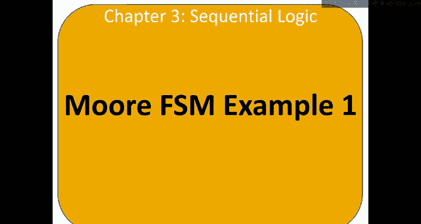
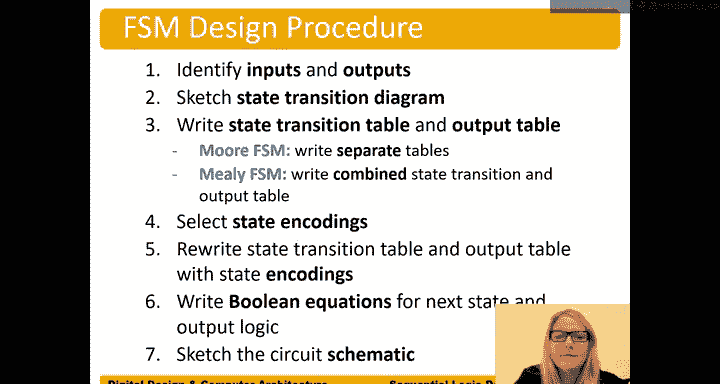

# 哈维穆德学院《数字设计和计算机架构RISC版｜Digital Design and Computer Architecture： RISC-V Edition》 - P36：Chapter 3 9.Moore FSM Example 1.zh_en - GPT中英字幕课程资源 - BV1JC1MY1E7F

So let's design a finite C machine。 And the word finite in。The term finite state machine refers to。

 well， the fact that there are not an infinite number of states in our finite state machine。

 we have some finite or fixed number of states。So let's suppose that you're having a a tough time staying on a schedule and so you want to might make finite state machine or build a finite state machine to help you do that。

So let's suppose the first state in your FSM or finance state machine is the wake up state。

 So this circle indicates a state。So start in the W of state。And after you wake up， you say， okay。

 well， do I have time for。For， for breakfast。Yeah， so T， you also write this as T equals equals 1。

But for being concise， we just write key。So if t is equal to one， then。Go to the breakfast date。

If you don't have time。Maybe just go take a shower。And don't go to the breakfast date。

Hop in the shower And then。 But if you do have time， go to breakfast and then。After breakfast。

 take a shower。And then after the shower， the next state。Is gonna be。

Go to class or watch the video lecture。And go to class。And so， let's， you know。

 let's just say after class， go back to the wake up state。

 not implying anything about falling asleep during lecture or anything like that。Okay。

 so we have this finite day machine。 In our case， it has four states and。And has the wake up state。

 the breakfast state， the shower state and the class state。

And so this is what's called a state transition diagram， state。Transition。

Diagram shows the states and the transition between those states。And so now， well， I mean。

 it's kind of cool we have a state transition diagram。

 but now we need to turn it into logic and so our first step is to make a state transition table also called the next state table。

😊，This is our state。Transition。Table。We're next state table。

So it either can be held a state transition table or。A next state table。

And so we have the state transition table。 And we want to take this state transition diagram and turn it into a table。

 So what we do is we put our current states。On the left and our input were input。

 sometimes we have more than one input。In case we just have one time input。And。

Remember that these arrows with possible inputs on a label on them are transitions between states。

And so we have our current state and our input on the left。And we have our next state。On the right。

So we're using our current state and our input to determine what the next state is。

So let's say we're， I'll start with the first date， the wake up state。If the input T is low， no time。

 then just go directly， the next day should be the shower state。After you wake up。

 if you're in the wake up state and you do have time。The next stage should be the breakfast date。

 So we're just taking this。This state transition diagram。And turning it into a table。

 state transition table， or also called the next state table。Okay。

 so now let's look at the next date。 Let's consider the。The breakfast date。

 So if you're in the breakfast state， well， no matter what， we'll put a don't care here。

 no matter what the input is。Right，There's nothing on that transition。

And so no matter what that input is。IGom to go to the shower state。

And the next state we can consider。 Let's consider this， the shower state。

If you're in the shower state again doesn't matter what the inputs are。

 there doesn't depend on inputs， the next state should be the class state。And finally。

 the last state to consider is the class state here in the class state doesn't matter what the inputs are。

 The next day should be the wake up state。 So here's our。Transition to the W at State。And。

 and then we're done。 We've completely specified what our finite day machine does。

Using this using this table。Okay。Well， this seems like， okay。

 except we need to build this in digital logic。 And yeah， digital logic understands ones and zeros。

 We've got some letters in here。So what we can do is we can encode our states。

 So with four states in order to encode four unique values， we need at least two Bs of state。

 And so we'll say， okay， let's encode our states。 Here。 We have let's say W B。S and C states。

 So these are states。And our encodings。Call us。State bit one to zero， we need at least two bits。

We have four states， if we've had five states， would need three bits。If we had， you know。

9 or 10 states would need 4 Bs and so on。 In this case， we only have four states。

 So we just need 2 Bs。Log base two of the number of states。So let's just encode W as 0，0， B as 0，1。

 S as 1，0 and C as 1，1。And now we can take our state transition table or our next state table and encode it。

So now we have our current state。S1 to0。 steep， it's 1 to0 and our inputs。This case。

 we have a single input at the time input。And。Now we have our next state。

And we right this is S1 Col 0 prime to indicate this is the next state。

And now we just take our encodings。So。Anywhere we see a W， we just put 0，0。 So that top row。

 we're going go row by row here，0。We can use the same colors here。0，0。

 if the current state is the W state。And time is zero。And the next state should be the S state。

S is one。0。The shower state or maybe two。Not confuse it with。The state will call the S H state。

Shower state。Okay， and so that rows done。Now we just go to the next row and encode that。 Well。

 here we have W。 we replace that with 0，0 or encoding for that state。 We do have time。

 So time is one， and it goes the next state should be the B state。Or 0，1。And row by row， we go here。

 The next one is B。 So I would go to our。Our our encodings B should be 0，1。Time was a don't care。

 but don't care there。 Next state should be the shower state。Or 10。And the next row。We have S H。

 The shower state is 1，0。 Don't care。 Next state should be the C state， which is 1，1。

 and the final row in our。Truth table， turns out we can use this as a truth table。C is 1，1。

I see being 11。 Don't care what the inputs are。 The next state should be W。Which is 0，0。So yeah。

 this looks a lot like a truth table。 We have some， some values that are determining。

Some other values。And so now we can use this to write what's called next state equations。

 So equations for these next state bits。So just like we've we've done before with other truth tables。

 we're going to use those same techniques to write equations。 So we'll start with state but。

Next8 bit1。 So S 1 prime。It's equal to。Well。Let's see。 We want to circle the ones。 So we have a。

S1 bar， S 0 bar and T bar。Or。This next one is。S1 bar。S 0。1 bar S 0。Or final one here。Is。S1。

And S 0 bar。And so。We could have， you know， we could also put this， you know。

 essentially this truth table into a K map to reduce it。 Or in this case， we could。

 we could see that this term here。 Well， one of these terms。But， for example。

 this term can be used to reduce this term S1 bar S 0。Is going to reduce this term。

 this left term to。S1 bar。And tea bar。Right， as an aside， if we factor out the S1 bar。

 it's probably the easiest way to see it of those two terms。 We get a S 0 bar and T bar or S 0。

 While this is the simplication theorem。 And we just get S 0 or。T板。And then we can。

Distribute that S1 bar again。 and we get S1 bar S T bar or S1 bar T bar， or， you know。

 that original term， S1 bar S0。Okay， so we can do some reduction， you know， some。

Simplification of of our next state equation as well。Okay。

 so we have our next equation for state bit 1。 So S1 prime is equal to this S1 bar T bar or S1 bar。

And we can see that this is actually the X or function， S 1 bar S 0。

 And so we could reduce the number of gates by。You know， by realizing that。

And just say that's or S 1， X or S 0。Or we could left it as is the same logically。

And now let's write an equation for S0 prime。State bit 0， prim or next state bit 0。So。

 S 0 is going to be。S is0 prime is going to be one。1， well， S 1 bar and S 0 bar and T。So F1 bar。

 S0 bar and。And T。Or the other place you get a one summer products form is S1 and S 0 bar。S 1。

And S 0 bar。Ts that don't care， so not included in our equation。And again。

 we can use the similar thing to get。 This is equal to。S 0 bar。And T or S1 S 0 bar。

So now that we have our next state equations， our equations for calculating the next state bits。

 S1 prime and S0 prime。Let's go ahead， and。Build the circuit。And so here we have a circuit。

 The first thing we're going to start with is putting in the state register。

 So this is the register that holds our state bits。So here is our current state。On the right， S1。

And S sub 0。Step at one and state at zero。 then we always have a clock input。And I reset input。

And in our state transition diagram， this reset input comes into a reset state。 in this case。

 the W state。 So when we get a reset on our our state register。It's going reset to the 0，0 state。

 or the W state。And we always want to reset our system because we don't want it to come up into an unknown state。

 right， if we turn on our， our X ray machine， we want don't want it to start firing X rays。 right。

 We want it to come into a known state。Okay， so we take our state bits and we bring them around because we want to use them。

To calculate。Our next state。 So we take our state bids。

 They're coming be output from our state register。And we use them to calculate our next state along with。

Our input， in this case， we have a single input， we could have multiple， but in this case， one。

 our input T。Okay， so now we just look at our state next state equations and say， okay， well。

 let's let's write the equation for next state bit one， so S1 prime。

 which are on the left side of the state register。So we're going to have S1。Bar and tea bar。

That first product term or。There's our orade or。S 1， X， or。S is 0。

I's draw the shape of the gates and then。Connect them。 So we have S1 bar。And key bar。

The bubble there or。Slon。X or S 0。And now we implement S1 or S is0 prime。Next state is 0。And we go。

S 0， bar and T。SoS 0 bar。And tea。Or。S1。And。😔，A zero bar。

And here's our finite state machine in circuit form。 we can test and make sure it works by。 Well。

 let's let's let's draw a timing diagram。To see what happens as we get our clock edges。

 So on each clock edge。We're going to transition between states。

 So we get a clock edge and we can transition between the W and the B state if T is true。

And after the next clock edge， we would transition to the S H state。

 the shower state and the next clock edge to the。To the class state。

 next clock edge would be to the W state。Okay， so。Let's see what。

 Let's draw timing waveform and see what happens。 So let's say we have a clock edge here，0，1，0，1，0，1。

Let's see what our clock edge looks like here。Let we get a clock edge。And then so， here's our clock。

And reset。Let's have our reset input。 Let's make reset go high。系ello。Stay low。

And remember time is in the X axis。Not the signal time， but actual time。

And let's do put our input here。 So we have an input T。And let's see， at first we have time。And then。

 sometime later。Stop having time。Okay， so let's see what our state does。

 so this is our state bits S1 clone zero。And let's see what that does。

And so we're going to have some state and see how that transitions across time， in fact。

 let's just do that across time。😊，So when reset is high， so here's our reset being high。😊。

We get a clock edge，ll say it's a synchronous resettable flip flop or state register。

 And so when the clock edge goes high。Our state becomes。0。0。So we get 0，0 for。

Our state bits S 1 Co 0。 And we know that that is。In fact， the W state。Okay。

 so we start in the W state as expected， when reset goes high。 and now。

 and now let's see what happens。 So reset goes low here。

And so can start calculating what the next date should be。So let's see our state bids are 1，0。I mean。

0， zero to start with right in the W state。What happens to our circuit。

 Well these state bits come around。To feed into our next state logic to our combinational logic here。

And if we have a 0，0 bear。Well， let's see。It is 0。0。

 and sometimes I label these just to help me keep track of them。 These are not inputs S 1 and S 0。 B。

 They're being fed out again， Remember by the state register。That's just to keep track。S 1 S 0。

 So we have a 0 and T is  one in this case。 So we get 0。Bar， which is one。And one bar， which is 0。

 So that top bit， this top gate is outputting is 0。Okay， so we get 0。

 or let's see what happens to this one we get 0， X or a 0。 Well， that's 0。 So we get 0 or 0。

 So this next state bit S1 prime is gonna be equal to 0。ok。When we're in the zero， zero state。

And T is one。We'll see about state bit 0 prime。 We expect it to be to go to the 0，1 stay。

 We expect state bit 0， the next state bit 0 to be  one。 We'll see if that happens。 So we get a0 bar。

Which is one，0 bar and T， which is one。 so we get a1 or something through this orgate。

 and we in fact get our one on next state bit0。And so at this next clock edge。The state。

 next state transitions over or becomes the current state， and we get 0，1。And。

We know that 01 is the B state， and which is。What we expected it to go to。

 we had time and we were in the W state in the wake up state。And so now。Let's。Transition our。

 our circuit here。Over to the 0，1 state。And。LetsGood back her。There go。Okay， so now we're in the。

0ero1 state， let use a different color here。Its for fun， Let's。s blue， so now we're in the 01 state。

 those are our state bits。And those come around be over here， what do we expect Well。

 if we're in the 01 state， we expect to go to the 10 state， right？

Because expect to go to the shower state is the next state。

So let's make sure our circuit calculates that as the next state。 So if the current state is 0，1。

 in other words， in the B state。WeEx our circuit to calculate that the next state should be the shower state。

 or in other words， the 10 state。Okay， so let's， let's see what happens there。 So we have 0，1 on our。

 on our current state。01 in our current state here。T is still one。

 Turn out T doesn't determine this next state at all， though。Okay， so。We have a zero bar。

And a one barb still gets zero on that top gate output。And then， we have a。This is our S 1 x or S 0。

 So have 0， x or 1。Which is， in fact， one。 So we get a one down here。On the output of the x orgas。

 if we get 0 or 1。 So S1 prime。Here's our S1 prime。Next statement one is， in fact， one。

 we get 0 x or 1。 We get a one there。Okay， and let's see what happens to our S0 prime。So， we get。

1 bar， which is 0。 We already know that gates can output is 0 because one bar is 0 and anything。

 And here we have S sub 1 is 0。 We get 0 and something also 0。 So we get 0 or 0。

And S of 0 prime is 0 for our next state。 just waiting for that clock edge。

 sitting on the left side of this state register is 1，0。At the next clock edge。

 that becomes the current state。 So here's our next clock edge。

That becomes the current state and we get 10， which we know is the shower state or the SH state。

And we could keep doing this， right we could faculty just do one more round here。

If we're in the now we're in the S H state， let's see what our circuit。

 our next state logic calculates as。As the next date。Okay， so now we're in the let's。

He's another color here。 Let's suppose we're now in the。1，0 state。

 So now our circuit isn't the10 state or the shower state。And so we get1，0。

 let's see what our circuit does。Comes around， feeds back to our next state logic and we get， well。

 we expect the next state to be the 11 state right from the shower state。

 the 10 state independent of any inputs we expect the next state to be the go to class state。😊，Okay。

 so let's see if that actually is what we calculate here。嗯。So， we have。1，0。 So we get one bar。

We know that that's going be 0。1 bar is 0 and something that top gate output is 0。

 And then we get one。X or 0 is 1。 We get 0 or 1 S1 prime is， in fact，1。As we had hoped and expected。

And now let's check out the S 0 prime or state is 0。 Next state is 0 calculation。 So we get a。

Zero bar， which is one。And T， which is one。Or。S of one， which is one。X or S 0 prime。 So one， x or 1。

It's going to be one。I that we have one or one， and in fact， our state at0 prime is one。

And so here's our next state waiting on the left side of this of the state register。

And at the clock edge， this next clock edge。We're going to get it。Transition。To the next state。

 that next state is going to become the current state。 and we get 1，1， which is。

They going to class 8。And so forth， right， so our circuit here is now performing this finite day machine or it's our circuit implementation of the FSM。

And so now we can look at this and say， okay， well， pretty good， right。

 we could expect the next day of the next clock edge。😊，Right。

 we look at this and we expect the next state that our circuit would calculate that the next state is the W back to the W state or the 0。

0 state and so forth。And so。We look at our state transition diagram and we could also put some outputs into this finite stay machine。

To see what that does。 So let's suppose we have， let's， let's annotate our。

 our state transition diagram so that it has some outputs in it。

 Let's suppose whenever we're in the class class state that we have some output， maybe it's the。

You know， the happy output， there's like an LED that lights up。 So if you can H is one， then。

 you know， it's connected to some LED that。You know。😔，Lights up and says， oh， yeah。

 we're happy we're in class。And so we label that on the state itself。

 So we can just write H if you wanted to， you could write H equals1。 But again， for conciseness。

 we just write， we just write H。 That means that H is asserted in that state。 And again。

 for conciseness， we don't list it as 0 in the other states。 We only list it in the states。

 So it's one。Would't be wrong to write h equals zero in the other states？

And so now to calculate this， well， we just want our， our happy LED to turn on in the class state。

 So we write what's called an output table。😊，Output table。 And this output table。

Has the current state on the left。And the output。We outputs。 We could have multiple。 this case。

 we just have one， the happy。Signal on the right， so we have our current state。S1 to S 0。

 I could have also written that as S1， Co and 0。 It's the same as S 1 S 0。

And we can either go to the directly it's the encoded or we could put right for each state， WB。

 shower， and class state。What do we want the happy LED or happy output to be， We want to be 0，0，0。

 and only one in this class state。And now we can use our encodings。0，0，0，1，1，0，1，1。

And this looks a lot like a truth table。 So now I can write an equation for this happy LED。

So we would have。8 is equal to。 well， this is just the and。Function， so H equals S1 and S 0。

 And so now I。Modify my。Circuit。To output。 So now we have some output logic here。To output our。

Our happy signal based just on the current state。And so we can see that we label， also label。 again。

 we label our。Output within a current state circle。

And so we can also put this onto our timing diagram Well would when would H assert。

 I'll put it up here for space reasons， normally we would put this down here。

 but H would assert in the class state， so here would be our timing diagram for that。

So let's recap what our design procedure was。So we started by identifying what our inputs and outputs were。

 So our inputs were T。We drew like a black box diagram。 We had an input of T。

 We only had a single input。 It could have had multiple。 But in the last example。

 we had a single input T， and our output was the happy output。And finite state machines always have。

Clock。And reset as inputs。So we identify our inputs beyond clock and reset and our output our outputs。

 in this case， H， a single output。We sketch our state transition diagram。

 write the state transition table and output table。For a more FSM， which is the kind that we。

Just designed。We write separate tables， a separate state transition table。

 and a separate outputqua table。And we'll show examples of Amelia SSM where that is combined。

A combined state transition and an output table。We select our state encodings。

Rewrite the state transition table and create an encoded state transition table。

 an encoded output table。Write Booleing equations for the next state and output logic and then implement the circuit。

