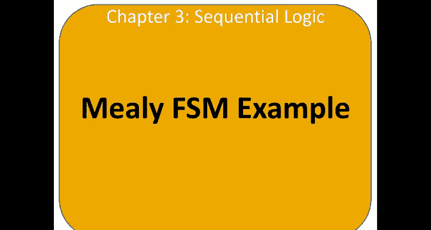
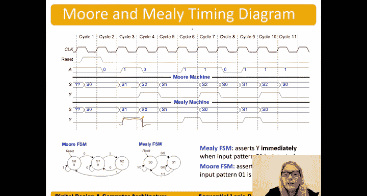

# 哈维穆德学院《数字设计和计算机架构RISC版｜Digital Design and Computer Architecture： RISC-V Edition》 - P38：Chapter 3 11.Mealy FSM Example.zh_en - GPT中英字幕课程资源 - BV1JC1MY1E7F

So now let's talk about the other kind of finite state machine。

 which is the Nely finite state machine。So a meal finite state machine。

 the output is determined by not only the current state， but also the inputs。So let's do an example。

 Let's suppose that Alyssa P Hacker has a snail that crawls down a paper tape。

 So here's the paper tape。With ones and zeros on it。

 the snail smiles whenever the last fudts is crawled over is 0，1。

So we want to design a more finite state machine and a meal finite state machine of the snail's brain。

So let's write state transition diagrams for each of these types of finite state machines。

So let's suppose that we do our more finite game machine and we're looking for the sequence 01。

So we'll start in S0， always put a reset。On our state transition diagram。And if we get a0。

 then we go to the next state， S1。And when we get a one after we received a zero。

Then goes to S 2 and outputs a a1。 So we could put smile here。

And then it continues to try to detect the the 0，1 sequence。Okay， so， so a little bit， some。

 you know， some things are， you know， almost right。

 So couple things we need to do is we we need to make sure that this deterministic what the next state should be。

 So right now， if there's， if we're in a 0。 And there's a one， not determined。

 So we need to make sure we include all possible transitions。 So there's a one。On the input。

 then we want to stay in the S 0 state。 We haven't seen anything that that we need。

 Same thing with the S1 state。 We need to know what happens if 0 is the input instead of a 1。

 So if zero is the input， Well， we still have our first0。 we still detected that first0。

 so we can stay in that state。And now， right， if we have the sequence 0，1，0，1。 Well。

 if we just do this， no matter what， and don't look at the inputs。 Now we've missed this 0。

we need to， if there's a 0。We need to go back to S1。But if there's a one。 So if it were 0。

1 and the next bit that we detected4 a1， then indeed go back to S 0 because S 0 means we haven't detected any part of our desired pattern。

Okay， so that's our more finite steam machine。I here written this way。

 And I want to show that because there's only one output。

 this this state transition diagram just shows 0，0，1 because we only have a single output。

 that smile output and you know， we could have put our inputs being some， you know， the name of them。

 but because we have one just a single input， we can also。Do it this way and just put 0。

 If our input is 0， if our input is one。Whatever that input is called， maybe it's I。

 You could have also written it like this。E equals 0， equals 1， equal equals 0。E equals 0。

 high equals1。And likewise， we could have just put either smile or smile equals one。There as well。

Okay， so， you know， various ways of writing our finite state machines typically use them the way that's most concise without sacrificing clarity。

Okay， for our mealli FSM， well， let's see what happens。 We start in the S0 state。And now。

 our transitions are going to have。Both the input or inputs。And the outputs。

 we put a slash there to separate the inputs from。The output or the outputs。So if S0。

 if we're in the S0 state， again， we always have a reset。And。The reset state。 So for the S 0 state。

And the reset state is just the state we go to upon reset。If the input is 0。

 still haven't found what we wanted。 So we still want to output a 0 for this。

Value on the right is the output。And the input is on the left， so for in state zero。And we get a 0。

 We have detected it the first bit of our potential sequence。And go to S1。 And now when we're in S1。

 if we get a one in the state。We want to go to S0， but we also want to output。A one。

 because now we have our entire sequence。 We received our 0， followed by our one。

And now we want to output a one to indicate， yeah， we， we saw that。

 that pattern that we were looking for。And now we go back and we put the other transition。

 So if we're in S0 and we don't。Get a0。 We get a one。Then we still want to output a0。

 but we want to go back to this zero state。 if we're in S1 and we get a0。

 we want to stay in that state and output a0 have not yet found our found the sequence that we're looking for。

So here's our mealli FSM， and you'll notice that in this FSM。

So the difference here is our outputs are。Shown on our transitions。And。

You'll notice so we don't in there more FSM our output is shown on our state。

And you'll notice that there are two states here。And in our more FSM， we have three states。

And typically， more FSMs require more states than merely FSms。

 And that's one easy way to remember that More FSMs have typically more states。

And so now let's encode our FSM， our state transition diagram in a state transition table or a next state table。

 and we'll do the same thing for our MEEE FSM。So forth in the0，0 state。

And we get a zero on our input。Then we w to go into the S1 state。And we've used binary encoding。

In this case， state its 1 to 0。If we're in the zero， zero state and we get a1。

 we want to go back a one on a or input， and we want to go back to the zero zero state。

If we're in the S。S one state。And we get a zero， we want to go back into the S1 state。

If we're in the S1 state and we get a1。We want to go into the。S2 state。And so on。

If we're in the S two state， we get 0。 I want to go into the S one state。

If we're the S2 state and we get a one， we want to go back to the S USD。

So here's our state transition table， went straight to the encoded straight state transition table。

 and we can now write our equations according to our table here。😊，So， S1 prime equals。S1 bar and S 0。

 and a。And S 0 prime equals。A bar。And this is that is most easy to see in a carno map。

 Let's go ahead and do that for S0 prime。So in our Carno map here， our K map。S1， S 0。

 and a is determining S 0。Prime。So we have the 0，0，0 row。 Let's just put our ones in。0，0，0 has a 1，0。

1，0。Ass a one。嗯。1，0，0。Has a one。And then these other ones， these other you know。

 the where the input is one。These ones。The output is zero。What about when S1 and S0 are。But for one。

Well， we don't have that encoding here。We're using that state。 That state will never occur in our。

 in our FSM。 So what do we put there we put zeros。And came out well。Butut don't cares。

 that's never going to occur。 right， We're never going to have that state in our， in our FSM。

 because it's never a next state。RightIt's never going to be calculated to be that state。

 And so by putting don't cares in there， we can actually。

Minimize our equation to be S0 prime equals a bar。Now let's look at our output table for the more FSM if we're in state0。

Remember here's our state encoding。 If we're in state  zero， Y should be zero our output。

 or we also call this the smile output。It should be zero， state 1， it should be0。

 it only asserts in state2。And again， we can use a K map to easily show this。S 1， S 0。

 Here's our output Y or smile。And 0，0 should be 0，0，1 should be 0，1，0 should be1。

 And then the  one one state， we don't， we don't use that stage。 we put it don't care there。

So we have that Y， which we've also called smile， is equal to。S the one。And， you know。

 just going directly from some products from from the table and saying S1 and S0 bar， it's not wrong。

It's just not quite as optimized as it could be And if we have a bunch of state bits and a bunch of inputs。

 I optimizing these in K maps is not realistic beyond four variables。😊。

And so just using direct some products is fine at that point。In our MEli FSM。

 our next state and our outputs are determined by the current state and the inputs。

 so we're going to have a combined state transition and output table。

So here we have our current state and our inputs， and our。Our， our next state and our。

Outputs are determined by both of those。And so if we are in the。S0 state here。

 we have only two states， so we can use a single bit of state。The0 bit。S 0 is encoded as 0，0。

 So for the S 0 state， oops is as 0。We're in the S0 state and a is0。Well， that's this case here。

 And our next stage should be。S sub 1， which is encoded as one。 and Y our output should be 0。

If we're in state zero。And our input is one。A is1， then our next day should be。S 0。

 which is encoded as0， and our output should be 0。If we're in state1。And our input is0。

Then our next date should be。State 1。And our output。Should be0。If we're in state one。

And our input is one。We're in state one and our input is one。 Then our next stage should be state 0。

and our output。识别 one。And so now we can write equations for this and some products S 0 prime is equal to。

 well， S 0 bar and a bar。不玩。S is0， and A bar。Or in other words， combining on those。

S0 prime equals a bar。And we can write the same thing for， all right。

 You would do the same process for Y。 Y is equal to。S0， and a。

And so now we have our next state equations and our output equation。

 and we can turn this into a circuit。So here we have our next state and output equations that we derived for our more FSM。

And we turn that into a circuit。Here's our let we start with our state register。

 put clock and reset into those。Our receipt bids， S1。And S 0， and our input a。

If have S is0 and a S0 and a for S1 prime， S0 prime is just a bar。And our output Y is equal to S1。

Likewise， for Amelia FSM， we have our next state equation and our output equation in ourmelia FSM。

 we get a single state bit。😊，Always start with our state register。

Clock and reset go into the state register。 We have a single state at state at 0。

Bringing that around。We also have our input， a。Our next state is。S0 prime equals。A bar。

And then we have our output Y is equal to。 And this is where our mealli FSM differs。

 It's equal to S0。 And now we bring our output。I mean， our input。To our connect to our output logic。

 and we get Y equals S 0 and a。So this wire here， this bringing of our input to determine with our current state。

 the output is the difference between war and meal FSMs。

So here you can see our input coming into our output logic。To determine our output。

And when we look at a timing diagram of our more ame FSM。 So here's time。

We can see that in our mealli machine。What happens is， as soon as。

We get our one on our input when we're in S1。So we're in S1， and we get。 So here's our 0，1。然后 you。

In our media FSM， the output Y immediately goes high。Whereas for our more FSM。

Only on the next clock edge。We get our input of one。

 and it has to wait for a clock edge to assert the output Y。And so timing。

 the timing of our output going high is different。The immediately FSM immediately responds to the input change and asserts the output。

 whereas the more FSMs has to wait for the clock edge。To assert， right， the input goes high。

 it has to wait for the clock edge to assert that output of one。And so if timing is a constraint。

 that is the one reason， then the main reason that mealing machines are used is when the output has to change immediately in response to an input change。

