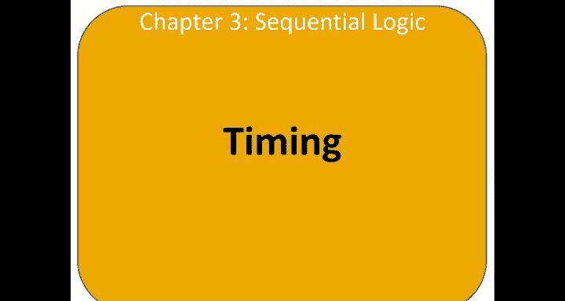
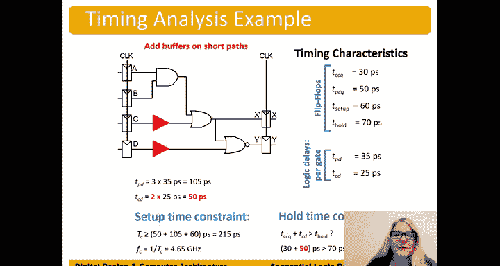

# 哈维穆德学院《数字设计和计算机架构RISC版｜Digital Design and Computer Architecture： RISC-V Edition》 - P40：Chapter 3 13.Timing.zh_en - GPT中英字幕课程资源 - BV1JC1MY1E7F

So let's talk about timing， we've talked about timing of combinational circuits。

 timing of sequential circuits is tied to the timing of a D flip flop。😊，So。😊。

One of the main stipulations is that D， the input to a flip flop has to be stable when it's sampled。

 Otherwise， we're going to get either you know， a value that's not valid or or a longer delay。

 So it's similar to a photograph right if we have our flip flop。

 this input when we sample it right when we get this clock edge。This input D， not stable。

 otherwise we're going to get a blurry or bad output。And so these constraints on our flip fl。

 we can divide them into input timing constraints and output timing constraints。

 So the input timing constraints are， well， input D has to be stable around the clock edge。

 and particularly， it has to be stable as setup time before the clock edge。

 This is the time before the clock edge that D has to be stable。 And this this。

Shows either one or zero doesn't matter which one， but it has to be stable。

Not changing a setup time before the clock edge， and then after the clock edge。

 it has to be held stable。For at least a whole time。

It has to be stable during this entire period around the clock edge。

And these hashlines mean that D can change at other times。

But it has to be stable around this clock edge。 we the sum of setup up and hold。

 we call the aperture time， similar to the ature time of the camera where the ature would open and then。

 and then you know， allow the the picture to be taken and then close。

 So this is setup plus hold is also referred to as the aperture time or T of a。

And let's think about where these， where these come from。 Well。

 let's dive into what the flip flop is。 Remember， a flip flop is two back to back latches。

L 1 and L 2。 And here we have our clock。And so。Where is the setup time， Well。

 the setup time we're clock going from 0 to 1。 Here's our clock edge。Ct going from 0 to 1。

 That's going to occur。Righter clock going from 0 to one here。When that happens。

 we need to make sure that this internal node and one has a stable value， that it's not changing。

 so that setup time really is the time it takes for D to get into that internal node。

And have a stable value。 So T setup is that physically， you know， from the circuit itself。

 it comes from the time it takes for D to get into the internal node。And one。

And then when the clock goes high。Clock goes from 0 to1 now。

 and one can travel through the second lat gel too。

And let's think about the whole time where the whole time comes from。 Well， whole time。Is well。

 when the clock goes from 0 to  one。I're going get that clock edge right here。嗯。

Our data is going to go through here。 But actually， when clockauus is from 0 to 1。Clock bar， right。

 This is clock bar。 This is driving L1。 Clock bar doesn't go to 0 until a short time later。

What's that short time， What the delay of that inverter。So really。

 the delay of that inverter is the whole time that says， hey， D can't change because actually。

 D is still getting sampled after the clock edge。Until that latch gets shut off a whole time later。

And so we can see where these values come from by looking at the internals of the flip flop。

 we have Thole， the time it takes a shut off L1 and T set up the time for D to get into the internal mode N1。

Now we can look at the output timing constraints。 The output timing constraints are how long after the clock edge that the output queue changes。

 And so remember that we now have our data or our Q our output Q changing。

According to the clock edge， not D， right， D changing will not change the output of Q until we get a clock edge。

 So we call this propagation clock。To queue。 So the from the clock edge。2。Q。😔，Output Q， changing。

So propagation clock to queue。So this is like in combinational logic。

 propagation delay was the maximum delay， propagation clock to Q is the maximum time after the clock edge that Q will change。

And contamination clock to Q TCCQ is the minimum delay after the clock edge that that Q will change。

 And again， we can dive into our internal circuit of our flip fl。 We have clock and clock bar。

 our Q D latches， L1 and L2。And when we get a clock edge， clock goes from zero to1。

 we get that clock transition from zero to one。Well， it still takes some time for a cu to change。

And that's this delay here。Proropagation clock to Q and is the maximum delay of L2 and contamination clock to Q is the minimum delay of L2。

And so we have a diagram here with our clock edge， here's our clock going from zero to1 key will change sometime after the clock edge at the earliest it would change is TCCQ and the latest it would change。

Is TPCQ， the propagation clock to Q， And these hash liness mean it could change within that time。

Between TCCQ and TPCQ。But outside of that time， Q is stable。그。

So we're going to define our dynamic discipline， dynamic means signals are changing。

 dynamic discipline so that the signals are valid。The sample signals on the flip flop are valid。

 so a synchronous sequential circuit must be stable。

 the inputs must be stable during the afterture time。

 the setup and hold time around the clock edge in order for us to have valid outputs of the flip flop。

 so specifically the input has to be stable at least a setup time before the clock edge and until at least a whole time after the clock edge。

 So a valid or stable sample is sampled by the flip flop。😊。

So let's think about the delay between a pair of registers。

 so when we're doing considering dynamic discipline， we are always considering a pair of registers。😊。

And the delay between these registers has a minimum delay and a maximum delay。

 depending on the delays of the circuit elements。 So here we have register 1 and Reg 2。

 And there's some delay of the signal between those registers。

And that delay is what we're going to call or the the minimum delay will be this cycle time。

 So let's suppose we have a clock edge。 So we get a clock edge here。

When is the next time we can sample。Right or get a rising edge on this clock。 Well。

 we have to allow this， this signal。 If we get a clock edge here。

 the signal is going to pass through。So come out of register one and then。

Go through the combinational logic and finally get put into Reg 2。

 right that internal load of register 2 and one。And termload of register to。

 And only at that point can we get the next。The next rising clock edge。And so this time。

At least the minimum time。Of that delay is what we call the cycle time or the clock period right between clock edges。

 So TC is the cycle time， orre also called the clock period。RightThe repeat。Time for the clock。

And so we can have both minimum and maximum delays those on those delays of the circuits。

 So we have a delay of getting our our signal out of the of Reg  one。 So after the clock edge。😊，T CQ。

 the minimum T PC CQ is the maximum。And then after it goes through the。Get out of the Reg one R1。

 we also have a minimum and maximum delay through the combinational logic， right？He。C， D。

 contamination delay or the long， the maximum delay。TPD。And then it takes some time to get into。嗯。

Get into the circuit as well。 that's our setup of time。

So let's talk about the setup time constraint this is we have two constraints on determining whether our circuit is going to run reliably。

 we have the setup time constraint and then we'll talk about the whole time constraint next。

The setup time constraint depends on the maximum delay from Reg one to Reg 2。

So remember that the input to register to must be stable。

 at least a setup time before the clock edge。So we get a clock edge here。A rising clock edge。

 And that drives。Q1 changing， so that time is the long time。

 the longest time that could take is TPCQ。And then Q1 changing drives a change in D2。

 The longest time that will take is TPD propagation delay。

 And then that has that signal has to be at D2， at least a setup time before the clock edge so that。

The two can can travel or can can get into the internal mode of that flip flop。

By the time we get the next。Clock edge。Very good。It's right here。

 And so we can add this up and say cycle time。Has to be greater than or equal to。😊，Well。

 that minimum time for that， for the signal to travel from R1。To R 2， T PC C，Q plus TP D。Plus。

 T setup。And can it be longer， sure， right， the signal can just be sitting here waiting inside that internal node and stable。

 you know， for a longer time， but not a shorter time。

And so we have our cycle time has to be greater than or equal to propagation clock Q time to get out of register  one。

😊，Plus。Proropagation delay。TPD。Plus， the setup time to get into register 2。

And we can rewrite this in terms of propagation delay because that's what we have control over。

 right we have control over the design of the combinational logic as a digital designer and so we can say。

 well， TPD has to be less than or equal to we're going to take these terms。😊。

And bring them over to other side。 So subtract them from both sides。

 So T PD has to be less than or equal to。Tc， minus。These terms， T PC C Q plus you set up。And this。

This kind of overhead right ideally would have the entire time if this were zero time and getting into the flip up or zero time would have an entire cycle time to do the work that we need to do。

 the calculations we need to do right TPD But we have this overhead of getting the signal out of Reg one and into Reg2 And so this TPCQ plus T setup is called the sequencing overhead because of the sequencing of our inputs and of our circuit。

😊，So remember that TC。this calculation of TC is called the set of time constraint。

 it's also called the cycle time constraint。😊，And's talk about the second constraint that we need to consider when we're doing our timing analysis。

 when we're figuring out of our circuit works reliably。This is called the whole time constraint。

 So the whole time constraint depends on the minimum delay from register  one through the combinational logic to register 2。

So the register 2 signal here， D2 has to be stable for at least a tea hold after the clock edge。

 So in this case， we're looking at the same clock edge。For R1 and R2。So here's our clock signal。

We're looking at that same clock edge。 And so we want to make sure that this signal does not。Right。

 any signal does not get samples。 So here's their clock。And race through。This circuit。

And start changing D2 before。A whole time after the clock edge。Khold。And so。

Theses a different color here。 T hold。And so， we would。Need to figure out， well。

 what's the fastest it's going to get through this circuit。 Well， this is T CQ。

 The earliest it would get out of the register one。Plus， T C D。

 the contamination delay or the short path through the combinational logic。

 And then it could start changing the value Ed D2。 And so if we draw this as in terms of our。

Our circuit， well， D2 could start to change as early as。嗯。t。😔，Cq。Plus。

TCD through our combinational logic。But as long as Dt doesn't start changing until after a whole time。

 right we just had to keep Dt stable。嗯。Until the whole time after the clock edge， it's fine。

 So there's no violation here。 So T， CC Q plus TD has to be greater than T hold。

You can't race through and start changing at D2 before a whole time， so this is our constraint。

Or you can write it another way， right T hold is less than TCCQ plus T CD。Either way。

 this is probably the easier way to think about it， but。You know either。

 it's just the same the same relationship。And so again， after the clock edge。

 we get the earliest time that the signal is going to change is a TCCQ。

It'll start changing Q1 and then Q1 will drive a change through combinational logic。

That earliest change is。TCD。And now D2 could start to change。TCCQ plus TCD after the clock edge。

And we need to make sure。But that is greater than the whole time constraint where D2 had to remain stable after the clockage in this case。

 check the constraint is met。So T hold is less than TCCQ plus TCD， or again。

 we could have written this together way， TCCQ plus TCD is greater than T hold。And again。

 rewriting this in terms of TCD， what we have control over as a circuit designer。

Bring this over to the other side。 And we get TCD is greater than。T hold minus。T CQ。

So TCD is greater than。T hold。 Then we bring that over to the other side， minus T CQ。

So drivingriving it， this is the way to derive it。And then using the equation in terms of thinking about what we can control TCD。

 we can use that second version of the equation。So when we're doing timing analysis to see if our circuit operates correctly。

 we need to calculate both constraints。The set of time constraint also known as the cycle time constraint and the whole time constraint。

If the whole time constraint isn't met， the circuit won't run reliably at any frequency。

So let's consider a circuit here Here。 We have some combinational logic， and we have two registers。

 Reg  one and register 2。 We want to make sure that。

Our set of time constraints and whole time constraints are met。

So let's suppose we have the timing characteristics shown here。

 our flip flos have these timing characteristics and our individual gates have these delays。

 propagation and contamination delay。So first all， let's figure out the propagation delay and contamination delay of the circuit Well TPD。

 the longest path is going to be through either A or B。Through three gates。

 So TPD equals three times TPD gate。Well， what was that equal to， That was equal to 35。

 And so that's equal to 105。Pcoseds。The contamination delay of the circuit is either through D to Y prime or C to X prime。

 So we have a single gate delay。 TCD is a single contamination delay。Of a gate。

 and that was 25 picoseconds。Okay， so now that we have those。

 we can calculate our cycle type constraint and our whole time constraint。

So cycle time constraint or setup time constraint， I call both of those TCS to be greater or equal to all the time it takes to get out of the flip flop。

😊，Plus， the maximum delay through the。Through the combinational logic。Plus， the time to。Set up。

Into the register。Okay， so let's see。 T PCCQ is 50。Plus，1，0，5。Plus， setup up time。With 60。Pcooses。

So we're going to have one or two。1undred and15。Pcooses。

So the cycle time has to be greater than or equal to。215 picoconds。 It could be longer than that。

 No problem。 And if later we find out， oh， hey， actually。

 the delay of the gate was 40 picoconds instead。Right after we get the circuit back。

 it's actually slower than we thought。We can change that cycle time of our clock。

 easy after after manufacture。Now it's consider the whole time constraint。The whole time constraint。

Is well， Thole。Has to be less than。T contamination clock Q plus TCD。

 the earliest that a signal could race out of the full flop and start changing the values at the input of the second bank of registers。

And so we have T hold 70 picoseconds。Has to be less than。TCCQ。Is 30。Plus。

 RRT C D of their combinational logic。Which is 25。Pcoconds。 so，70 picocons has to be less than。Oh。

 has to be less than 55 picoconds。 So it's 70 picoconds， less than 55 picoconds。 No， it's not。

This data could race through and start changing before the whole time constraint is met。

For the register， it's completely stop sampling， right？And so。Yeah， this is a problem。55 picoseconds。

Is not greater than 70 Pconds。Not good， right， So we have a problem here。

We haven't met the whole time constraint and the whole time constraint is actually a harder constraint to meet because if the whole time constraint isn't met。

 we can't increase the cycle time to make it work。 we're stuck right， And this whole time constraint。

 right， This is the worst case of our circuit， so。Even worse， it's， it's kind of unreliable。

 Sometimes it works， and sometimes it doesn't。 And that's。

 that's those are the worst kind of bugs becausere， you know， it's。

 there's something changing every time you run it or， you know， every few times that you run it。

And so we need to make the short path， basically these paths。These short paths through our circuit。

 We need to make them longer。 right， They're not long enough。

 They could start changing before that whole time is met。So， if we add。

A buffer to each of those short paths。Now we would have two gate delays。For our short path。

 either from C to X prime or D to Y prime and would get2 times 25 picoconds。

So we get 50 picoseconds for our TCD。And then， we would have。30。

 we still have our T C Q of 30 plus 50。 Is that greater than 70 pcoconds。 Yeah。

80 is greater than 70 piconds。😊，So we add buffers on that short path and ideally it doesn't change the delay of our long path。

 of our critical path， in this case it doesn't have to be careful there to recalculate that if you need to。

But now that we have this longer delay。We have satisfied the whole time constraint and our circuit can run reliably。

So remember in timing analysis， we're always doing two calculations。

 set up time constraint and whole time constraint。😊。

Set of time constraintst is also called the cycle time constraint。

And if our whole time constraint isn't met。You know。

 this is the other calculation set of time constraint doesn't make sense because our circuit won't run reliably at any frequency。

