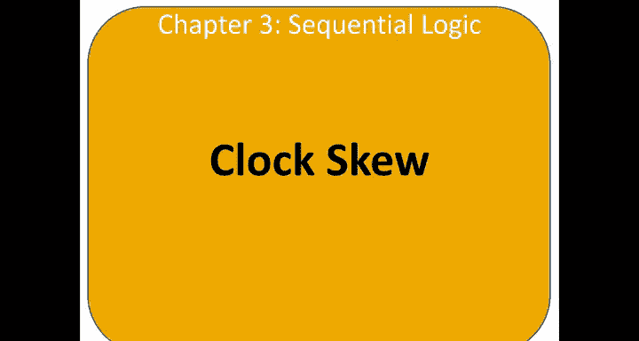
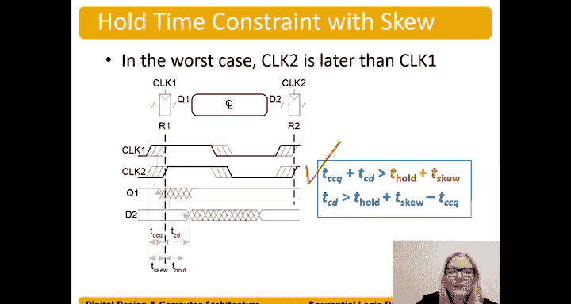

# 哈维穆德学院《数字设计和计算机架构RISC版｜Digital Design and Computer Architecture： RISC-V Edition》 - P41：Chapter 3 14.Clock Skew.zh_en - GPT中英字幕课程资源 - BV1JC1MY1E7F

So it turns out that our clock actually doesn't arrive at all registers at the same time。

And that is because， well， it's physically impossible， right。

 We have a few registers and they're separated in space。And in fact， if we have a big chip。

 there may be registers that are， you know， clear up here and registers that are clear down here。

 And if our clock we're coming in here at this point in our， in our chip。Now， there's a long delay。

For our clock。 And so this difference in the clock edges， right， we had a clock edge here。

 and only sometime later。Does this register see the clock edge？Because of this delay。

And so this difference in clock edges is called Sw。 So here's an example of clock 1。And clock 2。

 And there's a difference between the edges。 The frequency is still the same， right。

 It's still derived from that same clock。 But， for example， this clock。Clock 2。Is earlier。

Then clock1。We get a clock edge on clock 2， which is earlier。 and then some delay later。

We get the edge on clock1。And this can be aing a varying range， right。

 So these hashline here or these lines here mean that， well， it could vary。

 the worst case is that it's delayed by or the difference between those clock edges is T ski。

And so when considering Sku， we're going to perform a worst case analysis to guarantee that our dynamic discipline is not violated for any registers。

 There are many registers in the system。 So we're going to find the largest delay。

 make it work for that。 And then maybe some other the clock between some other registers are here and here。

 So a little bit less。 but we're going consider that the worst case possibility between two edges。

 which is。The the worst case， the worst for the worst case is going to work for those kind of intermediate worst cases or intermediate bad cases as well。

 or delayed cases。So let's talk about the setup time constraint or the cycle time constraint。

In terms of when we have to consider SU。So in the worst case， clock 2 is earlier than clock 1。

 So I'm going to redraw。The waveform for the。Clocks here。So here's clock1。And you register one。

And clock2 is earlier。And clock1。 So they still have the same frequency。不。Clock2 is earlier。

 so clock one's edge is delayed with respect to clock2。And so we still have this cycle time。

TC is still this entire time from here。You know， from edge to edge of a given clock。

Right that cycle time， we still have that cycle time for clock two。As well。Same cycle time。

 just delayed edges。And so let's see what happens。 Well。

 our data is going to be clocked into the circuit with clock1。After that clock edge。It will。

Come out of。Register  one。The latest time would be TPCQ。

It's going to go through our combinational logic。TPD。And then we need to have it。Set up。

And get into register 2 by clock twos edge， or clock 2。Is the one。That is sampling D2。

 And so that has to set up before。Clock tos edge。It has to be stable and available in that internal node of R2 of Register 2。

And so instead of having this entire cycle time。😊，To do that work。

 we actually have a cycle time minus。 Well， what's this difference here。

 The difference between these two edges。Is the sw。So instead of having a cycle time to do all of that work。

 we actually only have。A cycle time minus。Tcu。To do that work。

So TC minus TQ has to be greater than equal to well all that stuff that we need to do。

Proropagation clock to queue and get it out of the register。 Plus。

 get through the combinational logic。And set up into the next register。

So that stuff we need to do is the same， but now we should have less time to do it。

 We don't have the entire cycle time。 We have a cycle time minus T S。

And we can bring TQ over to the other side。Plus， TQ。And we have an equation then for TC。

Greater than or equal to all of this work we need to do plus TQ。

And so looking at these pre drawnrawn figures。比如。Clock in。Our data。From clock one。

TP C key later plus。呃TPD。Plus， a setup time。Is the amount of is the stuff we need to do。

 we have to do that before the next clock edge well， the next clock edge is being driven by clock2。

It the clock that's clocking out the data at D2 so instead of having TC this entire cycle time。

To do the work。We only have TC minus。Well the difference in these edges， so minus t S。

And we can bring Ske over to the other side and we get it。TC is greater than or equal to TPCCQ。

 TPCQ plus TD plus T setup plus TQ。We've basically increased our cycle time by that skuU amount。

And remember that the frequency of the clock frequency of the clock is equal to one over the cycle time。

 so for example， if we have a cycle time of one nanosecond。😊，One over one nano secondcond。

Equals1 gigahertz。As we increase that amount， right as we increase the cycle time。

 the frequency goes down。😊，So instead of one nanosecond， we had two nanosecond。😊，Ccle time。

We now have。A 500 MHz signal instead of a1 gigHz signal。 So our clock cannot run as fast。And again。

 we can rewrite it in terms of propagation delay， TPD is less than or equal to well Tc minus all this other stuff。

😊，But in terms of deriving the equation。This is the best way to derive it and then bring TQU over the other side to see what we need。

 what equation we have for determining our cycle time。

Now we can also consider the whole time constraint with SU。

 the worst case is that clock two is later than clock one。So in this case， when clock two is later。

 well we're considering the whole time off of the same edges right instead of considering the two edges。

 one edge and it's the next edge， we're actually considering the same edge。😊。

Right what we call the leading edge of the clock。And so this leading edge of the clock for clock 2。

 right here is clock 2 clocking out。The information。But now。

We're worried about the whole time of this clock。The whole time is those would start until a tcu later now。

 So now our our data that could be racing through and changing。D2， before it's correctly sampled。

 actually has a harder constraint because T。CCQ plus TCD has to be greater than not just T hold right last to get to past that time。

 but now relative to clock one's edge is driving this data。T S plus tea hold。So TCCQ plus TCD。

 that short path or that quick path through the circuit has to be greater than not just T hold。But P。

 T hold， plus。T Ss。 and now we have a harder constraint to meet。

And we can write it in terms of just our contamination delay again。

 by bringing TCCQ to the other side。And we get。This equation that determines what is the minimum value of TCD。

 right， The contamination delay of this combinational logic has to be greater than T hold plus TQ minus T CQ。

But again， drivingriving it。We would use this equation。

