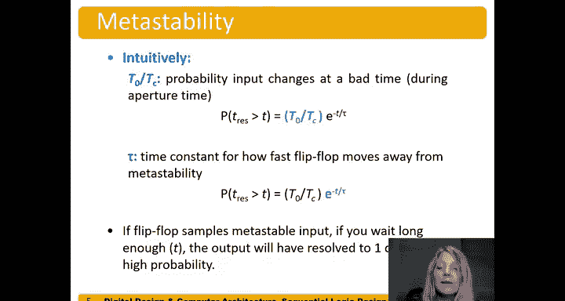

# 数字设计和计算机架构：3.15：亚稳态 📊

在本节中，我们将探讨数字电路中的一个重要概念——亚稳态。我们将了解它何时发生、为何会发生，以及它对电路行为的影响。理解亚稳态对于设计可靠、稳定的数字系统至关重要。

## 亚稳态的发生条件

上一节我们讨论了动态约束，本节中我们来看看当这个约束被违反时会发生什么。

亚稳态发生在输入信号在触发器的**建立-保持时间窗口**内发生变化时。这个时间窗口也被称为**孔径时间**。

## 异步输入与亚稳态

那么，亚稳态具体在什么情况下发生呢？它主要发生在处理**异步输入**时。例如，用户输入（如按下键盘按键）就是典型的异步输入。我们没有一个时钟信号来控制用户何时按下按键，而且要求用户在纳秒级时间内做出反应也是不现实的。

以下是异步输入进入触发器时可能发生的几种情况：
*   **情况1**：输入信号在时钟沿的建立-保持时间窗口**之前**发生变化。没有问题。
*   **情况2**：输入信号在时钟沿的建立-保持时间窗口**之后**发生变化。没有问题。
*   **情况3**：输入信号**正好在**建立-保持时间窗口**内**发生变化。这就是问题所在。

## 亚稳态的物理表现

当问题发生时，触发器内部会发生什么？让我们回想一下触发器的内部结构（基于SR锁存器和交叉耦合的或非门）。在时钟采样时刻，如果输入D正好在变化，内部节点（如L1）可能没有足够的时间稳定到逻辑高电平（1）或低电平（0）。

结果可能是，本应采样到的电压值（例如1V或0V）变成了一个中间值，比如0.5V。这个电压既不是明确的1，也不是明确的0。

## 双稳态器件与亚稳态

亚稳态实际上发生在任何**双稳态器件**中。对于触发器，它有两个稳定状态：`Q=1` 和 `Q=0`。但在这两个状态之间，还存在一个**亚稳态**。

如果触发器进入这个亚稳态，它可能会在那里停留一段不确定的时间——可能很短，也可能很长。在此期间，其输出是一个无效的中间电压值。

## 亚稳态的危害

这个中间电压值被送到后续的组合逻辑电路时，问题就出现了。部分逻辑门可能将其解释为1，另一部分可能将其解释为0。这会导致整个电路功能紊乱，行为完全不符合预期。

后果的严重性取决于应用场景：
*   在医疗设备（如X光机）中，可能导致剂量错误。
*   在汽车控制系统中，可能导致故障。
*   在儿童玩具中，可能只是需要重启。

## 亚稳态的电路模型分析

为了更好地理解，我们可以将处于保持状态的触发器内部（两个交叉耦合的反相器）简化为一个带有反馈的缓冲器模型。

一个普通缓冲器的直流传输特性是：低输入产生低输出，高输入产生高输出，中间有一个过渡区。

当我们加上反馈后：
*   如果初始输出是稳定的高电平（1），反馈回来仍是高输入，系统保持稳定。
*   如果初始输出是稳定的低电平（0），反馈回来仍是低输入，系统保持稳定。
*   如果初始输出是中间值（如0.6V），反馈回来作为输入，输出可能仍是0.6V。系统就会**卡在这个亚稳态点**附近，无法自行恢复到1或0。

## 亚稳态的概率与解决时间

如果输入在一个随机时间变化，特别是在孔径时间内，输出Q进入亚稳态的概率是存在的。输出从亚稳态**分辨**为一个确定的1或0所需的时间，称为**分辨时间**。

输出分辨时间超过某个等待时间t的概率可以用以下公式描述：

`P(t_resolution > t) = (T0 / Tc) * e^(-t / τ)`

其中：
*   `T0` 和 `τ` 是电路固有的时间常数。
*   `Tc` 是时钟周期。
*   `T0/Tc` 直观地表示了输入信号在“坏时间”（孔径时间内）变化的概率。
*   `τ` 表示电路从亚稳态点被驱赶到稳定电源轨（1或0）的速度。

这个公式表明，如果一个触发器采样到了亚稳态输入，只要你等待足够长的时间（`t` 很大），输出以很高的概率（尽管不是100%）会最终分辨为一个有效的1或0。

---

本节课中我们一起学习了亚稳态的概念。我们了解到，当异步输入违反触发器的动态约束时，电路可能进入一个既非1也非0的中间状态，并可能持续不确定的时间。这会导致系统功能错误。我们通过电路模型分析了其原理，并介绍了描述亚稳态发生概率和分辨时间的数学模型。在设计数字系统时，必须通过同步器等技术来管理亚稳态风险，以确保可靠性。