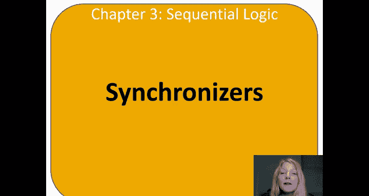
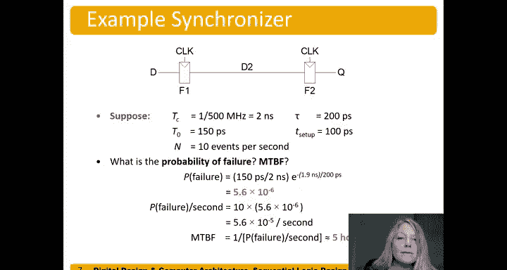

# 哈维穆德学院《数字设计和计算机架构RISC版｜Digital Design and Computer Architecture： RISC-V Edition》 - P43：Chapter 3 16.Synchronizers.zh_en - GPT中英字幕课程资源 - BV1JC1MY1E7F

We build synchronizers based on this waiting time of getting out meta stabilityability。

So we're going to have a sequence of inputs every user interface has。A user pressing buttons。

 even on your smartphone or on your computer， press on a keypad at times that are varying depending on the clock edge。

So the synchronizer's goal is to make the probability of failure low。

A synchronizer can never make the probability of failure is zero， so here is RD。

 and we have some synchronizer here。And then our output Q that we're sending into the system。

So a synchronizer is built with two back to back flip flos and basically the first one is the sampling flip fl。

 so this is sampling this metatable or this asynchronous input D。

And now we're going to allow it to regenerate using the feedback from the flipflop。

Regenerate for some amount of time。TC minus T setup。

Between those two flip flops allow it to do that regeneration again， of either you know。

 moving up to the rail or moving down to the rail during that cycle time。

The exciting time minus the set of time。And so。Now our time that we're reading this T。

Instead of just being a random tea is our that waiting time。

That we're allowing it to regenerate it's the cycle time as the setup time。Over Tau。

 and then we still have so that weve just substituted T or T weighting is TC。L T setup。

And so that we can calculate this probability of failure。For our， for our synchronizer。

And we also have two other measures， which is the probability of failure per second。

 so if every time we press a button we're going to get some probability failure。

 if we're pressing that button n times per second。We multiply that probability of failure times n。

Per second and get the probability of failure per second。So for example。

 if we have a dartboard and there's you know the block。But anyway。

 there's some probability that I'm going to hit some some region in the darkboard。

 maybe some you know black region then。Let's say that that probability is。0。1。

But there's just that probability and the probability of failure per second， if I throw that dart。

 you know five point times per second would have that times five。And we get 0。

5 is a probability of failure per second。Failures per second。Or second。

And so how many seconds would it take， what's the mean time between failure as well。

 if I have half of a probability of 0。5 failures per second， then one over that。

 it would on average would take me two seconds。To get a failure。

So that's the mean between failures is one over the probability of failure per second。

Or another example is if we toss a coin。And we have， right， I want to see a probability being ahead。

On the coin。 So that probability is， you know， half， right， half tails， half。

50% chance of giving heads， 50% chance of getting tails and let's say that I toss that。IYeah。

Just once per second。Then I have a probability failure per second of 05。Failures per second。

So clearly one over that。1 over 0。5 failures per second is equal to。2。😔，Seconds。For failureilure。

So the mean between failures for this example is two seconds。

Here's an example synchronizer where we have two flip flops， this is a sampling flip flop。

 and this flip flop is allowing it to regenerate。Between samples。

 either the high rail or the low rail。Because of the feedback in the flipfl。

And we have the parameters here of the cycle time，2 nanoiseseconds， 500 megahertz frequency， T knot。

T。She set up and the number of events per second。So we can calculate the probability of failure and the probability failure per second and the mean between failures。

We have our equations here。And meantime， seeing failures just one over。That。

We put our numbers in and we end up getting 5。6 times 10 minus6。

Probably a failure and multiply that by n to get the probability of failure per second。And one over。

Thus， to get our mean between failures， and that ends up being。Meantime two failures is five hours。

 so on average the system will fail every five hours， could be sooner， right。

 it could fail in one second。It could be later， could fail after a year。But on average。

 the system will fail every five hours。So my ask questionable， is that okay。

 you know if it's my computer and it's failing every five hours？I'm probably going to return it。Um。

 if it's， u， you know， you know， some， some， you know， toy that I'm that I'm my。

 I give to my kid who， you know， failed every five hours and they turn on and off。You know。

 no safety hazard there， maybe some frustration， but no safety hazard or some issue there。

 so it does depend on the application。So how would we drive this down even further well if we could put another flip flop so right this Q is what's setting out to the system。

 we put another flip flop there， flip flop three， well now instead of waiting know 1。

9 nanoiseseconds we're going to wait twice that we'll let it regenerate once and then whatever it got to it's going to keep regenerating there。

And so that doubles that， but you can do the numbers on your own， the effect is exponential。

And so we can add flip flops to increase that time we allow it to regenerate to either the high rail or the low rail。

 and then here's our system some the system only after it's high probability of being stable。

 being a one or a zero。

