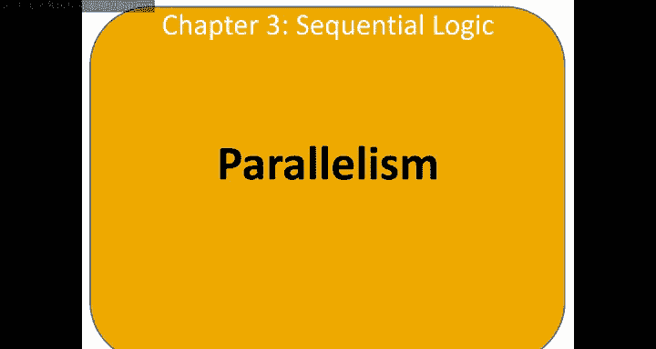
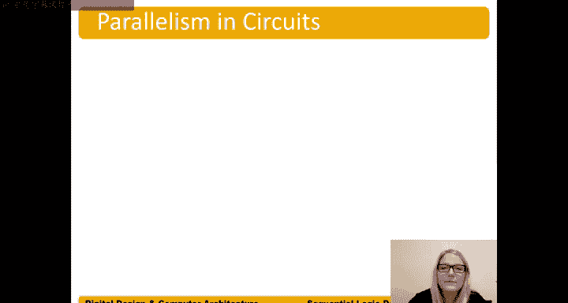

# 哈维穆德学院《数字设计和计算机架构RISC版｜Digital Design and Computer Architecture： RISC-V Edition》 - P44：Chapter 3 17.Parallelism.zh_en - GPT中英字幕课程资源 - BV1JC1MY1E7F

Yeah。We have two types of parallelism that we often use in circuits。

 So this parallelism is spatial parallelism and temporal parallelism。

 spatial parallelism is basically duplicating hardware。

 So if we have an adder or if we have some circuit that's calculating something。 Well。

 instead of one， let's use two。 or three or 4 right。

 So spatial parallelism means I'm just going do a bunch of things in parallel or at the same time。😊。

And so this is duplicating hardware to perform multiple tasks at once。

 this is similar to what you have in your PC where you have a quad corere processor。

 you have four processors， for example， and we've just duplicated the hardware to allow for parallelism of basically calculating multiple things at the exact same time。

Temporal parallelism is like an assembly line where we break up a task into multiple stages and perform part of the task at once。

 So we have multiple。 So， for example， let's say we have a an assembly line for a car。

 And maybe this is putting together the chassis。And this is adding the tires。

 And this is adding the interior or something。And this is， you know， finishing up the exterior。

Of the car。So car one could start here in the assembly line。At times equals0。

 And when car1 is ready to move to the second stage， the adding this higher stage。

 car1 moves to that stage。 and now a new car comes into the chassis stage， car 2。

And then car one will move on to the putting in the interior stage。And car2 will move to。

The putting on the tire stage。And then we add another car that gets started in the chassis stage。

 car3。And so in time， right， we have three cars。At this point。Being being worked on， being built。

And so we break a single task up into multiple stages and across time。

 so temporal parallelism across time， this word temporal means time。

 we're creating three cars or doing three unique operations， separate operations at once。

So let's talk about how we can analyze how a system is performing with regards to parallelism。

 so token is a group of inputs for this process to produce a group of outputs。

Latency is the time for a token to pass from the start to the end of a system。

 so to complete the entire calculation， for example。

 and throughput is the number of tokens produced per unit time。Parallism increases throughput。

 but it does not。 so it increases throughput， but it does not help with latency the time for any given task to be done。

 in fact， it usually。Makes latency a bit worse。So let's look at some examples of these。

So let's suppose that Ben Biitll has a task， he wants to bake some cookies to celebrate his traffic light control and installation。

And so it takes five minutes to roll the cookies and 15 minutes to bake it。

 What is the latency and throughput without parallelism。

Well latency is the time it takes to you know。Have the cookies。Start rolling them， baking them。

 and then eating the cookies。 right， The output is the， the， the finished cookie。

 So the latency is 5。Plus，15。Minutes。Or in other words。20 minutes is a latency。

And the throughput is one batch。Every。20 minutes。Or one tray every 20 minutes， In other words。

 one tray every third of an hour。Is three trays per hour。20 minutes is a third of an hour。Okay。

 so we have the latency of time， you know， if you're waiting for that cookie to be done。

 you have to wait 20 minutes from start to finish， how many trays per hour can we produce three trays per hour？

Now let's suppose that we want to employ parallelism。

 so with spatial parallelism where Ben is going to ask Elilysa P hacker to help using her own oven and in temporal parallelism。

 Ben's still going to complete the tasks but he's going to have two stages of rolling and baking and he's going to have two trays so while the first batches baking。

 he'll be able to roll the second batch and put it onto the tray。

So here's the example of spatial parallelism。 So here we have Ben。

This is the original kind of path with just Ben making cookies。 And we had every 20 minutes。

 a tray of cookies coming out。But now every 20 minutes。

We have two trays of cookies because both Ben and Alyssa are baking cookies。And so the latency。

 if I am waiting for cookies to be done， it will still take 20 minutes to get the cookies out。

 so 5 plus 15 minutes。😊，But the throughput is now instead of we used to have one tray。

Every 20 minutes or every third of an hour。Now we have。Two trays。

Every 20 minutes or every third of an hour。And so now the throughput is six trays per hour。

Whereas before without parallelism， we just had three trays per hour。So using spatial parallelism。

 we've doubled the throughput as expected， but the latency stayed the same。With temporal parallelism。

 Ben is going to， you， do all the work himself， but he's going to break it up into two stages。

 So he's going to have the five minute rolling out the cookies and placing them on the tray stage。

 and then the baking stage。 So we have stage1。And stage 2。And so the latency actually stays the same。

 so it still takes。5 plus 15 equals 20 minutes to get out。If you're waiting for cookies。

 you're going to have to wait 20 minutes。To get get the first cookie。But the throughput。Now。

 while Ben is waiting for the first tray to bake， he can roll out the next tray of cookies。

He has another another tray。 so he can put another batch of cookies on that tray。

 So when the the first batch of cookies finishes cooking， he immediately can put。The next。

Tray in the oven and so forth。It keeps doing that。Until he has， you know， millions of cookies。

And so the latency is still 20 minutes or a third of an hour， but the throughput is， well。

 he's going to tray of cookies after the first batch every 15 minutes。😊，公师。Every 15 minutes。

He gets one tray of cookies。 So one tray per。 Well，15 minutes is a quarter of an hour。

So every quarter of an hour。 And so now he's getting。4 trays。cookiesies can baked。Per hour。

And so what would have happened if both Ben and Alyssa have we use spatial parallelism and temporal parallelism。

 then and Alyssa are both you know doing temporal parallelism， but we have Alyssa down here as well。

 baking cookies， well now instead of one tray every quarter of an hour with both spatial and temporal parallelism。

 we get two trays。Every quarter of an hour。Which is equal to eight trays per hour。

So how does this correspond to our circuits。 So let's suppose we have some task this。

Make up a task here， or some calculation。That we're trying to calculate。And。We could use。

Let's say we're calculating。This four input X or function。And we could just calculate it as it is。

 And let's suppose the TPD of this circuit is。Let's say it's 100 picoconds。

And so each TPD of the X orgate。Is。50 Pseconds。And so we could see what the latency and throughput is。

 well latency would be the time it takes to put our inputs in until we get our outputs out。😊。

And so the time is really。The the latency。Is a cycle time。TC。

If you really want to get into nitty gritty。It's really a setup of time plus that cycle time。Plus。

 a propagation clock to queue。But you know， kind of。

Abstracting way those those details latency is a cycle time and the throughput is， well。

 how often are we getting？😊，诶。Throughput is how often we getting a result。

 while we're getting a result every。Whatever that cycle time is one over TC。Is that's the reportput？

And so what happens if we use spatial parallelism？ Well， now we're going to。

Put two of these circuits， I'll just draw a combination logic like that。

And so now we have two of these circuits， spatial parallelism， and so the latency is still the same。

 still takes us the same amount of time to get any outputs。😊，But the throughput is， well。

 now instead of one。Kind of calculation every cycle time。 Now the new throughput。

the new throughput is two calculations，Forcycle time。

 and so we've doubled the throughput of our system。And so how would we then employ？

Tempal parallelism。Into this， into the circuit， also called pipelining。Well， let's see。

 We have a circuit here。 We could break it up into two stages so we could add。A register。

 This would be a good place to add a register。In between that。

In the middle of that calculation or that combination logic， the calculation circuitry。

And so now we have two stages。 and so we have our。Stage one and stage2。

It will turn out that our latency will be bigger because of we've added an extra TPCQ。And T PD。

So now， let's say that our。Let's put some numbers to that。

 So let's suppose that we had T PCCQ is equal to 60 piCOseds and T setup。Equals 40 picoseconds。

And so let's just， let's make this。Let's make this like 900。

P acons for the original delay of the circuit。So that would mean that Tx or propagation delay was 450 picoconds。

Let's suppose we have that。 So originally， without the。Added register。That our added register here。

It would have been。It would have it would have been our cycle time would have been equals T PCQ plus TPD plus T setup。

So I would have been。60 plus 900。Plus，40。P acon would be 1000。Pcoose or in other words，1 nanosecond。

 So cycle time would have been one nanosecond latency。Would have been。In this case。

 latency would have been。Just the time it takes to。嗯。Calculate 1， one of those calculations。

 and the throughput。Would have been。The throughput would have been。One calculation every cycle time。

So in other words， the frequency of the circuit。Now let's add。That。

Register in there approximately without getting into details。 Latency is approximately the same。

 Actually a little bit longer， but approximately the same。 And throughput is now well。

We can approximately make our cycle time， half of the cycle time。 So our throughput is approximately。

 again， we'll put real numbers on this。Thput is approximately one over。TC over two。

 our cycle times is approximately cut in half， so we approximately get two over TC。

 which is twice the throughput we had before。But let's put some actual numbers on that to see what we got。

 So now our cycle time， our new cycle time with this pipeline system or with temporal parallelism being used。

 Now， our cycle time is， well， we still have I speak greater than equal to propagation clock to Q still at plus T PD。

 That's changed。Plus， he setup。And so we get TPCQ with 60。 TPD is now just a single。Ex orate delay。

Right， this is not too。 Some people count as too， but these are going in parallel， right。

 So this time is in parallel 60 plus。TPD is 450。Now， 450 peacconds plus T setup， which is 40。

And so our new cycle time is 550 picoseconds。So we said it would be half cycle time would be half originally it was 1000。

 and that's close to a half， but we have that overhead of the sequencing overhead propagation clock to Q and setup time。

 and so it's not it's not exactly half。 So TC is 550 picoseds because we have two stages。

 the latency is one，2 cycle times。 again， we could add setup time plus propagation clock to Q if we wanted to be you know。

 exactly precise。 but。Now， our new latency is。Q t时。Where our cycle time is 550。So， it's 1100。

Pco seconds。And our throughput。Is equal to， well， still one over TC。 This is a new T C。

 So it's one over 550 pecoseconds。One calculation， right， every 550 peacconds。

 we're going to get a clock edge and get a new result out。New result。 New result。 Next result。

And so our throughput is approximately twice， right， it used to be one over1000。

Pecooseconds are 1 gigHz，1 giga result per second。And it's just less than twice。

The throughput of the non pipeline version。And so in this case。

 we could only break up our circuit into two stages。

 but if we have some combinational logic and we can break it up。

 So originally we had this combinational logic， we can break it up into even more stages。

If we can break that combinational logic up into even more stages。

 then we can even get a bigger advantage with our temporal parallelism also known as pipelining。

 but now our depending on what that cycle time is is shorter now than it was when we didn't have a pipeline。

 but now the latency would be one， two， three， four cycle times and the throughput would be as usual one over TC because every。

Clock edge were getting any result out。Of our， of our system。

And of course there are some subtleties of well， take some time to fill up the pipeline right when we start up our system。

 while it's going to take one， two， three， four cycles to get the pipeline full and that's called filling the pipeline and then at the end we're going to be draining the pipeline where the last result is going to pipeline is pipeline its way through to to the output。

