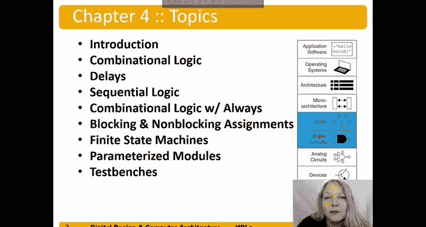
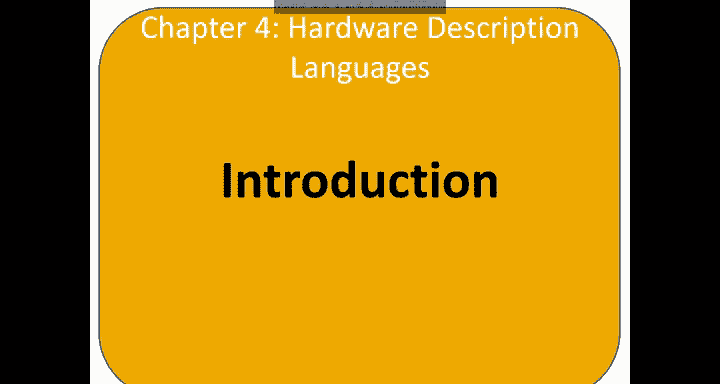
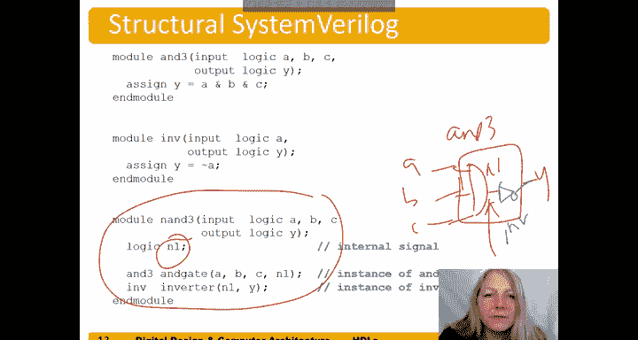

# 数字设计和计算机架构：4.1：硬件描述语言简介 🧠


在本章中，我们将学习硬件描述语言，简称 HDL。

硬件描述语言允许我们使用一种语言来描述逻辑，包括组合逻辑和时序逻辑。我们将讨论如何描述组合逻辑、如何描述延迟（仅在仿真中），以及如何使用所谓的“always块”来描述时序逻辑。此外，我们还将涵盖阻塞与非阻塞赋值、有限状态机、参数化模块和测试平台。





---

## 概述

在本节中，我们将介绍硬件描述语言的基本概念、它们的作用以及两种主流语言。我们将学习如何用 HDL 描述电路的行为和结构，并理解从 HDL 代码到实际硬件门电路的转换过程。

---

## HDL 的作用

硬件描述语言允许我们指定逻辑功能。它是一种计算机辅助设计工具，能够根据我们使用的描述语言生成综合后的门电路。如今，大多数商业设计都使用 HDL 而非原理图来完成。

以下是两种主流的 HDL：
*   **SystemVerilog**： 于 1984 年开发，最初称为 Verilog，后成为 IEEE 标准。在 2005 年扩展后，现称为 SystemVerilog。
*   **VHDL**： 于 1981 年由美国国防部开发，同样是 IEEE 标准，并于 2008 年更新。

---

## 设计流程

首先，我们使用选择的 HDL 描述电路。我们将展示如何在 SystemVerilog 中完成。接着，我们可以对电路进行仿真，即施加输入并检查输出是否正确。这种仿真能在电路投入硬件制造前进行调试，从而节省数百万美元的成本。

然后，我们将对电路进行综合。综合过程将 HDL 代码转换为一种称为“网表”的格式，该格式描述了硬件中的门电路及其连接关系。

---

## 重要概念：HDL 不是编程语言

这一点非常重要，因此用红色强调。硬件描述语言不是编程语言。因此，当你用 HDL 描述电路时，必须清楚你期望从所写的 HDL 代码中综合出什么样的硬件。

如果你仅仅将其视为软件语言，将会遇到麻烦，因为你可能会产生无法工作或规模远超所需的硬件。所以，再次强调：编写 HDL 时，要思考你期望它产生的硬件。

---

## 模块类型

模块分为两种类型：行为模块和结构模块。模块都有输入（图中左侧的 A、B、C）和输出（Y），即它们都有接口。但这两种模块的区别在于：

*   **行为模块**： 描述模块的功能，即电路的行为，但不说明内部组件是如何组合在一起的。
*   **结构模块**： 描述模块是如何组合而成的，即由子模块构建而成。

通常，底层模块是行为模块，而高层模块则以结构化的方式将这些底层行为模块组合在一起，即实例化并连接一系列子模块。

---

## 模块声明示例

以下是一个 SystemVerilog 中的模块声明示例：

```systemverilog
module example (input A, B, C, output Y);
    // 模块体将放在这里
endmodule
```

我们可以看到这里有关键字 `module`，后面跟着模块名 `example`，这定义了模块的名称。接着是输入（A, B, C）和输出（Y）。如果我们要绘制系统的黑盒图，它看起来就是这样的。模块声明的最后需要有关键字 `endmodule`，表示模块结束。在这之间，我们将放置描述模块功能的**模块体**。

---

## 行为模块示例

这是一个行为型 SystemVerilog 模块。它包含了我们之前提到的接口、`module` 关键字、模块名 `example` 和 `endmodule` 关键字。现在，我们来看模块体，即模块的功能部分。

在这个例子中，它是一个积之和表达式：
`Y = (~A & ~B & ~C) | (A & ~B & ~C) | (A & ~B & C) | (A & B & C)`

我们使用 SystemVerilog 语言描述了电路的行为，而没有具体说明“实例化一个与门和一个或门”。我们实际上让综合工具来决定如何用门电路来实现这些功能。

编写完 SystemVerilog 模块后，我们可以对其进行仿真。图中显示了输入 A、B、C 和输出 Y。例如，开始时 A、B、C 为 0,0,0，我们看到输出 Y 为 1，这符合 `~A & ~B & ~C` 项的结果。当输入为 0,0,1 时，输出为 0，因为没有哪个乘积项会迫使输出为 1。我们可以继续观察其他输入组合下的输出，通过仿真来验证。如果输出不符合预期，我们可以返回修改 SystemVerilog 代码以纠正错误。

下一步是综合 SystemVerilog 模块。综合工具将我们的模块转换为门电路。我们可以看到它被转换成了 `Y = (~B & ~C) | (A & ~B)`。综合工具并不总是最小化方程，但在这个简单案例中它做到了。我们注意到电路与我们描述的形式略有不同，但功能是相同的，并且它使用了最少数量的门电路来实现该功能。

---

## SystemVerilog 语法规则

以下是 SystemVerilog 的一些基本语法规则：
*   **区分大小写**： 这是许多人遇到难以排查错误的地方。例如，信号 `reset`（小写 r）与 `Reset`（大写 R）是两个不同的信号。
*   **命名规则**： 名称不能以数字开头。例如，`2mux` 是无效的名称，而 `mux2` 是有效的。
*   **空白符**： 空白符（空格、制表符、换行）会被忽略。
*   **注释**： 我们可以在代码中添加注释。单行注释以 `//` 开头。多行注释以 `/*` 开始，以 `*/` 结束。

---

## 结构模块示例

这里有一个结构型 SystemVerilog 模块的例子，模块名为 `Nand3`。

它仍然具有接口 A、B、C 和 Y。现在我们注意到两件事。首先，有一个名为 `n1` 的信号，它是一个内部信号。其次，我们在这个模块内部实例化了一个三输入与门 `and3`，并将其输出连接到内部信号 `n1`。然后，我们实例化了一个反相器模块 `inv`，将 `n1` 作为其输入，并将其输出连接到 Y。

这个模块是结构化的，因为我们实例化了子模块（三输入与门和反相器），并使用内部信号 `n1` 将它们连接起来。`n1` 不是输入或输出，只是一个内部连接信号。

```systemverilog
module Nand3 (input A, B, C, output Y);
    wire n1; // 内部连线

    and3 and_gate (.A(A), .B(B), .C(C), .Y(n1)); // 实例化三输入与门
    inv inverter (.A(n1), .Y(Y)); // 实例化反相器
endmodule
```

---

## 总结



本节课我们一起学习了硬件描述语言的基础知识。我们了解了 HDL 的作用、两种主流语言（SystemVerilog 和 VHDL）以及从设计描述到仿真和综合的完整流程。我们重点区分了行为描述与结构描述，并通过示例学习了如何在 SystemVerilog 中声明模块、编写行为代码和结构代码。最后，我们记住了一个核心原则：HDL 描述的是硬件结构，而非软件流程，编写时必须时刻考虑其对应的硬件实现。