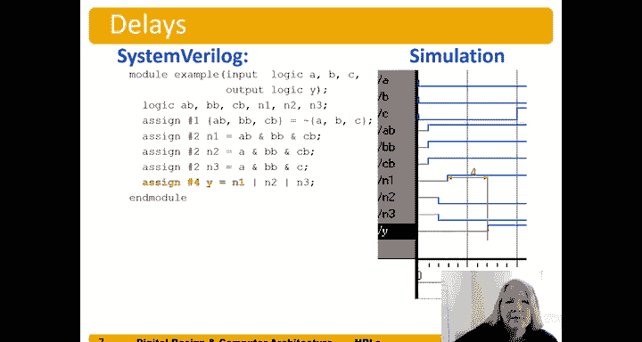

# 数字设计和计算机架构：4.3：SystemVerilog仿真中的延迟 ⏱️

在本节中，我们将学习SystemVerilog硬件描述语言中延迟的概念。我们将了解如何指定延迟，更重要的是，理解这些延迟仅用于仿真目的，而非描述硬件的实际物理延迟。

## 概述


在硬件设计中，信号传播需要时间。为了在仿真中更真实地观察信号间的因果关系和时序行为，SystemVerilog允许我们为赋值语句添加延迟。然而，**核心要点是：这些延迟仅用于仿真，不代表硬件的实际物理延迟**。它们帮助我们在仿真波形中清晰地看到信号变化的先后顺序和逻辑关系。

上一节我们介绍了组合逻辑的建模，本节中我们来看看如何在仿真中引入时间维度。

## 延迟的语法与含义

在SystemVerilog中，延迟通过在赋值语句中使用 `#` 符号后跟一个数字来指定。这个数字代表仿真器在计算右侧表达式后，等待多少个“仿真时间单位”再将结果赋值给左侧信号。

**代码示例：**
```systemverilog
assign #1 Abar = ~A; // 延迟1个时间单位
```
这条语句意味着：每当输入信号 `A` 发生变化，仿真器会计算 `~A` 的值，但会等待1个时间单位后，才将这个新值赋给输出信号 `Abar`。

需要再次强调，这里的“1个时间单位”是在仿真环境中定义的（例如1ps），它没有直接的物理意义，只是为了在仿真波形中可视化信号变化的时序。

## 深入分析一个带延迟的模块

让我们通过一个具体的模块例子来详细理解延迟在仿真中的行为。

**模块定义：**
```systemverilog
module example (input logic A, B, C, output logic Y);
    logic Abar, Bbar, Cbar;
    logic N1, N2, N3;

    assign #1 Abar = ~A;
    assign #1 Bbar = ~B;
    assign #1 Cbar = ~C;

    assign #2 N2 = A & Bbar;
    assign #2 N3 = B & Cbar;

    assign #3 N1 = (Abar & B) | (Bbar & Cbar);

    assign #4 Y = N1 | N2 | N3;
endmodule
```

### 仿真波形分析

假设在仿真时间 `t=0` 时，输入 `A`、`B`、`C` 同时从高电平变为低电平。

以下是信号变化的逐步推演：

1.  **第一级延迟（`#1`）：**
    *   输入 `A`， `B`， `C` 在 `t=0` 变化。
    *   经过1个时间单位（`t=1`），反相信号 `Abar`， `Bbar`， `Cbar` 被更新为各自输入的反相值。

2.  **第二级延迟（`#2`）：**
    *   信号 `A` 和 `Bbar` 是 `N2` 的输入。`A` 在 `t=0` 变为0，`Bbar` 在 `t=1` 变为1。
    *   根据 `assign #2 N2 = A & Bbar;`，任何右侧输入变化后，等待2个单位再更新 `N2`。
    *   `A` 的最后一次变化在 `t=0`，因此 `t=2` 时，仿真器会用 `A=0` 和 `Bbar` 的当前值计算 `N2`。由于是“与”操作，`0 & Bbar` 的结果恒为0，因此 `N2` 在 `t=2` 被赋值为0。
    *   同理，`N3` 也在 `t=2` 被更新为0（因为 `B=0`）。

3.  **第三级延迟（`#3`）：**
    *   信号 `Abar`， `B`， `Bbar`， `Cbar` 是 `N1` 的输入。它们分别在 `t=1`（`Abar`， `Bbar`， `Cbar`）和 `t=0`（`B`）发生变化。
    *   根据 `assign #3 N1 = (Abar & B) | (Bbar & Cbar);`，任何右侧输入变化后，等待3个单位再更新 `N1`。
    *   最后一个变化的输入是 `t=1` 的 `Abar`， `Bbar`， `Cbar`。因此，在 `t=4` 时，仿真器用所有输入的当前值计算 `N1`。代入数值 `(1 & 0) | (1 & 1)`，计算结果为1。因此 `N1` 在 `t=4` 被赋值为1。

4.  **第四级延迟（`#4`）：**
    *   信号 `N1`， `N2`， `N3` 是输出 `Y` 的输入。`N1` 在 `t=4` 变为1。
    *   根据 `assign #4 Y = N1 | N2 | N3;`，任何右侧输入变化后，等待4个单位再更新 `Y`。
    *   最后一个变化的输入是 `t=4` 的 `N1`。因此，在 `t=8` 时，仿真器计算 `Y`。由于是“或”操作，`1 | N2 | N3` 的结果恒为1，因此 `Y` 在 `t=8` 被赋值为1。

通过这个分析，我们可以看到延迟如何像涟漪一样在逻辑电路中传播，最终决定了输出 `Y` 在 `t=8` 时刻发生变化。

## 延迟仿真的关键点总结

以下是关于SystemVerilog仿真延迟的几个核心要点：

*   **仿真专用**：`#` 延迟仅用于仿真，综合工具会忽略它们。它们不定义芯片的实际工作速度。
*   **建模因果关系**：延迟的主要作用是帮助设计者在仿真波形中清晰地观察信号变化的**因果关系**和**路径**。
*   **不影响逻辑功能**：在理想的零延迟仿真中，只要输入稳定，输出会立即得到正确值。添加延迟后，输出结果在逻辑上保持不变，只是变化的时间点被推迟了。
*   **工具优化**：如示例所示，仿真器会进行逻辑优化。即使某个信号的延迟未到期，如果其值已能确定输出（如 `0 & X = 0`， `1 | X = 1`），仿真器可能会提前得出结果。

## 总结



本节课中我们一起学习了SystemVerilog中延迟的用法和意义。我们了解到，通过 `#` 符号可以为赋值语句添加仿真延迟，这使我们能够在波形图中直观地追踪信号在逻辑路径中的传播时序。必须牢记，**这些延迟是纯粹的仿真工具，用于调试和验证，并不代表最终硬件电路的物理时序特性**。硬件的实际速度由晶体管开关速度、导线长度等物理因素决定，需要通过静态时序分析等其它工具来评估。掌握仿真延迟，能帮助我们更好地理解和调试数字电路的行为。