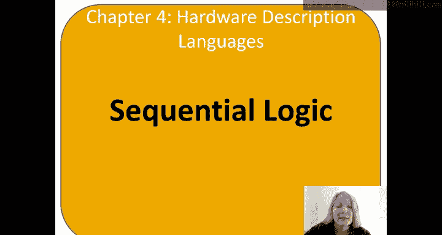
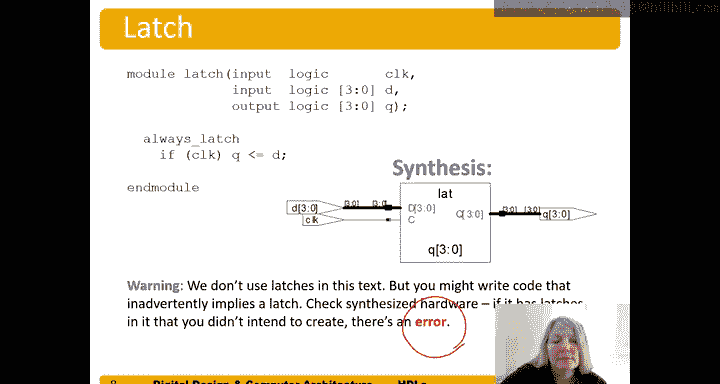

# 哈维穆德学院《数字设计和计算机架构RISC版｜Digital Design and Computer Architecture： RISC-V Edition》 - P48：DDCA Ch4 - Part 4： Sequential Logic in SystemVerilog -9bgTIwAdj70-.zh_en - GPT中英字幕课程资源 - BV1JC1MY1E7F

So we've talked about how to specify combinational logic using assigned statements。

 and let's talk about how to specify sequential logic in system V。

System Fair log uses idioms to describe latches， flip flops and FSN。 So these idioms are。

Kind of formats that we use in systemive B to specify， hey， this should be a latch。

 this should be a flip flop， and we'll show you what those idioms are。

Other coding styles may may seemingly correctly， but produce the incorrect hardware so so it's important to use。

These styles of idioms that we'll discuss right now。

The general structure of specifying these lashes and flip flos is always at。

What's called a sensitivity list。 So we put this always keyword at。

Some sensitivity list then perform a statement。So whenever anything then the sensitivity list changes。

 when that event happens。The statement should be executed。

So here's an example of a default flip flop。So we have the keyword module and the module name。

 this case we chose Fop。Again， that's up to the designer's choice， the circuit designer's choice。

 and we have inputs clock。And D， this is a four bit。

Flipflop are a four bit register and the4 bit output Q。And so this is the idiom that we use。

 we say underscore FF and always underscore FF indicates this should be a flip flop。

At pauses edge clock。 So this pause edge。Is the keyword saying at the positive edge or rising edge？

Of clock。Perform the statement。So at the positive edge of the clock， when clock rises from zero to1。

Then perform that statement， which is Q gets D。SoD transfers。D transfers over to Q。

And so when we synthesize this HD。We end up with exactly what we expect8 foot flop。

We can also specify a resettable def flipb， so here now in addition to our clock。Input。

 we add this reset input。And then we still have RD input and Q output。

This part of the always statement is the same。 always underscore FF at Poage clock。

 so this will perform the statement。But then not always block。

Whenever the positive edge of the clock occurs， whenever that event occurs。And。

What it happens this statement that it performs is now different if reset。Q becomes0。Otherwise。

 Q gets D as normal when reset is0， it acts like a regular D flip flop。

And so what kind of fl fl or recable fluff fl is this asynchronous or synchronous。Well。

 the reset only happens in response to the clock edge。So， this is a。Synchronous。

Synchronously resetable D flip fl。So we could also build an asynchronously resettable flip flop。

To do that， we need to put。The event that we want the statement to be evaluated on。

Were they the event trigger？In。The always statement， so always underscore FF at either。

 so it's going to evaluate the statement within the always block。

This entire thing is called an always block。When either we get a positive edge of the clock or we get a positive edge of reset。

 so reset going high。Resite going high。Can trigger。This evaluation。 So if reset goes high。

 pause edge of reset。And it evaluates and says， hey。So I get if reset is one， it is。

Q immediately resets and doesn't wait for。 doesn't have to wait for the clock。To rise。 So this is an。

Asynchronously resettable flip fl。And from the synthesis。

 you can't tell the difference between asynchronous and synchronously resettible from the symbol if a look at the system parallel code。

We can also specify a D flip fop with an enable。 So here's clock and reset has a it's a resetable D flip fl with an So the clock and reset before。

 and now we add。This enable input， and of course， the input and Q output as well。And now we。

Change it so that we have if reset Hu gets。Zero， so it becomes zero。Otherwise， if enable。

hen Q gets d。And we don't put the other statement。Because this is we don't need to。

ForFor the statement， if none of this is the case， it just retains whatever it had。

 so it keeps holding the previous value of Q。If if the enable is zero。And now we have our。

Synthesis of the。De flip flop with an enable。 And is this an asynchronous reset。Yeah。

 still has the asynchronously resettable flip flop with an enable。He took this out。

 You could make it a。Synchronously resetable flip flb。And then able。

So let's talk about one other state element or sequential logic circuit that we actually won't use and you generally don't use in your designs。

In this class， if you produce a latch， it's an error。So latch， remember。

 is something that when the clock goes high。So clock is one， if clock。Q follows D or Q gets d。

And so we use the keyword， always underscore latch。And then。😔，If clock is high。Here gets D。

And the else statement is just Q retains its value。And here is a picture of。

The symbol that's produced by the synthesis tool。And。The issue is here， if you don't fully specify。

 for example， accommodational logic， then you could produce a latch。

 and if you aren't expecting latches which you shouldn't in this class and you might see some warnings on the output of your synthesis tool that says。

 oh warning there's a latch produced。And you want to look at those and then fix and fully specify combinational logic is typically the problem with that。

 and I'll show an example of that momentarily。So again。

 if you're producing latches in your As parallel code。There's an error。

