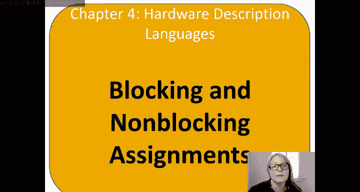
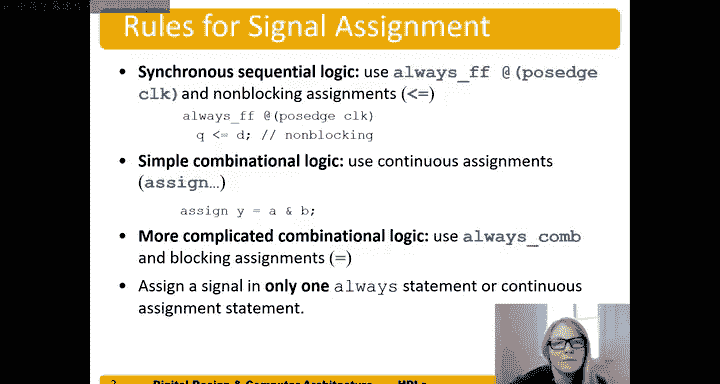

# 数字设计和计算机架构RISC版：4.6：信号赋值 🧠

在本节中，我们将学习Verilog中信号赋值的两种关键方式：阻塞赋值与非阻塞赋值。理解它们的区别对于正确设计同步时序逻辑和组合逻辑至关重要。



上一节我们介绍了时序逻辑的基本结构，本节中我们来看看如何具体地给信号赋值。

## 阻塞赋值与非阻塞赋值

在Verilog中，`=` 是**阻塞赋值**运算符，而 `<=` 是**非阻塞赋值**运算符。它们的核心区别在于赋值发生的时机。

*   **非阻塞赋值 (`<=`)**：在同一时钟边沿，所有使用 `<=` 的赋值是**同时**进行的。它模拟了寄存器在同一时刻更新其状态的行为。
*   **阻塞赋值 (`=`)**：赋值按照代码在文件中出现的**顺序**依次执行。一个赋值语句会“阻塞”后续语句的执行，直到它完成。

以下是这两种赋值方式的一个关键示例。

## 同步器示例：两种赋值的对比

假设我们需要设计一个由两个背靠背触发器构成的同步器。正确的写法应使用非阻塞赋值。

```verilog
// 正确的同步器：使用非阻塞赋值
always @(posedge clk) begin
    n1 <= d;  // 语句1
    q  <= n1; // 语句2
end
```

在时钟上升沿，语句1和语句2**同时**求值。`d` 的当前值被安排赋给 `n1`，而 `n1` 的旧值（即上一个时钟周期的值）被安排赋给 `q`。这综合出的正是我们想要的两个触发器。

现在，我们看看使用阻塞赋值会发生什么。

```verilog
// 错误的同步器：使用阻塞赋值
always @(posedge clk) begin
    n1 = d;  // 语句1
    q  = n1; // 语句2
end
```

在时钟上升沿，语句1**立即**执行，`n1` 获得了 `d` 的当前值。接着，语句2执行，此时 `n1` 已经是新的值（即 `d` 的值），因此 `q` 直接被赋值为 `d`。这导致综合工具只生成一个触发器，而不是我们想要的两个。

## 信号赋值的一般准则

理解了核心区别后，我们可以总结出在数字设计中使用信号赋值的一般规则。

以下是不同类型逻辑所推荐的赋值方式：

1.  **同步时序逻辑**
    *   **使用**：`always @(posedge clk)` 块 和 **非阻塞赋值 (`<=`)**。
    *   **示例**：`always @(posedge clk) q <= d;` 这是一个D触发器的标准描述。

2.  **简单组合逻辑**
    *   **使用**：**连续赋值语句 (`assign`)**。
    *   **示例**：`assign y = a & b;` 这综合成一个与门。当 `a` 或 `b` 变化时，`y` 会立即更新。

3.  **复杂组合逻辑**
    *   **使用**：`always @(*)` 块 和 **阻塞赋值 (`=`)**, 例如在 `case` 或 `if-else` 语句内部。
    *   **示例**：
        ```verilog
        always @(*) begin
            if (sel) y = a;
            else     y = b;
        end
        ```

## 一个至关重要的硬件概念

必须牢记，HDL描述的是**硬件**，而不是纯粹的软件程序。一个核心原则是：

**一个信号（网络）只能由一个逻辑源驱动。**

这意味着你不能在多个 `always` 块或多个 `assign` 语句中对同一个信号进行赋值。以下代码是错误的，因为它试图用两个不同的逻辑块驱动 `q`，会导致冲突。

```verilog
// 错误示例：对同一信号的多重驱动
always @(posedge clk) begin
    q <= d;
end

assign q = 1‘b0; // 错误！q 已经在上面的 always 块中被驱动了。
```

初学者常犯的错误是将HDL当作普通编程语言，认为可以随时给变量重新赋值。在硬件中，你需要预先定义好每个信号的驱动源。

---



本节课中我们一起学习了Verilog中阻塞赋值与非阻塞赋值的根本区别，掌握了在时序逻辑和组合逻辑中正确使用它们的方法，并理解了“单一驱动源”这一硬件描述的基本限制。遵循这些准则，是写出可综合、行为正确的硬件描述代码的关键。