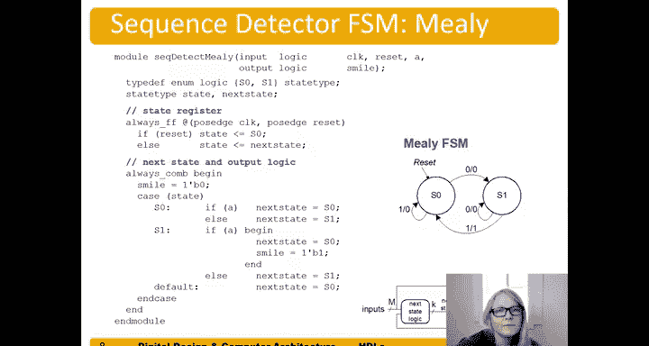

# 哈维穆德学院《数字设计和计算机架构RISC版｜Digital Design and Computer Architecture： RISC-V Edition》 - P51：Chapter 4 7.Finite State Machines (FSMs).zh_en - GPT中英字幕课程资源 - BV1JC1MY1E7F

Now let's talk about how to describe finite state machines in system Bar。

But just like in hardware design of an FSN。Our finite state machine and system Bar also consists of three blocks of logic。

 next state logic。Output logic and the state register。

Here are pictures of our Moore FSM and our Mili FSM。Ss our ex state logic and output logic。

And then our state register。And meal has the same state register。Illput it in next logic。

The difference between ormeli is。The output logic。An Amelia FSm。

Is driven by both the current state and。The inputs here。Whereas in more FSM。

 the output logic depends only on。The current state。Okay。

 so we have these three logic blocks and we're the same thing in our finite steam machine。

Well's suppose we have a divide by three counter。So we have the reset state。

S0 indicated by these double circles。 so this is the output of the synthesis tool。

But we can see the reset。State has two double circles and then we're going for each clock edge so it's called divide by three because you have this clock edge and there are no。

You know， no signals on these transitions。So at the clock edge。

This simply transitions to a new state， and so we get our output。Been。Wan。And state 2。So state zero。

State one right first blockage goes to state zero。It it starts in the reset state S0。

If write our current state， it's S0。But now transitions to the clock edge transitions to the next。

State S1。And at the clock next clock edge， it transitions to S2。And here's our output。output。0ero。

 zero， zero states。Ourput is one。N too， so。So， again。And transitionition again。S 0。

 S1 and right off the edge。It's going to transition。Again。And so we can see that for every。Right。

 so we can see what the frequency is here。If this time is， let's say one nanosecond， for example。

In this clock period。Is1，2。3 nanoseconds。So the clock period increases by。

So right this clock period here now is。Three nanoseconds。So TC increases by 3 x。

And so the frequency is divided by。A third， So Tc。Of the clock。Ck。He pulls in this case。

 one and a second。and t c of the output，Eals 3 nanoseconds。

And so the frequency here is one over one nanoisecond。This frequency， therefore。

 this frequency is whatever nanosecond is a gigahertz。And this frequency。is。1 over3 nanoseconds。

Or a third。a gigahertz。And so it's a divide by three in that our frequency。Has been divided by three。

 the clock frequency is。In the example， we gave1 gigahertz。And the frequency of the output。

Is a third。The gigahertz。So let's see how we take this state transition diagram and turn it into an FSM in hardware and system Para。

So here we have our module name divided by three FSM of inputs。

 clock and reset always and a single output， this output Q that's going to assert every third right in the end state。

嗯。This this FSM it inserts in s0。A0。So in S0， it asserts this the current state。zero thes。That1。

Thats2， state2。 It doesn't assert。And back in a0。This sorts again。And so forth。得。Okay。

 so we have here our。Inputs， clock and reset or output Q。And now we're going to define our。

A a state type。 So we're gonna say。Type de。 So define this type called。Logic。And it's a。Tubbit。

Signal。And we're going to define them as a0， S1， S2， and that type。

 that kind of new type that we're defining is called the state type。

And so that's just so I can use these these。These kind of symbols， S0， S1 S2 instead of you know。

 two bits， binary，0，0， two bits， binary 01， or maybe if I choose some other encoding like one hot encoding。

I don't have to specify that I can just say， oh， you know for that two bit signal。

 I'm going to define this type called state type。That's S 0， S1， S 2。

 And we know the underlying it it's a。It's a two bit logic signal。So。We have state type。

State and next state。 so I can assign those values these， S0， S1 and S2。

And we define these three blocks of logic， just like we did in hardware， our state register。

 next state logic， and output logic。So the state register is just a register that has the。

The current state left。So。😔，It's not in reset state， gets next state。

So here we have our next state on the left。their current state on the right。And。The current state。

 which we just call state in this case。Gets the next state at the rising clock edge as long as reset is low。

But if reset is high， so this is an。Asynchronously resetable flip flop。

 right when the positive edge of reset is seen the。Fll up reset， so if reset。State goes to S0。

 the reset state。Otherwise。第一。The state becomes。Or gets the next date。Next state logic。

 we have just our transitions， we do always calm because we have a case statement in here。Case state。

 if it's a0。Nextex date should be S1。The current state is S1。Next day should be。S 2。

If the current state is S2。Nextex date should be。S 0。

And then we have a default important to have that because we have a twobit state value。

 we're not defining all the states， so this is combinational logic it needs to know。

 even though that state will never happen， it needs to know what would happen if that state did occur so it can be deterministic for every possible combination of inputs。

So don't forget that default statement。In your case statement。And now the output logic we say， okay。

 assign Q equals， well， when state is equal to S0， we want Q that output Q to assert。

So Q asserts when state is equal to s0。If we wanted it to assert so right we would write this in this case that's what the output looks like Id threw them on those in fact。

 I guess I can。right。Here's S 0。 This is our reset input。S 0， S 1， S 2。

And our outputs going to assert。哦。Not in S2， we've defined it the output asserts in。And state 0。0。

In the other states。And so if we had wanted to assert it， for example， in both S0 and S1。

 we would change this and say or。State。Equals equals S1。And so a common error for that to do。

 you know， what people often do there is they'll say， oh， S0 or S1。

And that's not right because what happens is this or occurs。Let's say， S 0 is 0，0。S1 is 01。

 performs the or of those and gets， well，01。And it will only assert in state 0。

1 instead of both state S 0 and S1。So this is。Okay， but in this FSM。

 we wanted it just to assert in the S0 state。And so we say assign sign Q equals state equals equals S0。

So here we have another example of a more type FSM。

 and this is the sequence detector that we talked about in chapter 3。

 so we're detecting the sequence 01。So in go to the reset state a zero。And the zero is detected。

 followed by a one being detected the output。1 ass to one。And otherwise， we do， you know。

 other things with the FSM we want to detect that sequence， so for example， that input。You know。

 it could be changing。Like this over time， right？Time or you， bit zero。Orcycle zero。It's 0。

And then whatever some random。Sequence of bits that every time 01 is detected， the output。

Should assert。And。😔，You know， so forth， here's another。0，1。Sequence says 0 followed by a 1。

And so forth。So let's describe this now in an HDL。So we can go directly from or and should。

 from our state transition diagram to the system Bar。You don't design any circuits。

We have our three blocks of logic or state register。Our next state logic and our output logic。

Just like in hardware， this is hardware， but we're describing it。This is a behavioral module。

And we have our state tie up here， we have three states again， so we just need bits one to zero。

If we had had more states， for example， five states we would need another bit of state and would need three bits of state。

That would be two clone and zero。Yeah。10 states， we would need four bits of state，3 colon and zero。

Et cea。The state register looks the same as usual。And now our next state logic。

We have if we're in S0 and a。Is true。So if a。Nextext date should be s zero。Else。

 so the else is means a is0。Nextex date should be。S1。If we're an S1。And a。Asserts。The input is1。

 you should go to S2。Next stage is S2。ellse。The inputput a is0。And we should stay in S1 and so forth。

And。Again， it's super important to include the default state。Always include that。So that。

 for example， in this case， we have two bits of state， one of those。

State combinations is not being used because we only have three states and so even though that state will never occur。

We need to know what the combinational logic needs to be deterministic for all possible input combinations。

In this case， the output is true only in the S2 state。

 we have assigned signed smile equals state equals equals S2。

And don't forget the double equals because that's a comparison operation。

Comparing if those are equal。We now consider the sequence detector if it were a mealli type FSM。

 we're still looking for the0，1 sequence。0。foollowed by one。But here we have it is zero。

Input't remember the output is on that right side of that， the slash。If we get that one。

The output immediately asserts， the timing is slightly different for this。

For this meal FSM as opposed to the more FSM。So remember this is our。😔，Inputs。On the left side。

In this case， we only have one， but our。Input and then on the right side。We have the output。

And so let's turn this into a system V FSM。Syem very module。 Remember， we go directly from our。

Our state transition diagram to the system V module。We don't design any circuits for this。

You don't write next state equations or output equations。And so。Here we have our state register。

As usual， in case， we just have two states， so we just need one bit of state， so type F&M logic。

Instead of。Tpe F and M logic 1 colon and0， just one a single bit of state。And。

Now we have our next date and output logic combined。

So you could have separated those two into two blocks。But here we have our case table。

 let's look at our next state first if a。If A is1。Should stay in S 0 else a 0。And it should go to S1。

If we're in S1。And a is1。And we should go to you。S is0。And assert， smile。Else。

And notice that we needed to use the begin and end here because there are two statements within this if。

With a this if statement。And now we have our else。Next to you。I S1。

And you'll notice in this that we've only assigned the output once。

And this seems to violate what I said about having a combinational logic completely deterministic。

We know for every possible input， in this case the inputs are state and A。

 what the outputs should be， so what smile should be。But to take care of that。

 we actually right at the beginning right before the case statement， we put smile equals one bit of0。

 so otherwise smile is equal to zero unless it's assigned within the case statement。And so。

It's assigned here in all the other places instead of having to write it in all those places we could have。

 and instead of having of doing that， we saved some lines of system para log code by putting it up at the top and saying。

 well， smile is equal to one bit of zero。Unless it's a sign something else。

And this is within a single block of logic。And so。And so we're not assigning within two different hardware blocks。

