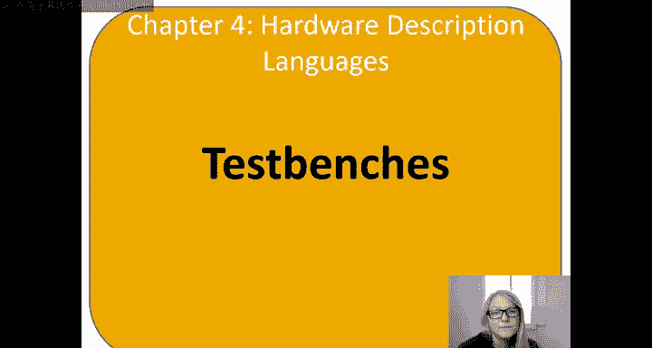

# 数字设计和计算机架构：4.9：测试平台 🧪



在本节中，我们将学习测试平台的概念。测试平台是用于自动化仿真测试的HDL模块，它本身不可综合成硬件，但能极大地帮助我们验证设计的正确性。

## 什么是测试平台？

上一节我们介绍了模块设计，本节中我们来看看如何验证这些模块。测试平台是一个用于测试另一个模块的HDL模块。被测试的模块称为被测设备或DUT。测试平台仅用于仿真，不可综合。

## 测试平台的类型

我们将介绍三种测试平台，它们的功能依次增强。

### 简单测试平台

首先，我们为被测设备编写一个简单的模块。假设其功能为：**Y = ~B & ~C | A & ~B**。

以下是该模块的代码：
```verilog
module sillyfunction(input logic A, B, C,
                     output logic Y);
  assign Y = ~B & ~C | A & ~B;
endmodule
```

接下来，我们编写第一个简单测试平台。它没有输入输出端口，其内部实例化DUT，并手动设置输入信号A、B、C的值，然后通过延时观察输出波形。

以下是简单测试平台的代码结构：
```verilog
module testbench1();
  logic A, B, C;
  logic Y;

  // 实例化被测设备
  sillyfunction dut(A, B, C, Y);

  initial begin
    A=0; B=0; C=0; #10; // 设置输入并延时
    A=0; B=0; C=1; #10;
    // ... 遍历所有输入组合
    A=1; B=1; C=1; #10;
  end
endmodule
```
这种方法的缺点是，我们需要手动查看波形来判断输出Y是否正确。

### 自检测试平台

为了自动化检查过程，我们引入自检测试平台。它在设置输入值后，立即检查输出是否符合预期，并在仿真监视器中打印错误信息。

以下是自检测试平台的核心逻辑：
```verilog
initial begin
  A=0; B=0; C=0; #10;
  if (Y !== 1) $display("000 failed.");
  A=0; B=0; C=1; #10;
  if (Y !== 0) $display("001 failed.");
  // ... 检查所有组合
end
```
这种方法节省了手动查看波形的时间，但编写所有输入组合和预期值仍然繁琐。

### 带测试向量的自检测试平台

最常用且高效的方法是使用带测试向量的自检测试平台。测试向量是一个文本文件，其中每一行代表一组输入和对应的预期输出，类似于真值表。

例如，一个名为 `example.tv` 的测试向量文件内容如下：
```
// A B C Y_expected
000 1
001 0
010 0
// ... 其他行
111 0
```

测试平台会读取该文件，在时钟的上升沿设置输入，在下降沿比较实际输出与预期值，并自动报告所有错误。

以下是这种测试平台的关键部分：
1.  **时钟生成**：用于控制输入设置和输出检查的时序。
    ```verilog
    always begin
      clk = 1; #5;
      clk = 0; #5;
    end
    ```
2.  **读取测试向量**：在仿真开始时将文件读入数组。
    ```verilog
    $readmemb("example.tv", testvectors);
    ```
3.  **应用与检查**：在时钟边沿应用输入并检查输出。
    ```verilog
    always @(posedge clk) #1; {A, B, C, Yexpected} = testvectors[vectornum];
    always @(negedge clk) if (!reset) begin
      if (Y !== Yexpected) begin
        $display("Error: inputs=%b", {A,B,C});
        errors = errors + 1;
      end
      vectornum = vectornum + 1;
      if (testvectors[vectornum] === 4‘bx) begin // 检查是否结束
        $display("%d tests completed with %d errors", vectornum, errors);
        $finish;
      end
    end
    ```
    注意，我们使用 `!==` 和 `===` 进行比较，因为它们可以正确处理 `x`（未知）和 `z`（高阻）状态。

## 总结

本节课中我们一起学习了测试平台的三种类型：
1.  **简单测试平台**：手动设置输入，需查看波形验证。
2.  **自检测试平台**：自动比较输出与预期值并报告错误。
3.  **带测试向量的自检测试平台**：从文件读取测试用例，自动化程度最高，是最常用的方法。


使用测试平台可以高效、自动地验证HDL设计的正确性，是数字设计流程中不可或缺的一环。