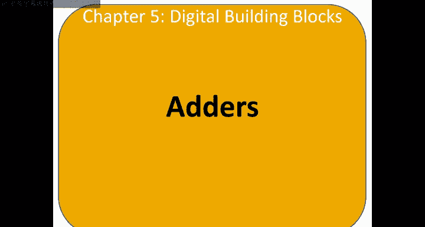
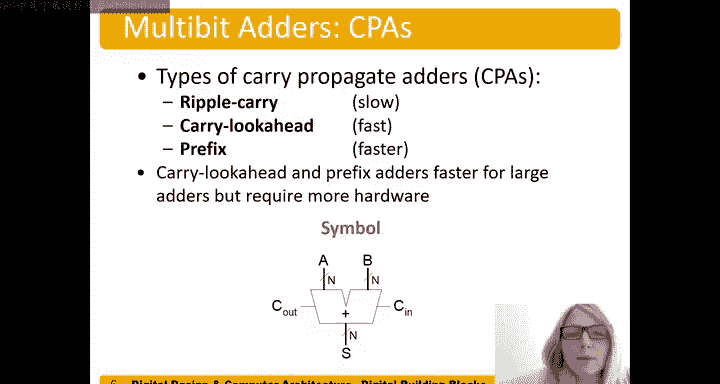

# 哈维穆德学院《数字设计和计算机架构RISC版｜Digital Design and Computer Architecture： RISC-V Edition》 - P55：Chapter 5 2.Adders Introduction.zh_en - GPT中英字幕课程资源 - BV1JC1MY1E7F

So let's consider two types of one bit adders。 So these are just adding。Single bits together。

 A and B。 We have the half adder， and the half adder does not include a carry in bit。

But the full adder does。 So if we think of our， you know， multi bit edition。

 let's just do an example here， four bit edition。We have something here that we're adding together。

 so two four bit numbers， A，3 to0 and B3 to0。And this zero column。

 we're going to number these columns， columns0， column 1， column2 and column3。

 Those are the column numbers。Well， for this one， this column column zero。

 we don' we don't need to carry in。 there's not a carry in on that one。

 so we could actually use a half adder。We may not always， as we'll show later， but in this case。

 there's no carry in， so one plus one。0， carry the one。 But these next columns。

Potentially have a carryion。 So this one， for example， column one does have a carryion of one。

And so these ones， these remaining columns require。One bit addition with a caranne。

 which is a full adder。We're use full adders here， and we could use。Some cases， a half ater。

That right most but。Okay， so let's look at the half adder to start with。And so if we add 0 and 0。

 So again， we're just adding these， these two bits， A and B。0 plus 0。Well，0， both carry out and some。

At these are two outputs for each of those types of adders。Okay， and then we have。0 plus 1 is one。

 so one in the sum bit and0 on the carryout bit，1 plus0 also1， and one plus1 is2。

 which gives us a carryout of one and a sum bit of 0。And then we can write this more nicely。

And use summer products or you know， summer products is the easiest in this case or K maps but K maps is overkill in this case。

So for C out， we get， well， that's A and B。And we could write our sum bit in。And some products form。

Or。We just recognize it as an Xor function。This would be A bar B or A B bar A bar B or A B bar。

And we recognize that as a X or B。And then as we said before， the carryout bit is just A and B。Okay。

 so now we have equations and we can build those from gates for our half ater。

 and let's consider our full adder with our full adder。😊。

We're going to have three bits that're addingtting because we potentially have this carry in bit。

And then A and B。And so。We add those all together。 Carion plus a plus B，0 plus0 plus0， top row。

 that's  zero。 This is one。This is one。This is two， so one carry out some is0。1。😔，To。To。And finally。

 three， which gives us a carry out of one and also a sum bit of one。And。You know written or typed。

And so now we can do the same thing and the easiest thing to do would probably be to draw this in a K map or recognize this as the three。

 the sum function here as the three input X or function or we could write it in some products and then do it that way as well so we have sum equals。

诶。X or， B， X or。Xin。And then we also have our carry out。And our carry outfit it is。哇。

Putting in the Kap is easiest， or we can also you know， think about this and say， well。

 we're going to carry out a carry out whenever any two inputs is true。Okay。

 well that would be A and B being true。Or B and C N being true。Or。A and C， N。Being true。And again。

 that would fall out from a KAP and putting that output in the KAPap。

So now we have two equations for our full adder。You know， required a little bit more logic。

 so there is a reason if we can use a half adder instead of a full ladder to use that， less hardware。

 less power， less cost。But we have both options， a one bit full adder or a one bit half ater。

So now let's talk about multi bit adders or carry propagate adders so these adders propagate the carry from one column to the next。

 so just like we saw in our last example， we have some numbers that we're adding together in this case4 bit numbers so and would be four1 plus10。

And then that carries the one。So the here's our carry。

 and that carry is going to propagate or could propagate from one column to the next。

 So one plus one plus1，3， which does one， carry the one。2 is 0。 carry the 1，2 again，0 carry the one。

 And so this carry propagates from one column or can propagate from one column to the next to the output。

 So here's our C out of that for of that for bit adder。

And so we're going to talk about different strategies for propagating this carry。

 so that that propagation， just like when we talked about propagation delay in chapter two。

 well this propagation of a carry is going to be our slowest path and so if we can speed up that path。

 we're going to speed up the whole edition。And so we'll talk about three different add。

 the first one is the ripple carry adder where we just basically use one bit adders and have the carry propagate from one column to the next。

And then we talk about two different adders， the carry Look ahead adder， and the prefix adder。

 where we're going to speed up this path， the slow path of that carry propagating。

And so these are typically faster for larger bit widths than the rip carry adder。

 but they're going to require more hardware， so we're going to pay the cost of well more hardware。

 more power and more actual cost right， more money to build it。And here we have a symbol of our。

Of our carry propagate add。 Gu remember， all of these are carry propagate adders。

 It looks very similar to our1 bit full adder that we just increased a bit with of our input。

Inputs A and B， and are some output。So again， carry look ahead and prefix adders are faster for large adders so for larger end。

 but they do require more hardware。

